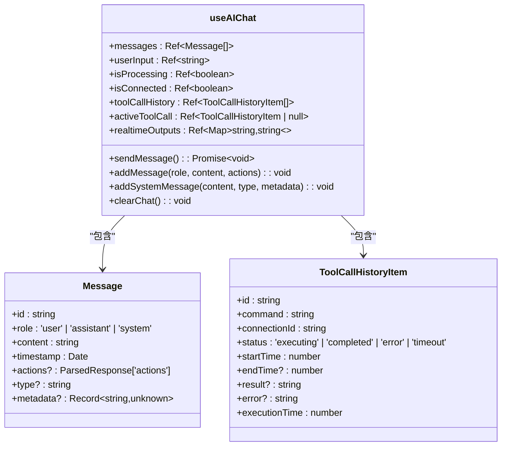
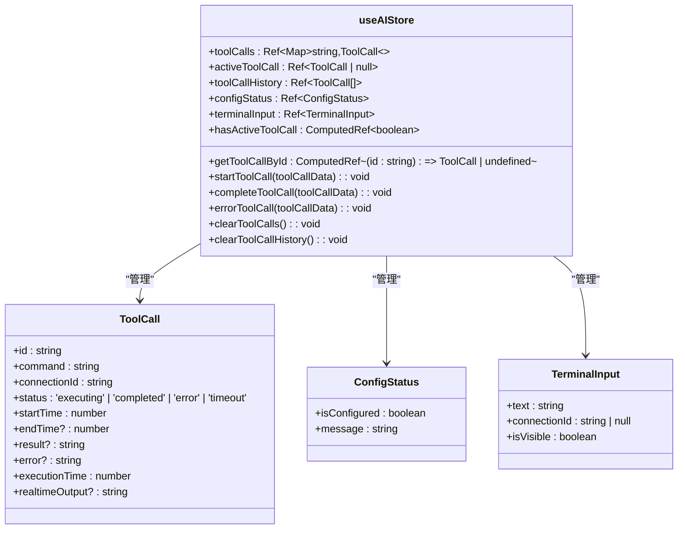
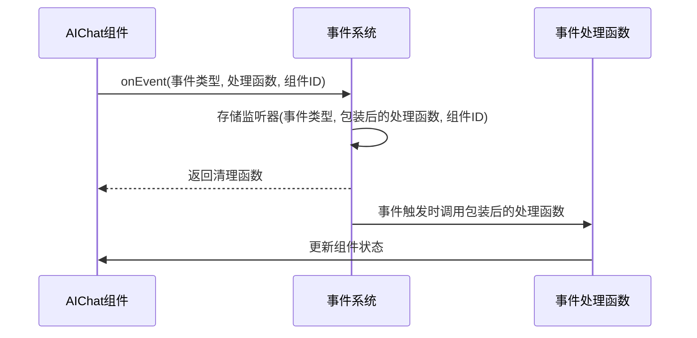
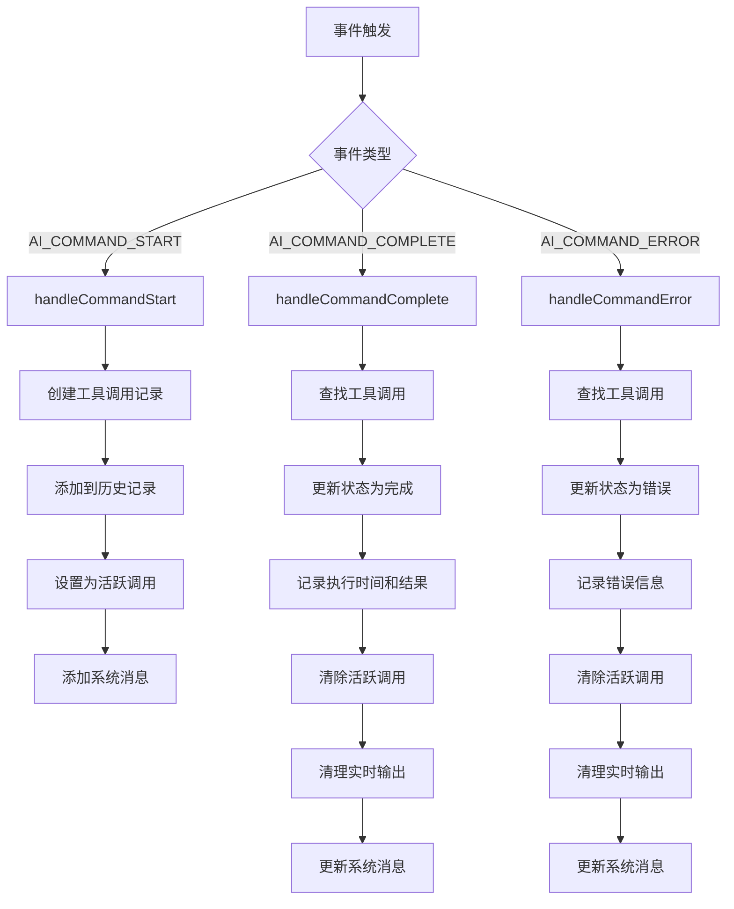
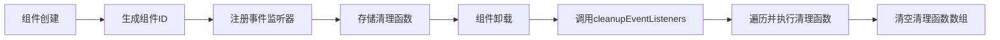
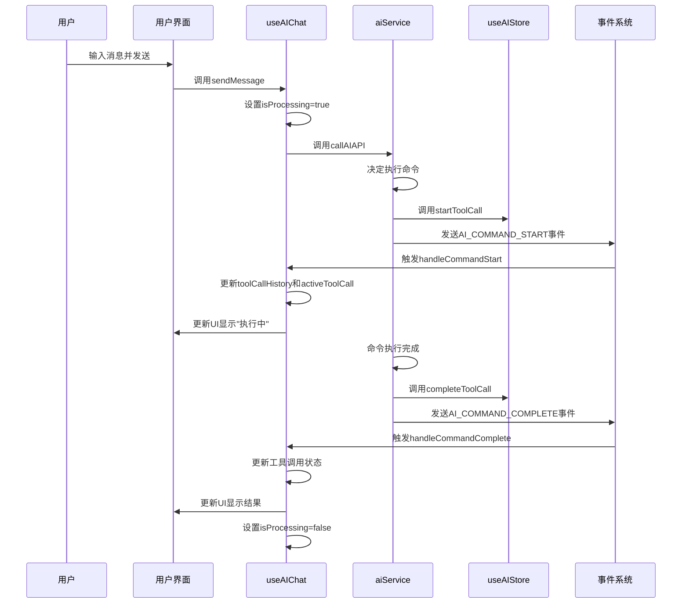

# 状态管理与事件系统

<cite>
**本文档引用的文件**
- [useAIChat.ts](file://src/modules/ai-assistant/composables/useAIChat.ts)
- [ai.ts](file://src/modules/ai-assistant/stores/ai.ts)
- [eventSystem.ts](file://src/utils/eventSystem.ts)
- [aiService.ts](file://src/modules/ai-assistant/utils/aiService.ts)
- [simpleCommandExecutor.ts](file://src/modules/terminal/utils/simpleCommandExecutor.ts)
- [ai.ts](file://src/types/ai.ts)
</cite>

## 目录
1. [引言](#引言)
2. [核心状态管理机制](#核心状态管理机制)
3. [全局状态管理](#全局状态管理)
4. [事件监听系统](#事件监听系统)
5. [事件处理流程](#事件处理流程)
6. [事件清理与组件隔离](#事件清理与组件隔离)
7. [状态与事件协同工作机制](#状态与事件协同工作机制)
8. [结论](#结论)

## 引言
本文档深入解析AI助手的状态管理机制，重点阐述`useAIChat`组合式函数中响应式状态的设计原理与实现方式。详细说明如何通过Pinia的`useAIStore`进行全局状态管理，分析事件监听系统如何通过`onEvent`监听关键事件，并描述事件处理函数如何更新UI状态和工具调用历史。

## 核心状态管理机制

`useAIChat`组合式函数通过Vue的响应式系统管理AI聊天界面的核心状态。该函数使用`ref`创建多个响应式变量，确保状态变化能够自动反映在用户界面中。

### 响应式状态设计

`useAIChat`函数定义了多个关键的响应式状态变量：

- `messages`: 存储聊天消息数组，类型为`Message[]`，用于展示用户与AI的对话历史
- `userInput`: 存储用户输入框的文本内容，类型为`string`
- `isProcessing`: 布尔值，表示AI是否正在处理消息，用于控制加载状态和防止重复发送
- `isConnected`: 布尔值，表示与AI服务的连接状态
- `toolCallHistory`: 存储工具调用历史记录，类型为`ToolCallHistoryItem[]`
- `activeToolCall`: 存储当前活跃的工具调用，类型为`ToolCallHistoryItem | null`
- `realtimeOutputs`: 使用`Map`存储实时输出数据，键为工具调用ID，值为输出内容

这些状态通过`ref`函数创建，确保了它们的响应式特性。当这些状态发生变化时，相关的UI组件会自动更新。

**图示来源**
- [useAIChat.ts](file://src/modules/ai-assistant/composables/useAIChat.ts#L24-L615)
- [ai.ts](file://src/types/ai.ts#L78-L88)
- [ai.ts](file://src/types/ai.ts#L98-L108)

**本节来源**
- [useAIChat.ts](file://src/modules/ai-assistant/composables/useAIChat.ts#L24-L615)

## 全局状态管理

系统使用Pinia作为全局状态管理解决方案，通过`useAIStore`定义AI助手的全局状态。这种设计模式实现了状态的集中管理和跨组件共享。

### Pinia Store设计

`useAIStore`定义了AI助手的核心状态和操作方法：

- `toolCalls`: 使用`Map`存储当前所有工具调用，键为工具调用ID，值为`ToolCall`对象
- `activeToolCall`: 存储当前正在执行的工具调用
- `toolCallHistory`: 存储已完成的工具调用历史记录
- `configStatus`: 存储AI服务的配置状态
- `terminalInput`: 存储终端输入状态

Store还提供了多个计算属性，如`hasActiveToolCall`、`getToolCallById`和`getToolCallStats`，用于派生状态和简化状态访问。

**图示来源**
- [ai.ts](file://src/modules/ai-assistant/stores/ai.ts#L18-L271)

**本节来源**
- [ai.ts](file://src/modules/ai-assistant/stores/ai.ts#L18-L271)

## 事件监听系统

系统采用事件驱动架构，通过自定义事件系统实现组件间的松耦合通信。事件系统基于`mitt`库构建，提供了轻量级的事件发布-订阅机制。

### 事件类型定义

系统定义了多种事件类型，涵盖AI聊天、终端操作和系统管理等场景：

- `AI_COMMAND_START`: AI命令开始执行事件
- `AI_COMMAND_COMPLETE`: AI命令执行完成事件
- `AI_COMMAND_ERROR`: AI命令执行错误事件
- `AI_RESPONSE`: AI响应事件
- `AI_CONFIG_REQUIRED`: AI配置需求事件
- `TERMINAL_OUTPUT`: 终端输出事件

### 事件监听器初始化

`useAIChat`函数通过`initializeEventListeners`方法注册事件监听器。每个监听器都与特定的组件ID关联，确保事件处理的隔离性。

**图示来源**
- [useAIChat.ts](file://src/modules/ai-assistant/composables/useAIChat.ts#L100-L150)
- [eventSystem.ts](file://src/utils/eventSystem.ts#L265-L266)

**本节来源**
- [useAIChat.ts](file://src/modules/ai-assistant/composables/useAIChat.ts#L100-L150)
- [eventSystem.ts](file://src/utils/eventSystem.ts#L11-L33)

## 事件处理流程

事件处理系统通过一系列事件处理器函数响应不同类型的事件，更新UI状态和工具调用历史。

### 关键事件处理器

#### 命令开始事件处理

`handleCommandStart`函数处理`AI_COMMAND_START`事件，当AI决定执行命令时触发：

1. 创建`ToolCallHistoryItem`对象，记录命令执行的开始状态
2. 将工具调用添加到`toolCallHistory`数组中
3. 更新`activeToolCall`为当前工具调用
4. 添加系统消息到聊天记录，显示"工具调用开始"状态

#### 命令完成事件处理

`handleCommandComplete`函数处理`AI_COMMAND_COMPLETE`事件，当命令执行完成时触发：

1. 更新工具调用历史中的状态为"completed"
2. 记录执行时间和结果
3. 清除活跃工具调用
4. 清理实时输出缓存
5. 更新或创建系统消息，显示"工具调用完成"状态

#### 命令错误事件处理

`handleCommandError`函数处理`AI_COMMAND_ERROR`事件，当命令执行出错时触发：

1. 更新工具调用历史中的状态为"error"
2. 记录错误信息
3. 清除活跃工具调用
4. 清理实时输出缓存
5. 更新或创建系统消息，显示"工具调用错误"状态

**图示来源**
- [useAIChat.ts](file://src/modules/ai-assistant/composables/useAIChat.ts#L490-L548)
- [useAIChat.ts](file://src/modules/ai-assistant/composables/useAIChat.ts#L363-L416)
- [useAIChat.ts](file://src/modules/ai-assistant/composables/useAIChat.ts#L418-L488)

**本节来源**
- [useAIChat.ts](file://src/modules/ai-assistant/composables/useAIChat.ts#L490-L548)

## 事件清理与组件隔离

系统实现了完善的事件清理机制，防止内存泄漏并支持多连接实例的隔离。

### 事件清理机制

`cleanupEventListeners`函数负责清理所有注册的事件监听器：

1. 遍历`eventCleanupFunctions`数组中的每个清理函数
2. 依次调用这些清理函数，移除对应的事件监听器
3. 清空`eventCleanupFunctions`数组

该函数在组件卸载时通过`onUnmounted`生命周期钩子自动调用，确保资源的及时释放。

### 组件ID生成策略

系统使用组件ID实现多连接实例的隔离：

- 每个`useAIChat`实例生成唯一的`componentId`，格式为`AIChat-{connectionId}`
- 事件监听器注册时关联到特定的`componentId`
- 事件触发时，只有匹配`componentId`的监听器才会被调用

这种设计支持多个AI聊天实例同时运行，每个实例独立处理自己的事件，避免状态混乱。

**图示来源**
- [useAIChat.ts](file://src/modules/ai-assistant/composables/useAIChat.ts#L597-L597)
- [useAIChat.ts](file://src/modules/ai-assistant/composables/useAIChat.ts#L78-L84)

**本节来源**
- [useAIChat.ts](file://src/modules/ai-assistant/composables/useAIChat.ts#L597-L597)

## 状态与事件协同工作机制

状态管理和事件系统协同工作，形成完整的AI助手功能闭环。

### 协同工作流程

当用户发送消息时，系统执行以下流程：

1. 调用`sendMessage`方法，设置`isProcessing`为`true`
2. 调用AI API获取响应
3. 如果AI需要执行命令，触发`AI_COMMAND_START`事件
4. `handleCommandStart`更新状态和UI
5. 命令执行完成后，触发`AI_COMMAND_COMPLETE`或`AI_COMMAND_ERROR`事件
6. 对应的事件处理器更新状态和UI
7. 最后设置`isProcessing`为`false`

### 跨模块状态同步

系统通过多种方式实现跨模块状态同步：

- `aiService.ts`中的`handleToolCalls`函数调用`emitEvent`发送事件，同时调用`useAIStore`更新全局状态
- `simpleCommandExecutor.ts`中的`recordCommandComplete`方法同时更新Pinia Store和发送事件

这种双重更新机制确保了状态的一致性和UI的及时响应。

**图示来源**
- [useAIChat.ts](file://src/modules/ai-assistant/composables/useAIChat.ts#L24-L615)
- [aiService.ts](file://src/modules/ai-assistant/utils/aiService.ts#L437-L562)
- [simpleCommandExecutor.ts](file://src/modules/terminal/utils/simpleCommandExecutor.ts#L274-L310)

**本节来源**
- [useAIChat.ts](file://src/modules/ai-assistant/composables/useAIChat.ts#L24-L615)
- [aiService.ts](file://src/modules/ai-assistant/utils/aiService.ts#L437-L562)

## 结论

本文档详细解析了AI助手的状态管理与事件系统。系统采用组合式函数`useAIChat`管理局部响应式状态，通过Pinia的`useAIStore`实现全局状态管理，并利用自定义事件系统实现组件间的松耦合通信。事件监听器与组件生命周期紧密结合，通过`cleanupEventListeners`机制防止内存泄漏。组件ID生成策略支持多连接实例的隔离。状态管理与事件系统协同工作，形成了完整的AI助手功能闭环，确保了系统的可维护性和可扩展性。