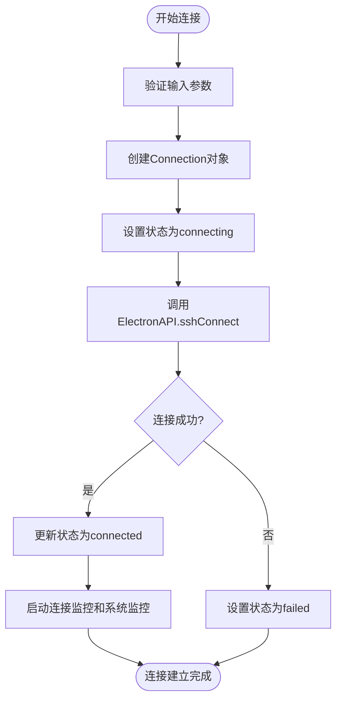
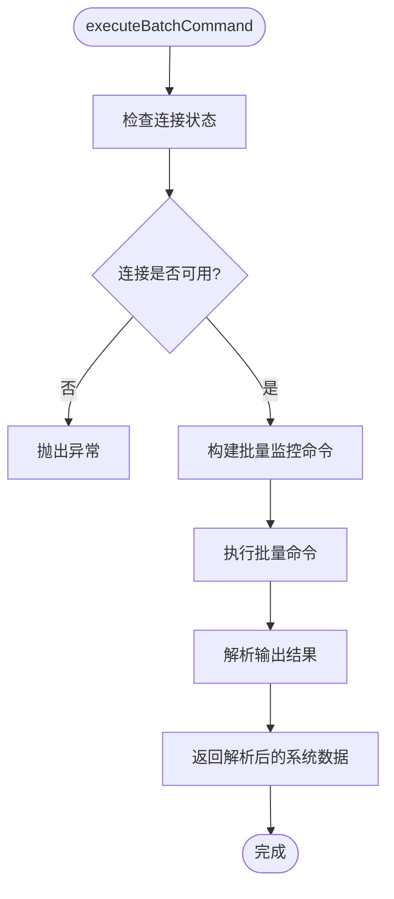
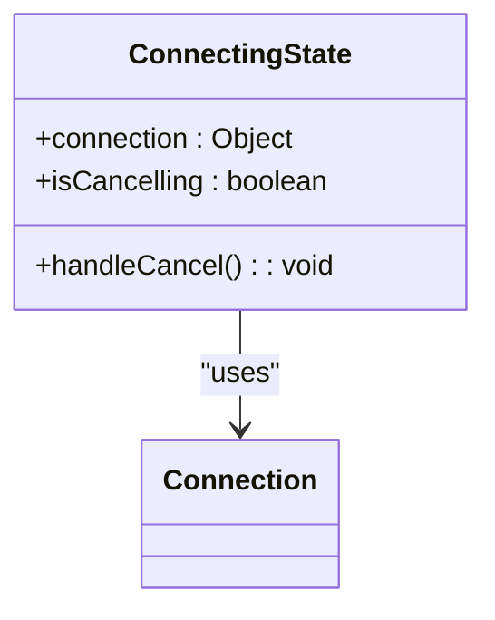
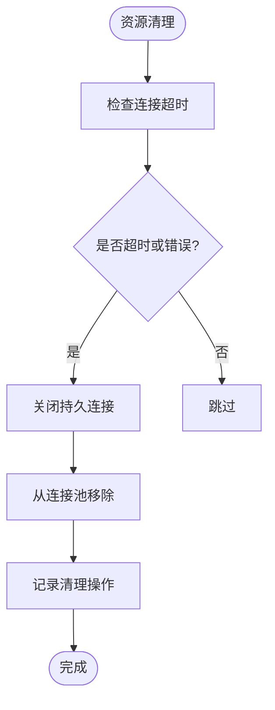

# SSH连接管理

<cite>
**Referenced Files in This Document**   
- [useConnectionManager.ts](file://src/composables/useConnectionManager.ts)
- [useSSHConnectionPool.js](file://src/composables/useSSHConnectionPool.js)
- [ConnectingState.vue](file://src/components/connection/ConnectingState.vue)
- [ConnectionFailedState.vue](file://src/components/connection/ConnectionFailedState.vue)
- [DisconnectedState.vue](file://src/components/connection/DisconnectedState.vue)
- [ConnectionStatusBar.vue](file://src/components/connection/ConnectionStatusBar.vue)
- [ssh.ts](file://src/types/ssh.ts)
- [terminal.ts](file://src/types/terminal.ts)
</cite>

## 目录
1. [简介](#简介)
2. [连接生命周期管理](#连接生命周期管理)
3. [连接池机制](#连接池机制)
4. [状态监控与UI反馈](#状态监控与ui反馈)
5. [错误处理与资源清理](#错误处理与资源清理)
6. [实际使用场景](#实际使用场景)

## 简介

sshcode应用的SSH连接管理模块提供了一套完整的远程服务器连接解决方案，核心功能包括连接生命周期管理、连接池机制和实时状态监控。该模块通过`useConnectionManager`组合式函数实现连接的创建、建立与断开流程，同时利用`useSSHConnectionPool`提供持久化连接与批量命令执行能力。系统采用状态机模式管理连接状态（connecting、connected、failed、disconnected），并通过专门的UI组件提供直观的用户反馈。

**Section sources**
- [useConnectionManager.ts](file://src/composables/useConnectionManager.ts#L10-L538)
- [useSSHConnectionPool.js](file://src/composables/useSSHConnectionPool.js#L2-L258)

## 连接生命周期管理

SSH连接的生命周期由`useConnectionManager`组合式函数全面管理，通过`addConnection`、`establishConnection`和`disconnectConnection`等方法实现完整的连接流程。

### 连接创建与建立

`addConnection`方法接收`SessionData`对象作为参数，创建一个响应式的`Connection`对象并将其添加到活动连接列表中。连接对象包含服务器信息（主机、端口、用户名、认证方式等）、连接状态、系统信息等属性。创建连接后，立即调用`establishConnection`方法启动连接过程。

`establishConnection`方法执行实际的SSH连接操作，首先将连接状态设置为"connecting"，然后通过`window.electronAPI.sshConnect`调用底层Electron API建立真实连接。连接成功后，会创建持久连接池条目，启动连接监控和系统监控，并更新连接状态为"connected"。

**Diagram sources**
- [useConnectionManager.ts](file://src/composables/useConnectionManager.ts#L100-L250)

**Section sources**
- [useConnectionManager.ts](file://src/composables/useConnectionManager.ts#L100-L250)
- [ssh.ts](file://src/types/ssh.ts#L37-L56)

### 连接断开与关闭

`disconnectConnection`方法负责断开已建立的SSH连接。该方法首先关闭连接池中的持久连接，然后调用`window.electronAPI.sshDisconnect`断开底层连接，最后停止连接监控和系统监控。`closeConnection`方法在断开连接后，还会从活动连接列表中移除该连接，并处理标签页切换逻辑。

## 连接池机制

`useSSHConnectionPool`组合式函数实现了SSH连接池的核心功能，通过`createPersistentConnection`和`executeBatchCommand`提供持久化连接与批量命令执行能力。

### 持久化连接

`createPersistentConnection`方法创建持久化的SSH连接，将连接信息存储在响应式的`Map`中。每个连接池条目包含连接参数、状态、最后使用时间、错误计数等元数据。连接池通过`startCleanupTimer`启动定期清理任务，每分钟执行一次`cleanupConnections`，自动清理超过5分钟未使用或处于错误状态的连接。

### 批量命令执行

`executeBatchCommand`方法实现批量命令执行，通过构建复杂的Shell脚本一次性获取多项系统监控数据。该脚本包含获取CPU使用率、内存使用率、磁盘使用率、网络数据、系统负载和进程信息的命令，通过管道和正则表达式处理输出结果。

**Diagram sources**
- [useSSHConnectionPool.js](file://src/composables/useSSHConnectionPool.js#L50-L150)

**Section sources**
- [useSSHConnectionPool.js](file://src/composables/useSSHConnectionPool.js#L50-L150)
- [useSSHConnectionPool.js](file://src/composables/useSSHConnectionPool.js#L150-L200)

## 状态监控与UI反馈

系统采用状态机模式管理连接状态，包括connecting、connected、failed和disconnected四种状态，并通过专门的UI组件提供直观的用户反馈。

### 状态机转换逻辑

连接状态的转换遵循严格的逻辑流程：
- **connecting**：连接开始时的初始状态，显示连接动画和步骤指示
- **connected**：连接成功后的状态，显示系统监控信息
- **failed**：连接失败时的状态，显示错误信息和重试选项
- **disconnected**：连接断开后的状态，提供重新连接选项

状态转换由`establishConnection`、`disconnectConnection`等方法触发，并通过响应式系统自动更新UI。

### UI反馈组件

系统提供了一系列专门的UI组件来反馈连接状态：

#### 连接中状态
`ConnectingState.vue`组件显示动态的连接动画，包括旋转的加载图标和分步指示器，让用户了解连接进度。用户可以在此状态下取消连接。

**Diagram sources**
- [ConnectingState.vue](file://src/components/connection/ConnectingState.vue#L1-L188)

#### 连接失败状态
`ConnectionFailedState.vue`组件在连接失败时显示错误信息，并提供"重试连接"和"编辑配置"两个操作按钮，帮助用户快速解决问题。

#### 已断开状态
`DisconnectedState.vue`组件在连接断开后显示简洁的断开状态信息，并提供"重新连接"按钮。

#### 状态栏
`ConnectionStatusBar.vue`组件在连接成功后持续显示系统监控信息，包括CPU、内存、磁盘使用率和网络速率，为用户提供实时的服务器状态概览。

**Section sources**
- [ConnectingState.vue](file://src/components/connection/ConnectingState.vue#L1-L188)
- [ConnectionFailedState.vue](file://src/components/connection/ConnectionFailedState.vue#L1-L98)
- [DisconnectedState.vue](file://src/components/connection/DisconnectedState.vue#L1-L68)
- [ConnectionStatusBar.vue](file://src/components/connection/ConnectionStatusBar.vue#L1-L251)

## 错误处理与资源清理

系统实现了完善的错误处理和资源清理机制，确保连接的稳定性和资源的有效管理。

### 错误处理

在连接过程中，系统捕获并处理各种可能的错误，包括认证失败、网络中断等。错误信息会存储在连接对象的`errorMessage`属性中，并通过`show-notification`事件通知用户。对于连接池中的连接，系统会记录错误次数，当错误次数达到3次时，将连接标记为错误状态。

### 资源清理

系统通过多种机制确保资源的及时清理：
- `cleanupConnections`方法定期清理超时或错误的连接
- `disconnectConnection`方法在断开连接时清理相关资源
- `closeConnection`方法在关闭连接时从活动列表中移除连接
- 连接监控和系统监控的定时器在连接断开时被清除

**Diagram sources**
- [useSSHConnectionPool.js](file://src/composables/useSSHConnectionPool.js#L200-L250)

**Section sources**
- [useSSHConnectionPool.js](file://src/composables/useSSHConnectionPool.js#L200-L250)
- [useConnectionManager.ts](file://src/composables/useConnectionManager.ts#L350-L400)

## 实际使用场景

### 批量连接服务器

通过循环调用`addConnection`方法，可以实现批量连接多个服务器。系统会为每个服务器创建独立的连接，并在标签页中显示。

### 连接恢复策略

当网络中断导致连接丢失时，系统会自动检测到连接状态变为"disconnected"，用户可以通过点击"重新连接"按钮恢复连接。`reconnectConnection`方法会先关闭现有连接，然后重新建立新的连接。

### 常见问题处理

#### 认证失败
当出现认证失败时，`ConnectionFailedState`组件会显示具体的错误信息，并提供"编辑配置"按钮，让用户可以修正用户名、密码或密钥配置。

#### 网络中断
系统通过每30秒发送心跳命令来检测连接状态。当网络中断时，心跳命令会失败，系统会自动将连接状态更新为"disconnected"，并通知用户。

**Section sources**
- [useConnectionManager.ts](file://src/composables/useConnectionManager.ts#L250-L350)
- [ConnectionFailedState.vue](file://src/components/connection/ConnectionFailedState.vue#L1-L98)
- [DisconnectedState.vue](file://src/components/connection/DisconnectedState.vue#L1-L68)