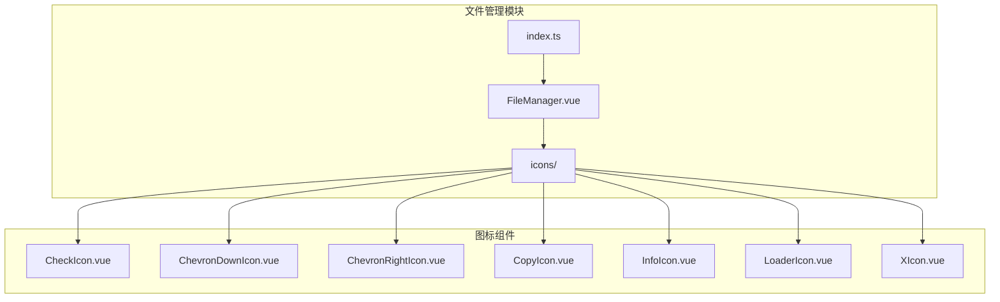
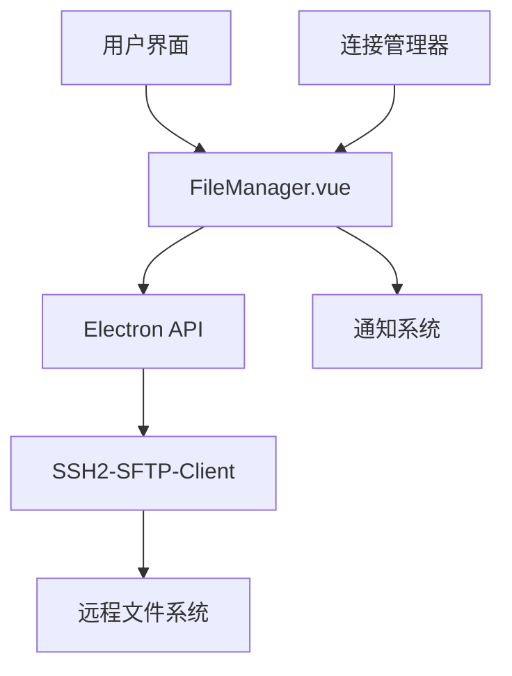
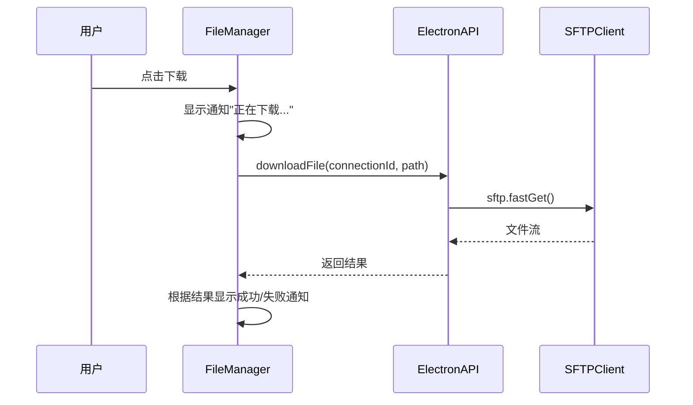
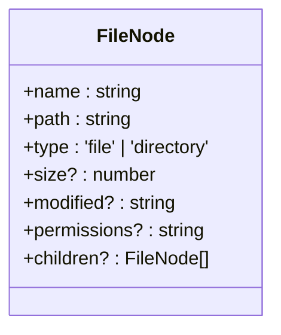
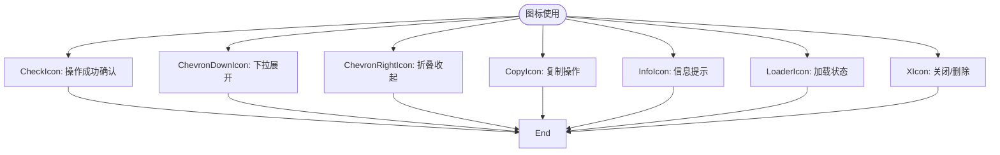
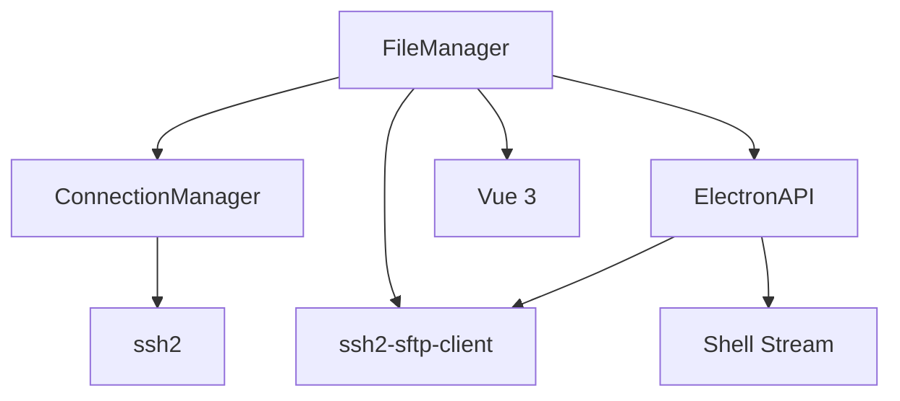

# 文件管理

<cite>
**本文档引用的文件**   
- [FileManager.vue](file://src/modules/file-manager/components/FileManager.vue)
- [file.ts](file://src/types/file.ts)
- [useConnectionManager.ts](file://src/composables/useConnectionManager.ts)
- [ssh.ts](file://src/types/ssh.ts)
- [CheckIcon.vue](file://src/modules/file-manager/components/icons/CheckIcon.vue)
- [ChevronDownIcon.vue](file://src/modules/file-manager/components/icons/ChevronDownIcon.vue)
- [ChevronRightIcon.vue](file://src/modules/file-manager/components/icons/ChevronRightIcon.vue)
- [CopyIcon.vue](file://src/modules/file-manager/components/icons/CopyIcon.vue)
- [InfoIcon.vue](file://src/modules/file-manager/components/icons/InfoIcon.vue)
- [LoaderIcon.vue](file://src/modules/file-manager/components/icons/LoaderIcon.vue)
- [XIcon.vue](file://src/modules/file-manager/components/icons/XIcon.vue)
</cite>

## 目录
1. [简介](#简介)
2. [项目结构](#项目结构)
3. [核心组件](#核心组件)
4. [架构概述](#架构概述)
5. [详细组件分析](#详细组件分析)
6. [依赖分析](#依赖分析)
7. [性能考虑](#性能考虑)
8. [故障排除指南](#故障排除指南)
9. [结论](#结论)

## 简介
本文件全面介绍文件管理模块的设计与实现，重点描述 `FileManager.vue` 组件的文件浏览界面架构与 SFTP 操作集成。说明如何通过 SSH2-SFTP-Client 库实现远程文件系统的目录遍历、文件上传下载、重命名、删除等操作。解析文件图标组件（如 CheckIcon、ChevronDownIcon 等）在文件类型识别与交互反馈中的作用。阐述文件节点数据模型（FileNode）的结构定义与状态管理机制。通过实际代码示例展示文件操作的异步处理流程、进度反馈和错误处理策略。解释文件管理器与连接管理器的集成方式，确保文件操作基于已建立的 SSH 会话。讨论大文件传输的性能优化方案与断点续传的可能性，并列出常见问题如权限拒绝、传输中断的应对措施。

## 项目结构
文件管理模块位于 `src/modules/file-manager` 目录下，采用模块化设计，包含组件和类型定义。主要功能集中在 `components` 文件夹中，特别是 `FileManager.vue` 作为核心组件，负责提供用户界面和交互逻辑。图标组件被组织在 `icons` 子目录中，便于复用和维护。

**图示来源**
- [FileManager.vue](file://src/modules/file-manager/components/FileManager.vue)
- [index.ts](file://src/modules/file-manager/index.ts)
- [icons/](file://src/modules/file-manager/components/icons/)

**本节来源**
- [FileManager.vue](file://src/modules/file-manager/components/FileManager.vue)
- [index.ts](file://src/modules/file-manager/index.ts)

## 核心组件
`FileManager.vue` 是文件管理模块的核心组件，实现了完整的文件浏览和操作功能。该组件通过 `connectionId` 和 `connection` 属性接收连接信息，并通过事件与父组件通信。组件内部维护了文件列表、当前路径、加载状态、错误信息、选中文件集合以及导航历史等状态。

文件操作通过 `window.electronAPI` 提供的接口实现，包括获取文件列表、下载文件、上传文件等。所有操作均采用异步处理，结合 Vue 的响应式系统更新界面状态。组件支持前进/后退、刷新、路径输入导航等功能，并提供了新建文件、新建目录、上传文件等操作按钮。

文件列表支持单击选择、Ctrl/Cmd 多选、双击打开等交互方式。右键菜单提供上下文操作，模态框用于新建和重命名操作。拖拽上传功能通过全局拖拽事件实现，提升用户体验。

**本节来源**
- [FileManager.vue](file://src/modules/file-manager/components/FileManager.vue)

## 架构概述
文件管理模块采用分层架构，上层为 UI 组件层，中层为业务逻辑层，底层为 Electron API 通信层。`FileManager.vue` 作为 UI 入口，封装了所有用户交互逻辑，并通过事件与外部系统集成。文件数据模型 `FileNode` 定义了文件和目录的结构，确保类型安全。

模块通过 `useConnectionManager` 与连接管理系统集成，确保所有文件操作基于有效的 SSH 会话。SFTP 操作通过 `ssh2-sftp-client` 库实现，封装在 Electron 主进程中，通过 `window.electronAPI` 提供安全的 IPC 通信。

**图示来源**
- [FileManager.vue](file://src/modules/file-manager/components/FileManager.vue)
- [useConnectionManager.ts](file://src/composables/useConnectionManager.ts)
- [ssh.ts](file://src/types/ssh.ts)

## 详细组件分析

### FileManager.vue 分析
`FileManager.vue` 组件实现了完整的文件管理功能，包括文件浏览、选择、操作和状态反馈。组件采用组合式 API，使用 `ref` 和 `reactive` 管理各种状态，通过 `computed` 属性实现目录和文件的分离排序。

#### 文件操作流程

**图示来源**
- [FileManager.vue](file://src/modules/file-manager/components/FileManager.vue)
- [useConnectionManager.ts](file://src/composables/useConnectionManager.ts)

#### 文件节点数据模型

**图示来源**
- [file.ts](file://src/types/file.ts#L4-L12)

**本节来源**
- [FileManager.vue](file://src/modules/file-manager/components/FileManager.vue)
- [file.ts](file://src/types/file.ts)

### 图标组件分析
文件管理模块包含多个 SVG 图标组件，用于提供视觉反馈和交互指示。这些组件均采用简单的 SVG 路径绘制，通过 CSS 控制颜色和大小，确保在不同主题下的一致性。

#### 图标组件作用

**图示来源**
- [CheckIcon.vue](file://src/modules/file-manager/components/icons/CheckIcon.vue)
- [ChevronDownIcon.vue](file://src/modules/file-manager/components/icons/ChevronDownIcon.vue)
- [ChevronRightIcon.vue](file://src/modules/file-manager/components/icons/ChevronRightIcon.vue)
- [CopyIcon.vue](file://src/modules/file-manager/components/icons/CopyIcon.vue)
- [InfoIcon.vue](file://src/modules/file-manager/components/icons/InfoIcon.vue)
- [LoaderIcon.vue](file://src/modules/file-manager/components/icons/LoaderIcon.vue)
- [XIcon.vue](file://src/modules/file-manager/components/icons/XIcon.vue)

**本节来源**
- 所有图标组件文件

## 依赖分析
文件管理模块依赖于多个核心系统，包括连接管理、Electron API、SSH2 库等。模块通过 `props` 接收连接信息，通过事件与父组件通信，确保松耦合设计。

**图示来源**
- [FileManager.vue](file://src/modules/file-manager/components/FileManager.vue)
- [useConnectionManager.ts](file://src/composables/useConnectionManager.ts)
- [ssh.ts](file://src/types/ssh.ts)

**本节来源**
- [FileManager.vue](file://src/modules/file-manager/components/FileManager.vue)
- [useConnectionManager.ts](file://src/composables/useConnectionManager.ts)

## 性能考虑
文件管理模块在设计时考虑了性能优化，特别是在处理大文件传输和大量文件列表时。对于大文件传输，建议实现断点续传机制，通过记录已传输字节数和校验和来支持恢复。可以采用分块传输策略，将大文件分割为多个块并行传输，提高带宽利用率。

在文件列表渲染方面，当目录包含大量文件时，应考虑实现虚拟滚动，只渲染可见区域的文件项，避免 DOM 节点过多导致的性能问题。对于频繁的文件操作，可以引入操作队列机制，避免同时发起过多 SFTP 请求导致连接拥塞。

文件图标和类型识别应采用缓存策略，避免重复解析文件扩展名。对于频繁访问的目录，可以实现客户端缓存，减少不必要的 SFTP 列表请求。

**本节来源**
- [FileManager.vue](file://src/modules/file-manager/components/FileManager.vue)

## 故障排除指南
文件管理模块可能遇到的常见问题包括权限拒绝、传输中断、连接丢失等。对于权限拒绝错误，应检查用户是否有目标文件的读写权限，必要时使用 `sudo` 或切换到有足够权限的用户。

传输中断问题可能由网络不稳定或服务器超时引起。建议增加重试机制，在传输失败时自动重试几次。对于长时间运行的传输，应发送心跳包保持连接活跃。

连接丢失问题可通过连接监控和自动重连机制解决。`useConnectionManager` 已实现基本的连接健康检查，可在检测到连接丢失时提示用户并提供重连选项。

在开发和调试过程中，应充分利用组件发出的通知事件和控制台日志，这些信息有助于快速定位问题根源。对于复杂的 SFTP 操作问题，可以启用 `ssh2-sftp-client` 的调试日志，获取详细的协议交互信息。

**本节来源**
- [FileManager.vue](file://src/modules/file-manager/components/FileManager.vue)
- [useConnectionManager.ts](file://src/composables/useConnectionManager.ts)

## 结论
文件管理模块通过 `FileManager.vue` 组件提供了完整的远程文件管理功能，集成了 SFTP 操作、文件浏览、上传下载等核心特性。模块采用现代化的 Vue 3 组合式 API，代码结构清晰，易于维护和扩展。

通过与连接管理器的紧密集成，确保了文件操作的安全性和可靠性。图标组件的使用提升了用户界面的直观性和交互性。尽管当前实现已满足基本需求，但在大文件处理、性能优化和错误恢复方面仍有改进空间。

未来可以考虑增加更多高级功能，如文件搜索、批量操作、版本控制集成等，进一步提升用户体验。同时，完善的测试套件和文档将有助于确保模块的长期稳定性和可维护性。