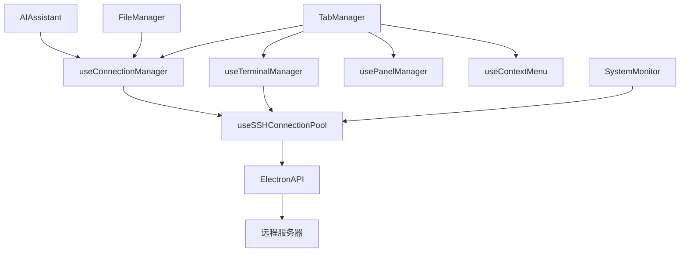

# 核心功能

<cite>
**本文档引用的文件**
- [TabManager.vue](file://src/components/TabManager.vue)
- [useSSHConnectionPool.js](file://src/composables/useSSHConnectionPool.js)
- [useConnectionManager.ts](file://src/composables/useConnectionManager.ts)
- [ConnectingState.vue](file://src/components/connection/ConnectingState.vue)
- [DisconnectedState.vue](file://src/components/connection/DisconnectedState.vue)
- [ConnectionFailedState.vue](file://src/components/connection/ConnectionFailedState.vue)
- [SystemMonitor.vue](file://src/components/SystemMonitor.vue)
- [AIAssistant.vue](file://src/modules/ai-assistant/components/AIAssistant.vue)
- [FileManager.vue](file://src/modules/file-manager/components/FileManager.vue)
- [XTerminal.vue](file://src/modules/terminal/components/XTerminal.vue)
</cite>

## 目录
1. [功能概述](#功能概述)
2. [SSH连接管理](#ssh连接管理)
3. [终端模拟](#终端模拟)
4. [文件管理](#文件管理)
5. [AI助手](#ai助手)
6. [系统监控](#系统监控)
7. [核心集成机制](#核心集成机制)

## 功能概述

sshcode是一款集成了SSH连接管理、终端模拟、文件管理、AI助手和系统监控五大核心功能的远程连接管理平台。这些功能通过统一的标签页系统和连接池机制紧密集成，为用户提供高效、安全的远程服务器操作体验。

在用户工作流中，SSH连接是所有远程操作的基础，为后续的终端交互、文件管理和系统监控提供连接支持。终端和文件管理作为主要的交互界面，分别负责命令行操作和文件系统浏览。AI助手通过智能命令建议和自然语言交互，显著提升操作效率。系统监控则提供实时的服务器性能反馈，帮助用户及时了解服务器状态。

所有功能通过`TabManager`实现多会话支持和统一的用户界面，并通过`useSSHConnectionPool`实现连接的高效管理和复用。连接状态管理（ConnectingState、DisconnectedState）和错误处理机制（ConnectionFailedState）在整个系统中保持设计一致性，确保用户体验的连贯性。

## SSH连接管理

SSH连接管理是sshcode所有功能的基础，负责建立、维护和管理与远程服务器的安全连接。该模块通过`useConnectionManager`组合式函数和`useSSHConnectionPool`连接池服务协同工作，实现了连接的全生命周期管理。

连接过程通过`ConnectingState`组件提供可视化反馈，显示连接步骤（解析主机地址、身份验证、建立SSH连接）和取消连接选项。连接成功后，状态变为`connected`，用户可以进行后续操作。当连接断开时，`DisconnectedState`组件提供重新连接的选项。如果连接失败，`ConnectionFailedState`组件会显示错误信息，并提供重试连接和编辑配置的选项。

连接管理模块支持多种认证方式，包括密码和SSH密钥，并通过ElectronAPI与后端服务通信，确保连接的安全性和可靠性。连接状态在标签栏中通过不同颜色的指示器直观显示，方便用户快速了解各会话的状态。

**Section sources**
- [useConnectionManager.ts](file://src/composables/useConnectionManager.ts#L1-L540)
- [ConnectingState.vue](file://src/components/connection/ConnectingState.vue#L1-L188)
- [DisconnectedState.vue](file://src/components/connection/DisconnectedState.vue#L1-L68)
- [ConnectionFailedState.vue](file://src/components/connection/ConnectionFailedState.vue#L1-L98)

## 终端模拟

终端模拟功能通过`XTerminal`组件实现，为用户提供完整的SSH终端体验。该组件基于xterm.js库构建，支持标准的终端功能，包括命令输入、输出显示、文本选择和快捷键操作。

终端支持智能命令补全，结合本地命令数据库和AI助手提供的建议，帮助用户快速输入命令。用户可以通过Tab键触发自动补全，通过上下箭头键在建议列表中导航。F4键可以切换AI补全的启用状态，Ctrl+Space可以手动触发补全。

终端输入通过`TerminalInputBox`组件独立管理，与终端显示分离，提供更好的用户体验。终端支持ANSI转义序列的解析，能够正确显示彩色输出和特殊格式。通过`ResizeHandle`组件，用户可以调整终端和输入框的相对大小，以适应不同的工作需求。

**Section sources**
- [XTerminal.vue](file://src/modules/terminal/components/XTerminal.vue#L1-L1622)
- [TerminalInputBox.vue](file://src/modules/terminal/components/TerminalInputBox.vue)

## 文件管理

文件管理功能通过`FileManager`组件实现，提供SFTP文件浏览器，支持远程文件的浏览、上传、下载和管理操作。用户可以通过工具栏的导航控件在目录间移动，或直接在路径输入框中输入路径进行跳转。

文件列表以表格形式显示，包括文件名、大小、权限和修改时间等信息。用户可以通过双击打开文件或目录，通过右键菜单执行更多操作。支持文件的多选操作，可以同时下载或删除多个文件。

文件管理支持拖拽上传，用户可以将本地文件拖放到文件管理区域进行上传。通过`createNewFile`和`createNewDirectory`功能，用户可以在远程服务器上创建新的文件或目录。文件的重命名和删除操作都有确认提示，防止误操作。

**Section sources**
- [FileManager.vue](file://src/modules/file-manager/components/FileManager.vue#L1-L1550)

## AI助手

AI助手功能通过`AIAssistant`组件和`useAIChat`组合式函数实现，为用户提供智能命令建议和自然语言交互能力。用户可以通过自然语言描述操作意图，AI助手会将其转换为具体的SSH命令并执行。

AI助手支持命令执行建议，当用户输入部分命令时，会提供相关的完整命令建议。对于危险命令，AI助手会进行检测和保护，提醒用户潜在风险。通过`CommandExecution`组件，AI助手可以显示命令执行的实时输出和结果。

AI助手与终端深度集成，可以通过事件系统接收命令执行状态，并在聊天界面中显示执行进度。用户可以查看工具调用历史，重试失败的命令，或清除聊天记录。AI助手还支持多AI提供商，可以根据需要配置不同的AI服务。

**Section sources**
- [AIAssistant.vue](file://src/modules/ai-assistant/components/AIAssistant.vue)
- [useAIChat.ts](file://src/modules/ai-assistant/composables/useAIChat.ts#L1-L619)

## 系统监控

系统监控功能通过`SystemMonitor`组件实现，提供实时的服务器性能监控。该组件通过`useSSHConnectionPool`的批量命令执行功能，定期获取服务器的CPU使用率、内存使用率、磁盘使用率、网络速率、系统负载和进程数等关键指标。

监控数据以直观的图表形式显示，CPU、内存和磁盘使用率通过进度条展示，网络速率以上传和下载速度分别显示，系统负载显示1分钟、5分钟和15分钟的平均值。所有数据每秒更新一次，确保用户能够及时了解服务器状态。

系统监控还显示连接池的状态，包括错误次数、最后使用时间和最后错误信息，帮助用户诊断连接问题。连接状态通过不同颜色的标签显示，绿色表示已连接，黄色表示连接中，红色表示连接失败或已断开。

**Section sources**
- [SystemMonitor.vue](file://src/components/SystemMonitor.vue#L1-L343)
- [useSSHConnectionPool.js](file://src/composables/useSSHConnectionPool.js#L1-L260)

## 核心集成机制

sshcode的核心功能通过`TabManager`和`useSSHConnectionPool`两大机制紧密集成，实现了功能的统一和高效管理。

`TabManager`作为核心的用户界面管理器，负责管理所有标签页的创建、切换和关闭。它通过`useConnectionManager`管理连接状态，通过`useTerminalManager`处理终端交互，通过`usePanelManager`管理三面板布局的大小调整。`TabManager`确保了多会话支持，用户可以在不同服务器间快速切换，而不会丢失任何会话状态。

`useSSHConnectionPool`作为核心的连接管理服务，实现了SSH连接的池化管理。它通过`createPersistentConnection`创建持久连接，通过`executeBatchCommand`批量执行监控命令，通过`checkConnectionHealth`检查连接健康状态。连接池定期清理超时或错误的连接，确保连接资源的有效利用。

连接状态管理在所有组件中保持一致性，`ConnectingState`、`DisconnectedState`和`ConnectionFailedState`组件在不同连接状态下提供统一的用户界面和交互方式。错误处理机制通过`getConnectionStatus`获取连接状态，并在状态异常时采取相应的恢复措施，如重新连接或关闭连接。

**Diagram sources**
- [TabManager.vue](file://src/components/TabManager.vue#L1-L364)
- [useConnectionManager.ts](file://src/composables/useConnectionManager.ts#L1-L540)
- [useSSHConnectionPool.js](file://src/composables/useSSHConnectionPool.js#L1-L260)

**Section sources**
- [TabManager.vue](file://src/components/TabManager.vue#L1-L364)
- [useSSHConnectionPool.js](file://src/composables/useSSHConnectionPool.js#L1-L260)