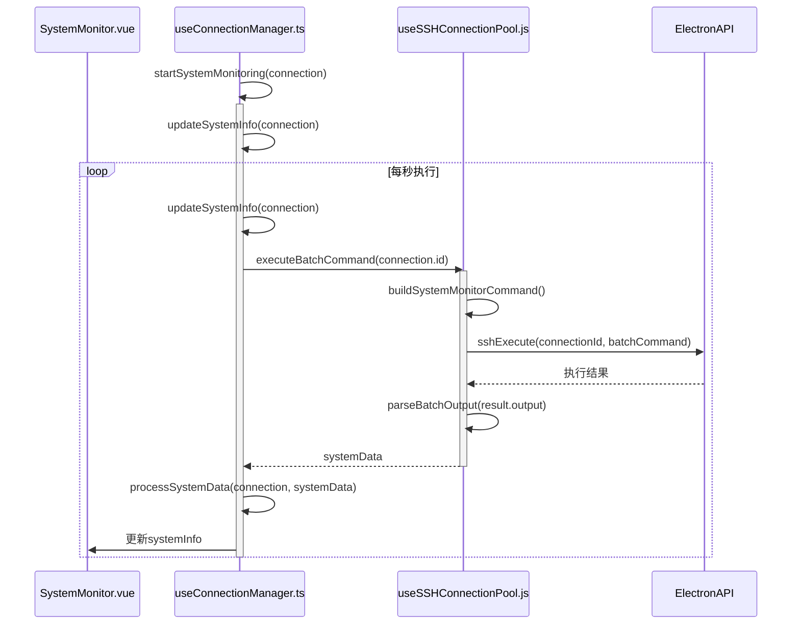
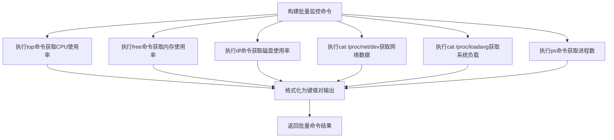
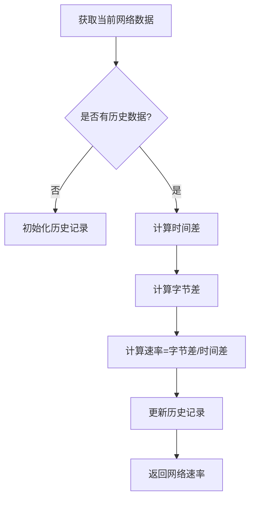
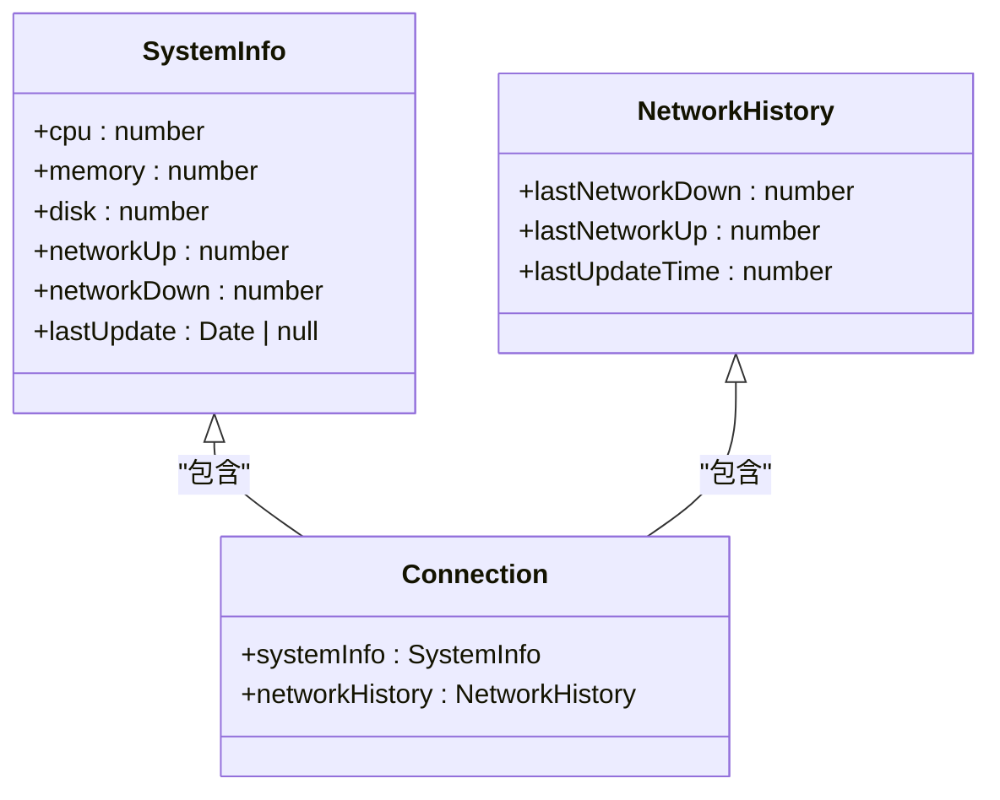

# 系统监控

<cite>
**Referenced Files in This Document**  
- [SystemMonitor.vue](file://src/components/SystemMonitor.vue)
- [useConnectionManager.ts](file://src/composables/useConnectionManager.ts)
- [useSSHConnectionPool.js](file://src/composables/useSSHConnectionPool.js)
- [ssh.ts](file://src/types/ssh.ts)
- [formatters.ts](file://src/utils/formatters.ts)
</cite>

## 目录
1. [简介](#简介)
2. [核心组件](#核心组件)
3. [系统监控数据流](#系统监控数据流)
4. [批量命令执行机制](#批量命令执行机制)
5. [网络速率计算算法](#网络速率计算算法)
6. [数据模型与响应式更新](#数据模型与响应式更新)
7. [性能优化与稳定性](#性能优化与稳定性)
8. [结论](#结论)

## 简介
本系统监控功能通过`SystemMonitor.vue`组件实时可视化展示服务器资源使用情况，包括CPU、内存、磁盘和网络等关键指标。系统采用高效的批量命令执行机制，通过连接池每秒获取服务器状态数据，并利用响应式编程实现界面的实时更新。监控系统还实现了异常阈值告警和历史趋势显示功能，为用户提供全面的服务器健康状况视图。

## 核心组件

`SystemMonitor.vue`组件是系统监控功能的可视化核心，负责展示服务器资源使用情况。该组件通过`useConnectionManager`提供的`systemInfo`对象获取实时监控数据，并以直观的进度条和数值形式展示CPU、内存、磁盘使用率以及网络速率等信息。

组件采用响应式设计，当连接状态变化时，会动态更新状态指示器的颜色和文本。监控数据显示采用网格布局，确保在不同屏幕尺寸下都能良好呈现。网络速率部分特别设计为上下行分离显示，使用不同颜色区分上传和下载流量，提升用户体验。

**Section sources**
- [SystemMonitor.vue](file://src/components/SystemMonitor.vue#L1-L343)

## 系统监控数据流

系统监控功能的数据流始于`useConnectionManager`中的`startSystemMonitoring`函数，该函数在SSH连接建立后被调用。此函数初始化网络历史记录，并设置每秒执行一次`updateSystemInfo`的定时器，确保监控数据的实时性。

**Diagram sources**
- [useConnectionManager.ts](file://src/composables/useConnectionManager.ts#L389-L410)
- [useConnectionManager.ts](file://src/composables/useConnectionManager.ts#L420-L452)
- [useSSHConnectionPool.js](file://src/composables/useSSHConnectionPool.js#L46-L103)

**Section sources**
- [useConnectionManager.ts](file://src/composables/useConnectionManager.ts#L389-L452)

## 批量命令执行机制

系统监控采用批量命令执行机制，通过`buildSystemMonitorCommand`函数生成包含多个系统信息查询命令的Shell脚本。该脚本一次性执行`top`、`free`、`df`、`cat /proc/net/dev`等命令，有效减少了SSH连接的往返次数，提高了数据获取效率。

**Diagram sources**
- [useSSHConnectionPool.js](file://src/composables/useSSHConnectionPool.js#L106-L135)
- [useSSHConnectionPool.js](file://src/composables/useSSHConnectionPool.js#L138-L173)

**Section sources**
- [useSSHConnectionPool.js](file://src/composables/useSSHConnectionPool.js#L106-L135)
- [useSSHConnectionPool.js](file://src/composables/useSSHConnectionPool.js#L138-L173)

## 网络速率计算算法

网络速率计算基于历史数据差值实现动态更新。系统维护`networkHistory`对象，记录上一次的网络收发字节数和时间戳。每次获取新数据时，通过计算当前与历史数据的差值除以时间间隔，得到实时的网络速率。

该算法确保了网络速率的平滑更新，避免了瞬时波动对用户体验的影响。计算结果经过`Math.round`处理，确保显示值的整洁性，同时使用`Math.max(0, ...)`确保速率值不会出现负数。

**Diagram sources**
- [useConnectionManager.ts](file://src/composables/useConnectionManager.ts#L455-L503)

**Section sources**
- [useConnectionManager.ts](file://src/composables/useConnectionManager.ts#L455-L503)

## 数据模型与响应式更新

系统信息数据模型`SystemInfo`定义了CPU、内存、磁盘、网络等监控指标的结构。该模型通过Vue的响应式系统与`SystemMonitor.vue`组件绑定，确保数据更新时界面自动刷新。

**Diagram sources**
- [ssh.ts](file://src/types/ssh.ts#L66-L73)
- [ssh.ts](file://src/types/ssh.ts#L75-L81)
- [ssh.ts](file://src/types/ssh.ts#L48-L64)

**Section sources**
- [ssh.ts](file://src/types/ssh.ts#L66-L81)

## 性能优化与稳定性

系统监控功能在设计时充分考虑了性能影响与稳定性。采样频率设置为每秒一次，平衡了实时性与服务器负载。批量命令选择轻量级的系统命令，避免对目标服务器造成过大压力。

在高负载服务器上，系统通过连接池的错误计数机制保障监控稳定性。当连续三次执行失败时，连接将被标记为错误状态，防止无效的监控请求持续消耗资源。同时，系统实现了优雅的错误处理，当获取监控数据失败时，会保持上一次的有效数据，避免界面显示异常。

**Section sources**
- [useSSHConnectionPool.js](file://src/composables/useSSHConnectionPool.js#L46-L103)
- [useConnectionManager.ts](file://src/composables/useConnectionManager.ts#L420-L452)

## 结论

本系统监控功能通过高效的批量命令执行、精确的网络速率计算和响应式数据更新，实现了对服务器资源使用情况的实时可视化。系统设计充分考虑了性能优化和稳定性保障，在高负载环境下仍能可靠运行。未来可进一步优化采样频率自适应调整和历史数据持久化存储，提升监控系统的智能化水平。