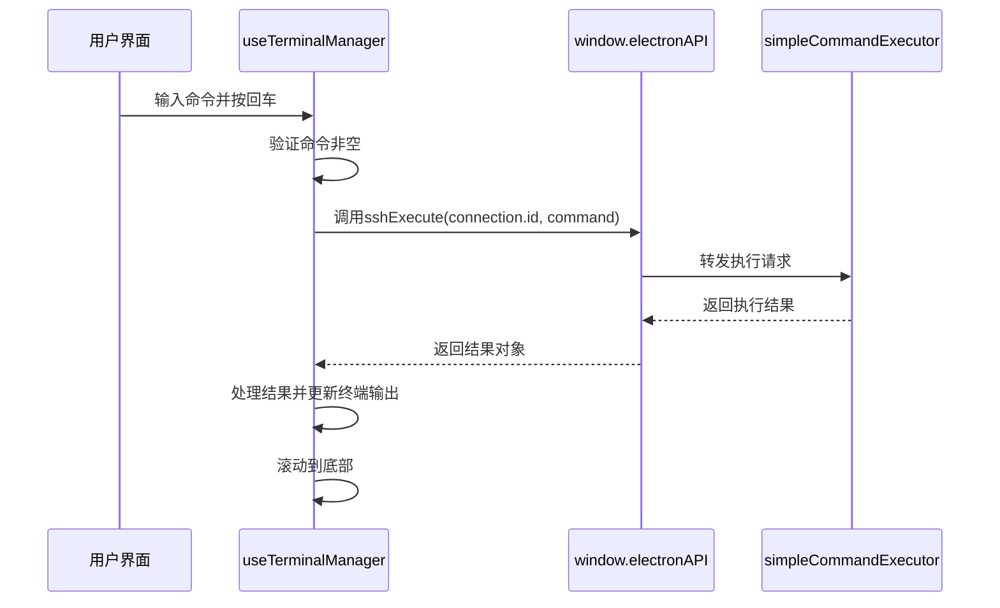
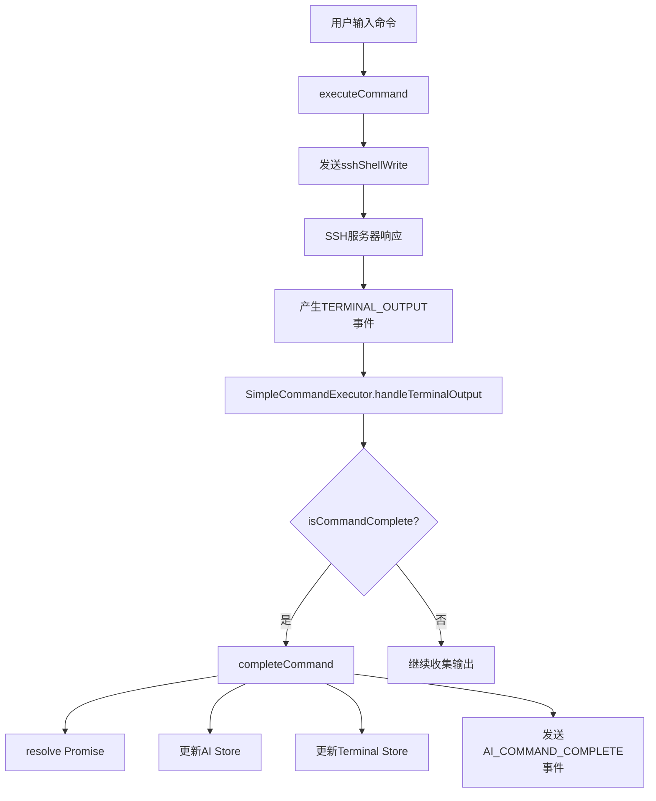
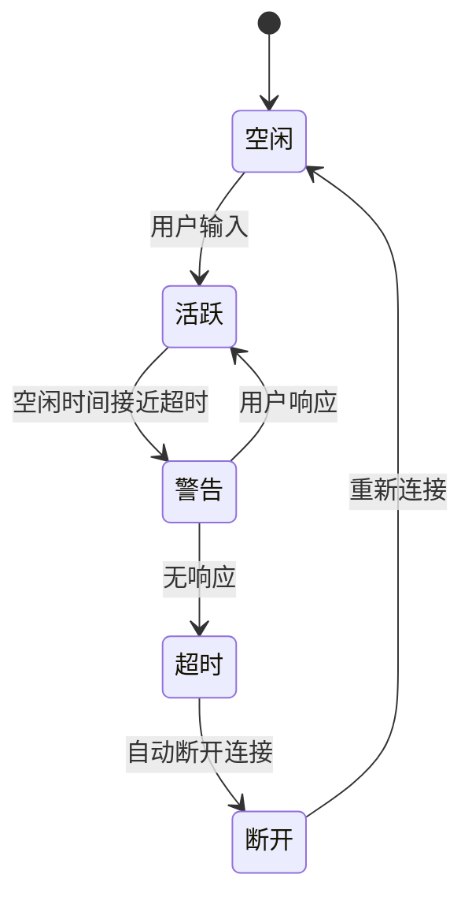
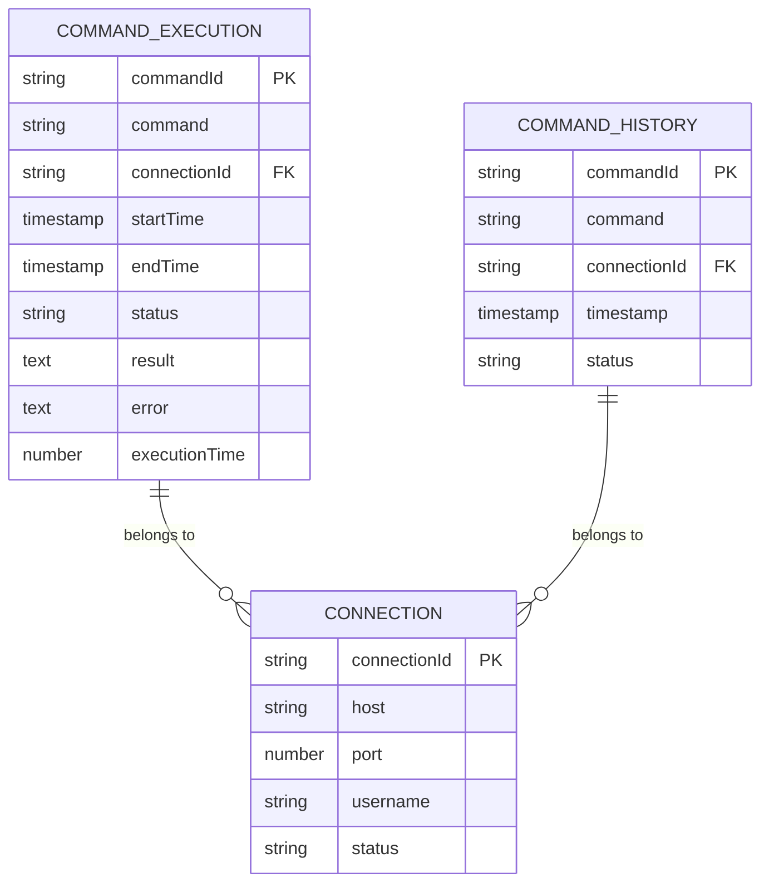

# 命令执行

<cite>
**Referenced Files in This Document**   
- [useTerminalManager.ts](file://src/modules/terminal/composables/useTerminalManager.ts)
- [simpleCommandExecutor.ts](file://src/modules/terminal/utils/simpleCommandExecutor.ts)
- [terminalTimeoutManager.ts](file://src/modules/terminal/utils/terminalTimeoutManager.ts)
- [useElectronAPI.ts](file://src/hooks/useElectronAPI.ts)
- [eventSystem.ts](file://src/utils/eventSystem.ts)
- [ai.ts](file://src/modules/ai-assistant/stores/ai.ts)
- [terminal.js](file://src/modules/terminal/stores/terminal.js)
- [events.ts](file://src/types/events.ts)
</cite>

## 目录
1. [命令执行流程概述](#命令执行流程概述)
2. [核心组件分析](#核心组件分析)
3. [事件驱动机制](#事件驱动机制)
4. [超时管理机制](#超时管理机制)
5. [命令历史与状态管理](#命令历史与状态管理)
6. [安全与性能考量](#安全与性能考量)

## 命令执行流程概述

本系统实现了从用户输入到远程SSH命令执行的完整流程，通过Electron主进程IPC通信实现跨进程调用。整个流程始于用户在终端输入框中输入命令并按下回车键，触发`useTerminalManager`中的`executeCommand`函数。该函数通过`window.electronAPI.sshExecute`接口与Electron主进程通信，将命令发送到远程SSH服务器执行。系统采用事件驱动架构，通过监听`TERMINAL_OUTPUT`事件来判断命令完成状态，并结合正则表达式检测终端提示符变化。整个流程设计注重用户体验和系统稳定性，包含完善的错误处理、超时管理和状态跟踪机制。

**Section sources**
- [useTerminalManager.ts](file://src/modules/terminal/composables/useTerminalManager.ts#L7-L51)

## 核心组件分析

### useTerminalManager 组件

`useTerminalManager`是终端管理的核心组合式函数，负责处理用户输入、执行命令和管理终端状态。其`executeCommand`函数是命令执行的入口点，接收连接对象作为参数，从连接对象中提取当前命令进行执行。该函数首先验证ElectronAPI的可用性和连接状态，然后调用`window.electronAPI.sshExecute`执行远程命令。执行结果通过`addTerminalOutput`函数添加到终端输出流中，成功时显示命令输出，失败时显示错误信息。最后调用`scrollToBottom`确保终端视图滚动到底部，保持用户可见性。



**Diagram sources**
- [useTerminalManager.ts](file://src/modules/terminal/composables/useTerminalManager.ts#L7-L51)

**Section sources**
- [useTerminalManager.ts](file://src/modules/terminal/composables/useTerminalManager.ts#L3-L268)

### simpleCommandExecutor 组件

`simpleCommandExecutor`是简化版命令执行器，采用Promise和事件系统替代复杂的消息队列，提供更高效的命令执行机制。该组件通过`executeCommand`方法对外提供服务，接收命令字符串、连接ID和可选参数。执行过程首先检查`window.electronAPI.sshShellWrite`接口的可用性，然后创建Promise并存储在`pendingCommands` Map中，同时设置超时定时器。命令通过`sshShellWrite`接口发送到SSH会话，后续通过监听`TERMINAL_OUTPUT`事件来收集输出并判断命令完成状态。

```mermaid
classDiagram
class SimpleCommandExecutor {
-pendingCommands : Map
-commandHistory : Array
-maxHistorySize : number
-defaultTimeout : number
+executeCommand(command, connectionId, options) : Promise
+handleTerminalOutput(data) : void
+isCommandComplete(latestData, allOutput) : boolean
+completeCommand(commandId) : void
+handleCommandTimeout(commandId, command, executionTime) : void
+cleanupCommand(commandId) : void
}
class CommandInfo {
+command : string
+connectionId : string
+resolve : Function
+reject : Function
+startTime : number
+output : Array
+completed : boolean
+timeoutId : Timeout
}
SimpleCommandExecutor --> CommandInfo : "存储"
SimpleCommandExecutor --> "EventTypes.TERMINAL_OUTPUT" : "监听"
SimpleCommandExecutor --> "window.electronAPI" : "调用"
```

**Diagram sources**
- [simpleCommandExecutor.ts](file://src/modules/terminal/utils/simpleCommandExecutor.ts#L9-L458)

**Section sources**
- [simpleCommandExecutor.ts](file://src/modules/terminal/utils/simpleCommandExecutor.ts#L9-L458)

## 事件驱动机制

### 事件系统架构

系统采用轻量级事件系统`eventSystem.ts`实现组件间的松耦合通信。该系统基于`mitt`库构建，定义了`EventTypes`枚举来规范事件类型，包括AI相关事件、终端相关事件和系统事件。`SimpleCommandExecutor`通过`onEvent`函数监听`TERMINAL_OUTPUT`事件，当收到终端输出数据时，触发`handleTerminalOutput`方法处理输出。事件系统还支持优先级、历史记录和组件级监听管理，确保事件处理的可靠性和可追溯性。



**Diagram sources**
- [eventSystem.ts](file://src/utils/eventSystem.ts#L11-L33)
- [simpleCommandExecutor.ts](file://src/modules/terminal/utils/simpleCommandExecutor.ts#L12-L25)

**Section sources**
- [eventSystem.ts](file://src/utils/eventSystem.ts#L1-L287)
- [simpleCommandExecutor.ts](file://src/modules/terminal/utils/simpleCommandExecutor.ts#L12-L25)

### 命令完成检测

`isCommandComplete`方法通过正则表达式检测终端提示符来判断命令是否完成。该方法首先清理ANSI转义序列，然后检查输出末尾是否匹配常见的shell提示符模式，包括Linux系统的`$`、`#`提示符和Windows系统的`>`提示符。检测逻辑考虑了多种情况：正常命令执行完成、命令错误后返回提示符、以及输出包含换行符的情况。通过结合提示符检测和输出长度变化，确保准确判断命令完成状态，避免误判。

**Section sources**
- [simpleCommandExecutor.ts](file://src/modules/terminal/utils/simpleCommandExecutor.ts#L270-L300)

## 超时管理机制

### 命令超时处理

系统默认设置60秒命令超时，通过`setTimeout`实现超时控制。当命令执行超过指定时间，超时定时器触发`handleCommandTimeout`方法，记录超时事件、通知AI Store并清理相关资源。超时处理不仅rejects Promise，还通过事件系统通知相关组件，确保状态一致性。`defaultTimeout`属性可配置，允许根据不同场景调整超时阈值。超时清理包括清除定时器和从`pendingCommands`中移除命令记录，防止内存泄漏。

**Section sources**
- [simpleCommandExecutor.ts](file://src/modules/terminal/utils/simpleCommandExecutor.ts#L10-L11)

### 连接空闲超时

`terminalTimeoutManager.ts`负责管理SSH连接的空闲超时，默认10分钟无活动自动断开。该管理器通过`initConnection`初始化连接监控，`updateActivity`更新活动时间戳，`setupTimers`设置警告和超时定时器。支持在超时前30秒发送警告，给予用户操作机会。管理器维护连接状态映射，支持暂停、恢复和清理操作，确保资源的合理利用和连接的安全性。



**Diagram sources**
- [terminalTimeoutManager.ts](file://src/modules/terminal/utils/terminalTimeoutManager.ts#L10-L11)

**Section sources**
- [terminalTimeoutManager.ts](file://src/modules/terminal/utils/terminalTimeoutManager.ts#L1-L297)

## 命令历史与状态管理

### 命令历史存储

系统通过`commandHistory`数组存储执行过的命令，限制最大历史记录数为50条。`addToHistory`方法负责添加新记录，自动移除最旧的记录以保持容量限制。历史记录包含命令ID、命令内容、执行结果、执行时间和状态等信息，支持后续查询和分析。历史记录不仅用于用户界面展示，还为AI助手提供上下文信息，支持命令重试和模式识别。

**Section sources**
- [simpleCommandExecutor.ts](file://src/modules/terminal/utils/simpleCommandExecutor.ts#L400-L415)

### 状态管理与同步

系统采用集中式状态管理，通过Pinia store同步命令执行状态。`useAIStore`跟踪AI相关的工具调用状态，包括执行中、完成、错误和超时等状态；`useTerminalStore`管理终端相关的命令状态和连接信息。当命令状态变化时，`simpleCommandExecutor`通过`recordCommandStart`、`recordCommandComplete`等方法更新两个store的状态，确保UI和其他组件能实时反映命令执行情况。状态同步还通过事件系统广播，实现跨组件的状态一致性。



**Diagram sources**
- [ai.ts](file://src/modules/ai-assistant/stores/ai.ts#L18-L271)
- [terminal.js](file://src/modules/terminal/stores/terminal.js#L8-L215)

**Section sources**
- [ai.ts](file://src/modules/ai-assistant/stores/ai.ts#L18-L271)
- [terminal.js](file://src/modules/terminal/stores/terminal.js#L8-L215)
- [events.ts](file://src/types/events.ts#L1-L51)

## 安全与性能考量

### 安全防护措施

系统在命令执行过程中实施了多层安全防护。输入验证确保命令非空，防止空命令执行。通过`window.electronAPI`接口的可用性检查，避免在Electron环境不可用时尝试执行命令。命令发送前进行清理，移除多余的换行符。错误处理机制捕获并记录所有异常，防止未处理的Promise rejection。此外，系统通过限制输出历史记录大小（1000条）和命令历史记录大小（50条），防止内存溢出。

### 性能优化策略

系统采用多种性能优化策略提升用户体验。异步执行避免阻塞主线程，保持界面响应性。事件驱动架构减少轮询开销，提高资源利用效率。输出缓冲区管理限制历史记录大小，防止内存过度消耗。`pendingCommands` Map使用连接ID和命令ID作为键，确保快速查找和状态管理。超时机制防止长时间挂起的命令占用资源。状态管理采用响应式设计，仅在状态变化时更新UI，减少不必要的渲染。

**Section sources**
- [useTerminalManager.ts](file://src/modules/terminal/composables/useTerminalManager.ts#L200-L215)
- [simpleCommandExecutor.ts](file://src/modules/terminal/utils/simpleCommandExecutor.ts#L100-L110)