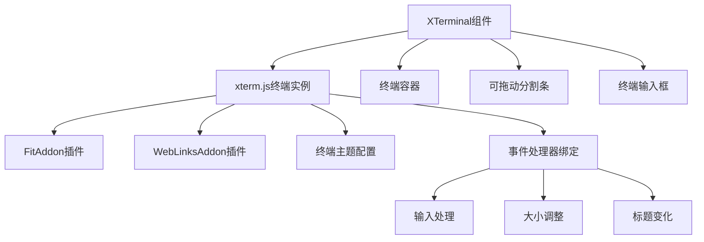
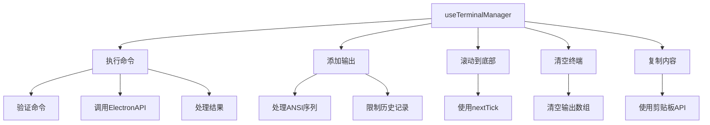
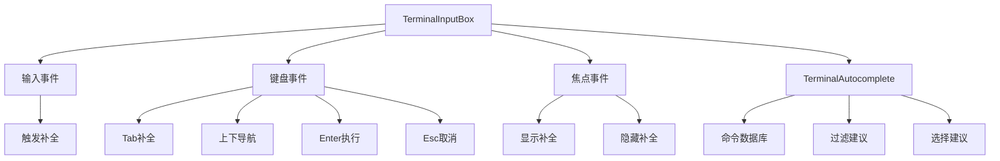
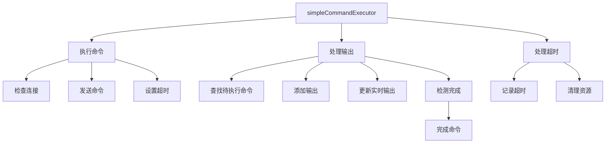
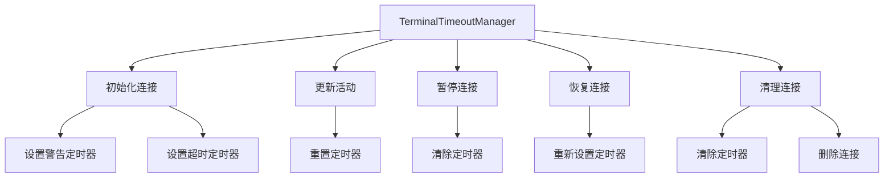
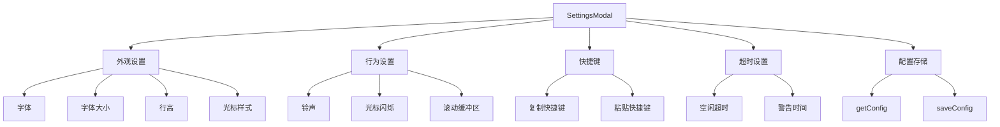
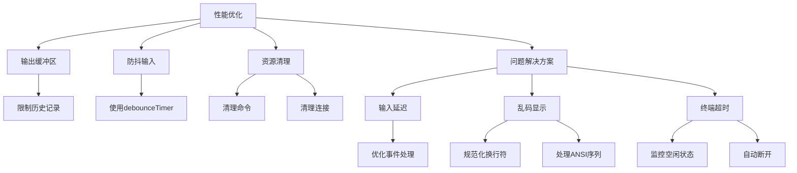

# 终端功能

<cite>
**本文档引用的文件**   
- [XTerminal.vue](file://src/modules/terminal/components/XTerminal.vue)
- [useTerminalManager.ts](file://src/modules/terminal/composables/useTerminalManager.ts)
- [TerminalInputBox.vue](file://src/modules/terminal/components/TerminalInputBox.vue)
- [TerminalAutocomplete.vue](file://src/modules/terminal/components/TerminalAutocomplete.vue)
- [simpleCommandExecutor.ts](file://src/modules/terminal/utils/simpleCommandExecutor.ts)
- [terminalTimeoutManager.ts](file://src/modules/terminal/utils/terminalTimeoutManager.ts)
- [SettingsModal.vue](file://src/components/SettingsModal.vue)
- [main.ts](file://main.ts)
- [preload.ts](file://preload.ts)
- [electron.d.ts](file://src/types/electron.d.ts)
- [terminal.js](file://src/modules/terminal/stores/terminal.js)
</cite>

## 目录
1. [终端功能](#终端功能)
2. [XTerminal组件与xterm.js集成](#xterminal组件与xtermjs集成)
3. [终端会话状态管理](#终端会话状态管理)
4. [用户交互与自动补全](#用户交互与自动补全)
5. [命令执行与响应解析](#命令执行与响应解析)
6. [超时管理机制](#超时管理机制)
7. [终端数据流与通信路径](#终端数据流与通信路径)
8. [配置选项说明](#配置选项说明)
9. [性能优化与问题解决方案](#性能优化与问题解决方案)

## XTerminal组件与xterm.js集成

XTerminal组件是终端功能的核心渲染组件，它通过集成xterm.js库实现了终端的可视化渲染。该组件在初始化时创建xterm.js终端实例，并配置了多种插件和主题。终端实例的创建过程包括设置字体、字号、主题颜色等外观属性，以及配置FitAddon和WebLinksAddon插件来实现自适应大小和链接识别功能。

终端的渲染过程通过`initTerminal`方法实现，该方法创建终端实例并绑定各种事件处理器。终端的输入输出通过`handleTerminalData`和`write`方法处理，其中`normalizeLineBreaks`函数用于规范化换行符，避免多余的空行。终端的样式通过CSS深度选择器`:deep()`进行定制，确保文本选择、滚动条和选择区域的视觉效果符合应用的整体设计。



**图源**
- [XTerminal.vue](file://src/modules/terminal/components/XTerminal.vue#L3-L268)

**本节源**
- [XTerminal.vue](file://src/modules/terminal/components/XTerminal.vue#L3-L268)

## 终端会话状态管理

终端会话状态通过`useTerminalManager`组合式函数进行管理，该函数提供了终端会话的核心功能。`useTerminalManager`接收活动连接、活动标签ID、事件发射器和ANSI转换器作为参数，返回一系列用于管理终端会话的方法。

会话状态管理的核心功能包括命令执行、输出添加、滚动控制、清空终端和复制内容。`executeCommand`方法负责执行SSH命令，它首先验证命令的有效性，然后通过ElectronAPI调用`sshExecute`方法执行命令，并将结果添加到终端输出中。`addTerminalOutput`方法处理ANSI转义序列，将其转换为HTML格式，并限制输出历史记录的数量以优化性能。



**图源**
- [useTerminalManager.ts](file://src/modules/terminal/composables/useTerminalManager.ts#L3-L268)

**本节源**
- [useTerminalManager.ts](file://src/modules/terminal/composables/useTerminalManager.ts#L3-L268)

## 用户交互与自动补全

终端的用户交互设计通过TerminalInputBox和TerminalAutocomplete组件实现。TerminalInputBox组件提供了一个独立的终端输入框，包含提示符、主输入框和发送按钮。该组件支持多种交互功能，包括键盘导航、Tab补全、历史记录和AI辅助。

自动补全逻辑通过TerminalAutocomplete组件实现，该组件维护一个本地命令数据库，包含文件操作、系统信息、网络工具、Git命令等多种常用命令。当用户输入时，`filterSuggestions`方法会根据输入内容过滤匹配的命令，优先显示精确匹配，然后是模糊匹配和描述匹配。用户可以通过上下箭头键导航建议列表，按Enter键选择建议，或按Esc键取消补全。



**图源**
- [TerminalInputBox.vue](file://src/modules/terminal/components/TerminalInputBox.vue#L3-L268)
- [TerminalAutocomplete.vue](file://src/modules/terminal/components/TerminalAutocomplete.vue#L3-L268)

**本节源**
- [TerminalInputBox.vue](file://src/modules/terminal/components/TerminalInputBox.vue#L3-L268)
- [TerminalAutocomplete.vue](file://src/modules/terminal/components/TerminalAutocomplete.vue#L3-L268)

## 命令执行与响应解析

命令执行与响应解析通过simpleCommandExecutor工具实现。该工具使用Promise和事件系统替代复杂的消息队列，提供了一个简化的命令执行器。`SimpleCommandExecutor`类维护一个待执行命令的映射，每个命令都有唯一的ID、连接ID、解析函数、拒绝函数和超时ID。

命令执行过程包括发送命令到SSH Shell、监听终端输出、检测命令完成和处理超时。`executeCommand`方法首先检查连接状态，然后发送命令到SSH Shell，并设置超时。`handleTerminalOutput`方法监听终端输出，当检测到命令完成的标志（如提示符）时，调用`completeCommand`方法完成命令执行。`isCommandComplete`方法通过正则表达式检测输出中是否包含命令完成的标志。



**图源**
- [simpleCommandExecutor.ts](file://src/modules/terminal/utils/simpleCommandExecutor.ts#L3-L268)

**本节源**
- [simpleCommandExecutor.ts](file://src/modules/terminal/utils/simpleCommandExecutor.ts#L3-L268)

## 超时管理机制

终端超时管理通过terminalTimeoutManager工具实现。该工具负责监控SSH连接的空闲状态，并在超时时自动断开连接。`TerminalTimeoutManager`类维护一个连接映射，存储每个连接的超时信息，包括空闲超时时间、警告时间、最后活动时间和活动状态。

超时管理的核心功能包括初始化连接、更新活动状态、设置定时器和清理资源。`initConnection`方法初始化连接的超时监控，设置警告和超时定时器。`updateActivity`方法更新连接的活动状态，并重置定时器。`setupTimers`方法设置警告和超时定时器，当连接空闲时间达到警告时间时发送警告，达到超时时间时断开连接。



**图源**
- [terminalTimeoutManager.ts](file://src/modules/terminal/utils/terminalTimeoutManager.ts#L3-L268)

**本节源**
- [terminalTimeoutManager.ts](file://src/modules/terminal/utils/terminalTimeoutManager.ts#L3-L268)

## 终端数据流与通信路径

终端数据流从用户输入开始，经过Electron主进程IPC通信，最终在远程SSH服务器上执行。用户在TerminalInputBox中输入命令后，`handleTerminalKeydown`方法处理Enter键事件，调用`executeCommand`方法执行命令。该方法通过ElectronAPI调用`sshExecute`方法，将命令发送到Electron主进程。

在Electron主进程中，`ipcMain.handle('ssh-execute')`处理器接收命令，通过ssh2库的`conn.exec`方法在远程服务器上执行命令。命令的输出通过`stream.on('data')`事件发送回渲染进程，`mainWindow.webContents.send('terminal-data')`方法将输出数据发送到渲染进程。渲染进程通过`onTerminalData`事件监听器接收数据，并将其显示在终端中。

```mermaid
graph LR
A[用户输入] --> B[TerminalInputBox]
B --> C[useTerminalManager]
C --> D[ElectronAPI]
D --> E[ipcMain]
E --> F[ssh2 conn.exec]
F --> G[远程SSH服务器]
G --> H[命令执行]
H --> I[输出数据]
I --> J[stream.on('data')]
J --> K[mainWindow.webContents.send]
K --> L[渲染进程]
L --> M[onTerminalData]
M --> N[终端显示]
```

**图源**
- [main.ts](file://main.ts#L3-L268)
- [preload.ts](file://preload.ts#L3-L268)
- [electron.d.ts](file://src/types/electron.d.ts#L3-L268)

**本节源**
- [main.ts](file://main.ts#L3-L268)
- [preload.ts](file://preload.ts#L3-L268)
- [electron.d.ts](file://src/types/electron.d.ts#L3-L268)

## 配置选项说明

终端功能提供了丰富的配置选项，用户可以通过设置模态框进行自定义。外观设置包括字体、字体大小、行高、光标样式等。行为设置包括启用铃声、光标闪烁、滚动缓冲区大小等。快捷键设置允许用户自定义复制和粘贴的快捷键。超时设置包括空闲超时时间和超时警告时间。

配置选项通过SettingsModal组件实现，该组件使用响应式数据绑定和表单控件管理设置。设置数据存储在应用配置中，通过`getConfig`和`saveConfig`方法进行读取和保存。终端主题、字体大小、行数限制等配置直接影响终端的外观和行为。



**图源**
- [SettingsModal.vue](file://src/components/SettingsModal.vue#L3-L268)

**本节源**
- [SettingsModal.vue](file://src/components/SettingsModal.vue#L3-L268)

## 性能优化与问题解决方案

终端功能通过多种策略进行性能优化，包括输出缓冲区管理、防抖输入处理和资源清理。输出缓冲区通过限制历史记录数量（最多1000条，保留最后500条）来优化内存使用。防抖输入处理通过`debounceTimer`实现，避免频繁触发补全建议。资源清理通过`clearAllCommands`和`clearAllConnections`方法实现，确保在连接断开或应用关闭时释放所有资源。

常见问题如输入延迟和乱码显示有相应的解决方案。输入延迟通过优化事件处理和减少不必要的计算来解决。乱码显示通过规范化换行符和正确处理ANSI转义序列来解决。终端超时问题通过terminalTimeoutManager工具进行监控和管理，确保连接在空闲时自动断开。



**图源**
- [useTerminalManager.ts](file://src/modules/terminal/composables/useTerminalManager.ts#L3-L268)
- [terminalTimeoutManager.ts](file://src/modules/terminal/utils/terminalTimeoutManager.ts#L3-L268)

**本节源**
- [useTerminalManager.ts](file://src/modules/terminal/composables/useTerminalManager.ts#L3-L268)
- [terminalTimeoutManager.ts](file://src/modules/terminal/utils/terminalTimeoutManager.ts#L3-L268)