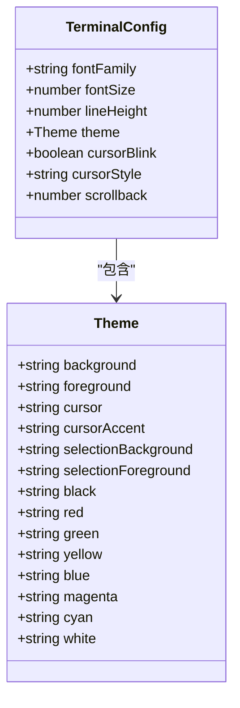
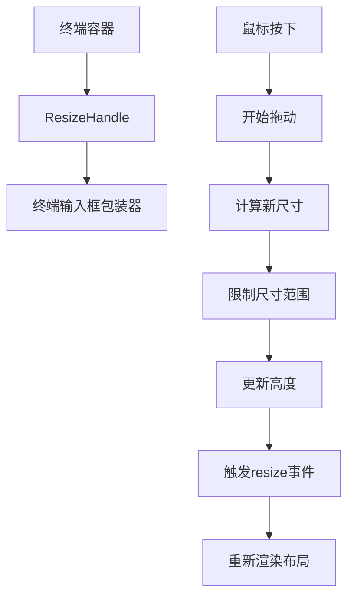
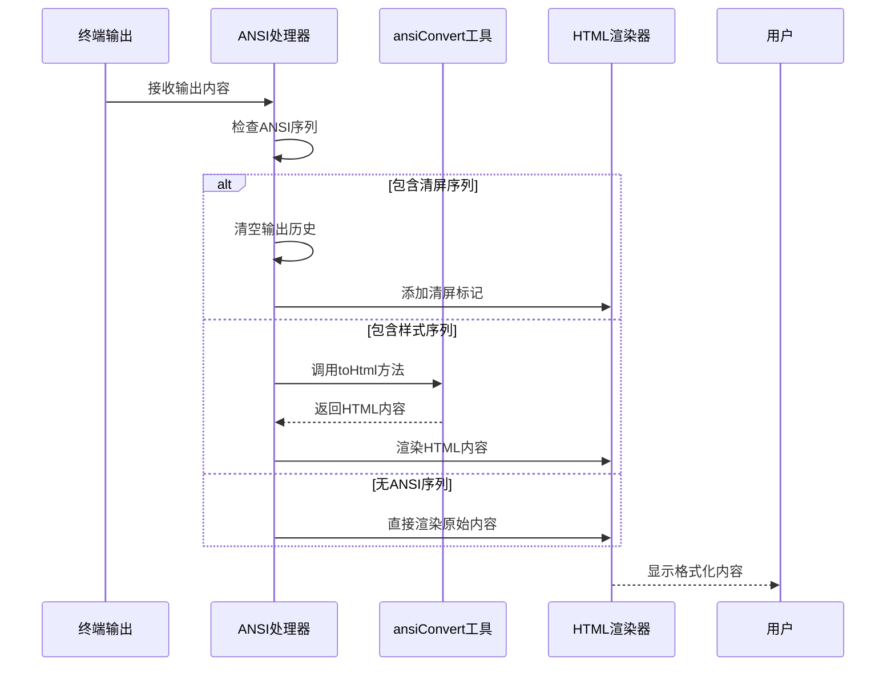
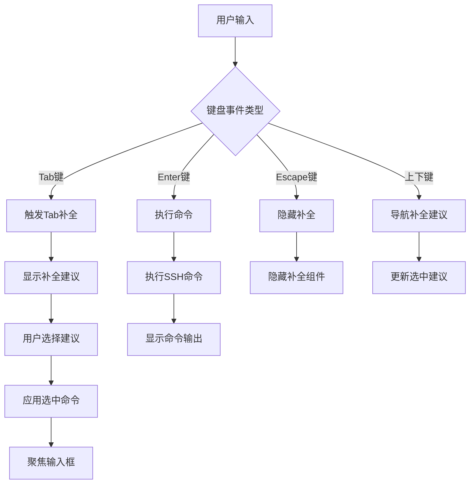
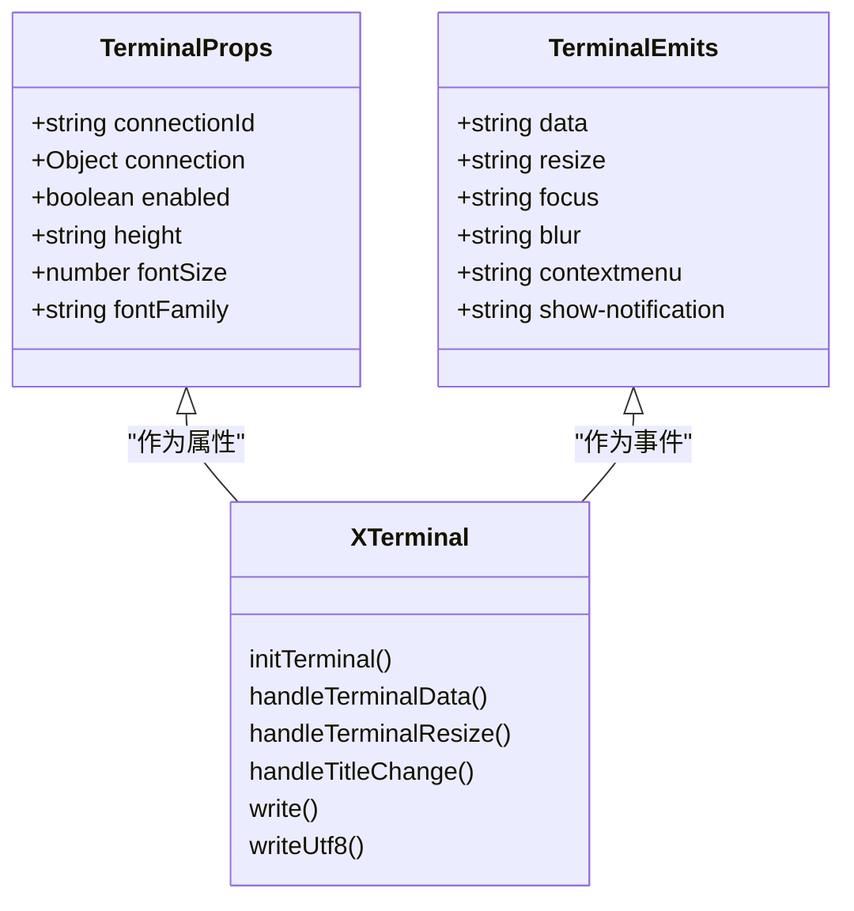

# 终端渲染

<cite>
**本文档引用文件**   
- [XTerminal.vue](file://src/modules/terminal/components/XTerminal.vue)
- [ResizeHandle.vue](file://src/components/ui/ResizeHandle.vue)
- [useTerminalManager.ts](file://src/modules/terminal/composables/useTerminalManager.ts)
- [SettingsModal.vue](file://src/components/SettingsModal.vue)
</cite>

## 目录
1. [简介](#简介)
2. [XTerminal组件初始化流程](#xterminal组件初始化流程)
3. [主题与字体配置](#主题与字体配置)
4. [自适应布局与分割机制](#自适应布局与分割机制)
5. [ANSI转义序列处理](#ansi转义序列处理)
6. [用户交互功能实现](#用户交互功能实现)
7. [性能优化策略](#性能优化策略)
8. [常见问题与解决方案](#常见问题与解决方案)
9. [代码配置示例](#代码配置示例)

## 简介
XTerminal组件是基于xterm.js库构建的终端渲染核心模块，提供完整的终端模拟功能。该组件实现了终端的初始化、主题配置、字体设置、自适应布局等关键功能，并通过集成ResizeHandle组件实现可拖动分割布局。组件支持ANSI转义序列处理、用户交互操作和性能优化，为用户提供流畅的终端使用体验。

## XTerminal组件初始化流程
XTerminal组件的初始化流程始于`initTerminal`方法的调用。该方法首先检查终端容器是否存在，然后创建xterm.js终端实例，配置包括字体大小、字体家族、主题颜色等基本属性。初始化过程中，组件会加载FitAddon和WebLinksAddon两个插件，分别用于终端自适应大小和链接识别功能。

终端实例创建后，组件会绑定关键事件处理器，包括`onData`用于处理用户输入，`onResize`用于响应大小变化，以及`onTitleChange`用于处理标题变更。通过`attachCustomKeyEventHandler`方法，组件实现了自定义键盘事件处理，支持Tab补全、上下键导航等智能功能。最后，终端实例被挂载到DOM元素上，并通过`fitAddon.fit()`方法进行自适应调整。

**Section sources**
- [XTerminal.vue](file://src/modules/terminal/components/XTerminal.vue#L557-L600)

## 主题与字体配置
XTerminal组件支持灵活的主题和字体配置。主题配置通过终端实例的`theme`属性实现，包含背景色、前景色、光标颜色、选择区域颜色等20多种颜色定义。默认主题采用深色配色方案，背景色为#1e1e1e，前景色为#f0f0f0，光标为#74c0fc。

字体配置通过`fontSize`和`fontFamily`属性实现，支持自定义字体大小和字体家族。组件默认使用"Consolas, Monaco, 'Courier New', monospace"字体栈，确保在不同操作系统上都能显示等宽字体。用户可以通过设置模态框中的外观设置项来调整字体、字体大小和行高等参数。

**Diagram sources **
- [XTerminal.vue](file://src/modules/terminal/components/XTerminal.vue#L557-L600)
- [SettingsModal.vue](file://src/components/SettingsModal.vue#L276-L310)

**Section sources**
- [XTerminal.vue](file://src/modules/terminal/components/XTerminal.vue#L557-L600)
- [SettingsModal.vue](file://src/components/SettingsModal.vue#L276-L310)

## 自适应布局与分割机制
XTerminal组件通过与ResizeHandle组件的集成，实现了终端与输入框的可拖动分割布局。组件结构包含三个主要部分：终端容器、可拖动分割条和终端输入框包装器。分割条组件支持水平和垂直方向的拖动调整，通过`@resize`事件监听器实时更新输入框高度。

布局机制采用CSS Flexbox和相对定位相结合的方式。终端容器占据主要空间，输入框包装器通过`height`属性动态调整大小。当用户拖动分割条时，`handleResize`方法会计算新的尺寸，并在`minSize`和`maxSize`范围内进行限制，确保布局的合理性。分割条的视觉反馈通过CSS过渡效果实现，提供平滑的用户体验。

**Diagram sources **
- [XTerminal.vue](file://src/modules/terminal/components/XTerminal.vue#L1-L799)
- [ResizeHandle.vue](file://src/components/ui/ResizeHandle.vue#L0-L343)

**Section sources**
- [XTerminal.vue](file://src/modules/terminal/components/XTerminal.vue#L1-L799)
- [ResizeHandle.vue](file://src/components/ui/ResizeHandle.vue#L0-L343)

## ANSI转义序列处理
终端输出内容的ANSI转义序列处理是通过`ansiConvert`工具实现的。当接收到终端输出时，`addTerminalOutput`方法会检查内容是否包含清屏命令的ANSI序列（如`\x1b[2J`或`\x1b[H`）。如果包含清屏序列，组件会清空终端输出历史并添加清屏标记；否则，使用`ansiConvert.toHtml`方法将ANSI序列转换为HTML格式。

转换后的HTML内容被标记为`isHtml: true`，并在终端中安全渲染。这种处理方式确保了颜色、样式等ANSI效果能够正确显示，同时避免了潜在的安全风险。如果转换过程中发生错误，组件会保持原始内容并记录警告信息，保证终端功能的稳定性。

**Diagram sources **
- [useTerminalManager.ts](file://src/modules/terminal/composables/useTerminalManager.ts#L80-L123)

**Section sources**
- [useTerminalManager.ts](file://src/modules/terminal/composables/useTerminalManager.ts#L80-L123)

## 用户交互功能实现
XTerminal组件实现了丰富的用户交互功能，包括终端滚动、清屏和复制内容等操作。滚动功能通过`scrollToBottom`方法实现，该方法使用`nextTick`确保DOM更新完成后，将终端容器的滚动位置设置为最大值，实现自动滚动到底部的效果。

清屏功能由`clearTerminal`方法提供，该方法清空指定连接的终端输出历史，并添加"终端已清空"的信息行。复制功能通过`copyTerminalContent`方法实现，该方法收集所有输出行的内容，使用`navigator.clipboard.writeText`API复制到剪贴板，并通过事件通知用户操作结果。

组件还实现了Tab补全、上下键导航、Enter执行命令等键盘交互功能。通过`handleTerminalKeydown`方法，组件能够识别不同的键盘事件并执行相应的操作，如Tab键触发补全，Enter键执行命令，Escape键隐藏补全等。

**Section sources**
- [useTerminalManager.ts](file://src/modules/terminal/composables/useTerminalManager.ts#L3-L268)

## 性能优化策略
为确保终端的流畅运行，XTerminal组件实施了多项性能优化策略。输出历史记录限制是最关键的优化措施，通过在`addTerminalOutput`方法中检查输出历史长度，当超过1000行时，只保留最近的500行，有效控制内存使用。

滚动处理采用了防抖机制，`scrollToBottom`方法结合`nextTick`使用，确保在DOM更新完成后才执行滚动操作，避免了频繁的滚动调用。终端初始化时的插件加载和事件绑定也经过优化，确保只在必要时创建和注册，减少不必要的资源消耗。

对于大型输出，组件实现了换行符规范化功能，通过`normalizeLineBreaks`方法处理连续的换行符，避免产生过多的空行，同时保持必要的分隔效果。这种优化不仅提升了渲染性能，还改善了用户的阅读体验。

**Section sources**
- [useTerminalManager.ts](file://src/modules/terminal/composables/useTerminalManager.ts#L80-L123)

## 常见问题与解决方案
在使用XTerminal组件时，可能会遇到一些常见问题。乱码显示问题通常由字符编码不匹配引起，解决方案是确保SSH连接使用UTF-8编码，并在终端配置中正确设置字符集。可以通过检查`window.electronAPI.sshExecute`调用的返回数据编码来诊断此问题。

光标错位问题可能出现在终端大小变化后，解决方案是确保`fitAddon.fit()`方法在大小变化后被正确调用。可以通过监听`resize`事件并调用`handleTerminalResize`方法来解决此问题。另外，确保`scrollToBottom`方法在输出新内容后被调用，可以避免光标位置异常。

性能下降问题通常与输出历史记录过多有关，解决方案是严格执行输出历史限制策略。如果问题仍然存在，可以检查是否有频繁的不必要的渲染调用，并优化事件处理逻辑。对于大型数据输出，建议分批处理，避免一次性写入大量数据。

**Section sources**
- [useTerminalManager.ts](file://src/modules/terminal/composables/useTerminalManager.ts#L80-L123)
- [XTerminal.vue](file://src/modules/terminal/components/XTerminal.vue#L557-L600)

## 代码配置示例
以下是如何配置终端主题、行高和字体家族的代码示例。通过设置组件的props属性，可以轻松定制终端外观。字体家族配置支持多种字体的回退机制，确保在不同系统上都能显示合适的等宽字体。

**Diagram sources **
- [XTerminal.vue](file://src/modules/terminal/components/XTerminal.vue#L41-L91)

**Section sources**
- [XTerminal.vue](file://src/modules/terminal/components/XTerminal.vue#L41-L91)