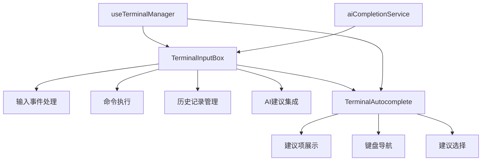
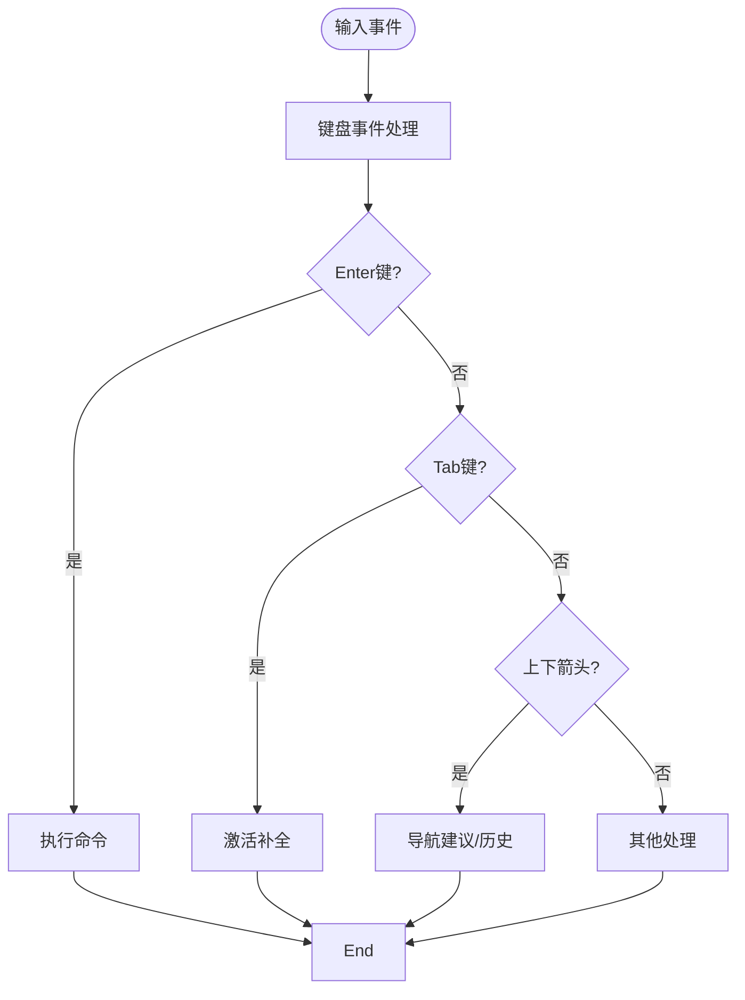
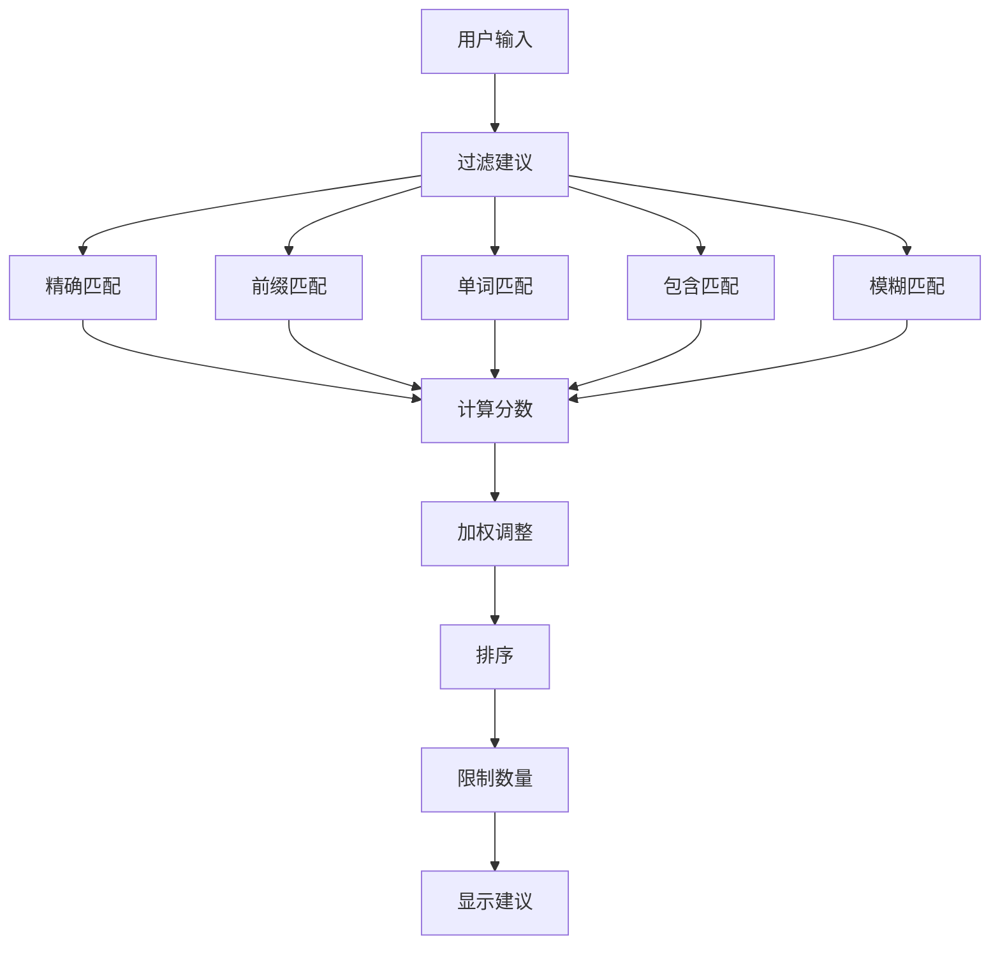
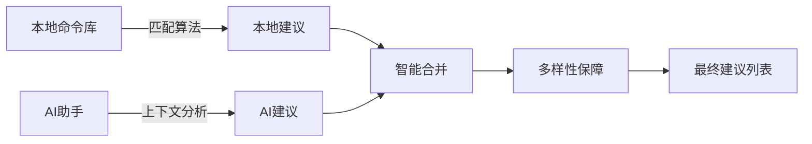
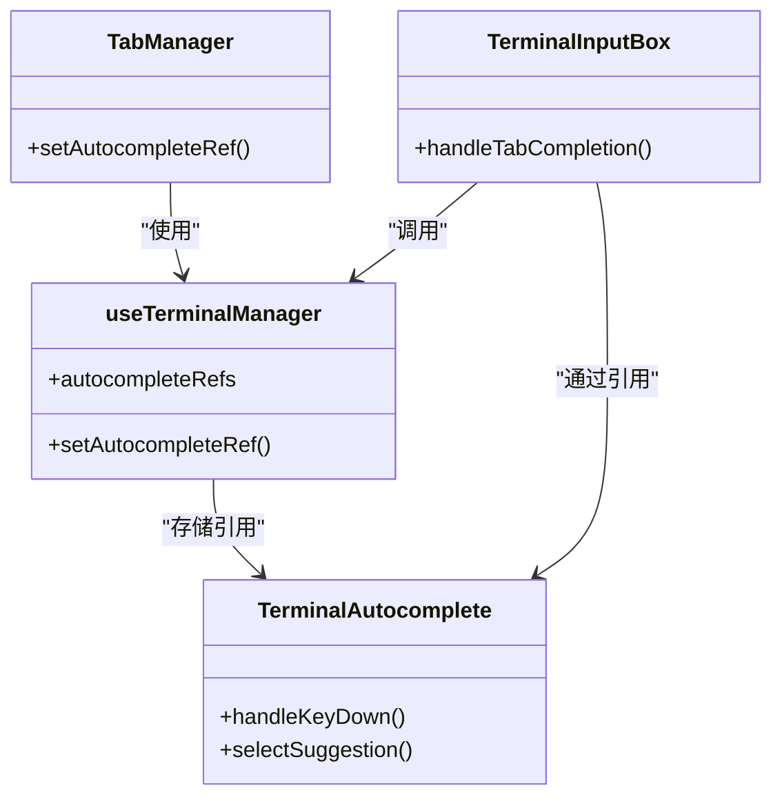

# 输入交互

<cite>
**本文档引用的文件**
- [TerminalInputBox.vue](file://src/modules/terminal/components/TerminalInputBox.vue)
- [TerminalAutocomplete.vue](file://src/modules/terminal/components/TerminalAutocomplete.vue)
- [useTerminalManager.ts](file://src/modules/terminal/composables/useTerminalManager.ts)
- [aiCompletionService.ts](file://src/modules/ai-assistant/utils/aiCompletionService.ts)
- [TabManager.vue](file://src/components/TabManager.vue)
</cite>

## 目录
1. [组件架构与关系](#组件架构与关系)
2. [用户输入事件处理机制](#用户输入事件处理机制)
3. [自动补全系统实现](#自动补全系统实现)
4. [智能建议融合策略](#智能建议融合策略)
5. [焦点管理与面板显示](#焦点管理与面板显示)
6. [组件间引用关系](#组件间引用关系)
7. [扩展与自定义](#扩展与自定义)
8. [常见问题解决方案](#常见问题解决方案)

## 组件架构与关系

终端输入系统由`TerminalInputBox`和`TerminalAutocomplete`两个核心组件构成，通过组合式API实现功能解耦与协作。`TerminalInputBox`作为主输入容器，负责处理用户输入、命令执行和历史记录管理；`TerminalAutocomplete`作为独立的自动补全组件，专注于建议项的展示与导航。两个组件通过事件机制和引用传递实现通信，形成清晰的职责分离。

**图示来源**
- [TerminalInputBox.vue](file://src/modules/terminal/components/TerminalInputBox.vue)
- [TerminalAutocomplete.vue](file://src/modules/terminal/components/TerminalAutocomplete.vue)
- [useTerminalManager.ts](file://src/modules/terminal/composables/useTerminalManager.ts)

## 用户输入事件处理机制

输入框通过`@keydown`、`@input`、`@focus`和`@blur`事件监听器构建完整的交互闭环。`handleKeyDown`方法采用事件分发模式，根据按键类型执行相应逻辑：Enter键触发命令执行，Tab键激活自动补全，上下箭头键在历史记录和建议项间导航。事件处理中使用`preventDefault()`阻止浏览器默认行为，确保终端交互的精确控制。

输入处理采用防抖技术，通过`debounceTimer`在用户停止输入300ms后触发建议过滤，平衡响应性与性能。`handleCompositionStart`和`handleCompositionEnd`专门处理中文输入法场景，避免在组合输入过程中触发不必要的建议更新。

**图示来源**
- [TerminalInputBox.vue](file://src/modules/terminal/components/TerminalInputBox.vue#L1800-L2100)

## 自动补全系统实现

自动补全系统采用多级匹配算法，结合精确匹配、前缀匹配、单词匹配、包含匹配和模糊匹配五种策略。匹配过程首先计算基础分数，然后根据命令优先级和使用频率进行加权。精确匹配得分为1.0，前缀匹配0.95，单词匹配0.85，包含匹配0.7，模糊匹配通过字符序列相似度计算。

建议项排序采用多维度策略：首先按置信度降序排列，其次按优先级排序，最后按命令长度升序排列，确保最相关、最常用的短命令优先展示。`ensureDiversity`函数确保建议列表包含多个类别，避免同类建议过度集中。

**图示来源**
- [TerminalInputBox.vue](file://src/modules/terminal/components/TerminalInputBox.vue#L1466-L1596)

## 智能建议融合策略

系统创新性地融合本地命令数据库与AI助手建议，创建混合智能补全体验。本地命令库包含超过150个常用命令，按文件操作、系统信息、网络工具等类别组织，每个命令标注优先级。AI建议通过`aiCompletionService`异步获取，该服务调用AI API分析输入上下文，生成情境感知的命令建议。

建议融合采用智能去重策略：当AI建议与本地命令重复时，提升置信度并标记为"混合建议"；否则直接合并。`mergeSuggestions`函数确保最终建议列表既包含可靠的本地命令，又包含创新的AI建议。AI建议的获取受`aiEnabled`开关控制，用户可随时启用或禁用。

**图示来源**
- [TerminalInputBox.vue](file://src/modules/terminal/components/TerminalInputBox.vue#L1591-L1636)
- [aiCompletionService.ts](file://src/modules/ai-assistant/utils/aiCompletionService.ts)

## 焦点管理与面板显示

自动补全面板的显示与隐藏由焦点状态和输入内容共同控制。获得焦点时，若输入框有内容则显示建议；失去焦点时，通过200ms延迟隐藏，确保用户能点击建议项。`handleFocus`和`handleBlur`事件处理器实现这一逻辑，配合`setTimeout`避免快速切换时的闪烁。

面板位置通过CSS绝对定位实现，始终位于输入框上方。`suggestionsDropdownStyle`计算属性根据建议数量动态调整最大高度和滚动行为，超过6个建议时启用垂直滚动。全局点击监听器`handleClickOutside`确保点击面板外区域时隐藏建议，提升用户体验。

**本节来源**
- [TerminalInputBox.vue](file://src/modules/terminal/components/TerminalInputBox.vue#L2200-L2300)

## 组件间引用关系

组件间通过`setAutocompleteRef`建立引用关系，实现跨组件方法调用。`useTerminalManager`中的`setAutocompleteRef`函数将`TerminalAutocomplete`实例存储在`autocompleteRefs`映射中，以连接ID为键。当`TerminalInputBox`需要与特定连接的自动补全组件交互时，通过连接ID查找对应引用。

`TabManager`作为父组件，在模板中通过`@set-autocomplete-ref`事件绑定建立这一关系。这种设计模式实现了组件间的松耦合，`TerminalInputBox`无需直接引用`TerminalAutocomplete`，而是通过组合式函数间接通信，符合Vue 3的最佳实践。

**图示来源**
- [useTerminalManager.ts](file://src/modules/terminal/composables/useTerminalManager.ts#L152-L156)
- [TabManager.vue](file://src/components/TabManager.vue#L45)

## 扩展与自定义

系统提供多种扩展点支持自定义需求。`filterSuggestions`方法可被重写以实现自定义匹配算法，`getFallbackSuggestions`允许添加领域特定的命令建议。历史记录管理通过`commandHistory`数组和`navigateHistory`函数实现，可轻松扩展为持久化存储。

输入验证可通过在`executeCommand`前添加验证逻辑实现，例如检查命令格式或参数合法性。快捷键扩展在`handleKeyDown`的switch语句中添加新case即可，支持Ctrl、Alt等修饰键组合。`defineExpose`暴露的`focus`、`clear`和`executeCommand`方法为外部控制提供API。

**本节来源**
- [TerminalInputBox.vue](file://src/modules/terminal/components/TerminalInputBox.vue#L2400-L2500)

## 常见问题解决方案

输入延迟通过防抖技术解决，将建议过滤延迟300ms，避免频繁计算。事件冒泡冲突通过`stopPropagation()`和精确的事件委托解决，确保自动补全的键盘导航不干扰主输入框。中文输入法问题通过`compositionstart`和`compositionend`事件监听器处理，在组合过程中暂停建议更新。

性能优化方面，本地命令匹配采用单次遍历多策略评估，避免重复过滤。AI建议使用5分钟缓存，减少API调用频率。建议列表限制为8项，确保渲染性能。`nextTick`用于确保DOM更新完成后再执行滚动等操作，避免异步更新问题。

**本节来源**
- [TerminalInputBox.vue](file://src/modules/terminal/components/TerminalInputBox.vue#L2000-L2200)