# AI交互类型

<cite>
**Referenced Files in This Document**   
- [ai.ts](file://src/types/ai.ts)
- [useAIChat.ts](file://src/modules/ai-assistant/composables/useAIChat.ts)
- [api.ts](file://src/types/api.ts)
- [aiService.ts](file://src/modules/ai-assistant/utils/aiService.ts)
- [ai.ts](file://src/modules/ai-assistant/stores/ai.ts)
- [aiCommandExecutor.ts](file://src/modules/ai-assistant/utils/aiCommandExecutor.ts)
</cite>

## 目录
1. [简介](#简介)
2. [核心数据结构](#核心数据结构)
3. [对话状态管理](#对话状态管理)
4. [AI配置与服务集成](#ai配置与服务集成)
5. [响应解析与操作生成](#响应解析与操作生成)
6. [智能建议与分类](#智能建议与分类)
7. [组件间通信与事件流](#组件间通信与事件流)
8. [错误处理与重试机制](#错误处理与重试机制)
9. [性能统计与监控](#性能统计与监控)

## 简介
本文档全面解析了SSHCode项目中AI助手功能的核心数据结构和交互机制。文档详细阐述了`AIMessage`、`ToolCall`、`CommandSuggestion`等关键类型的设计与用途，深入分析了`useAIChat`组合式函数如何协调AI对话流程，以及`ParsedResponse`如何解析AI响应并生成可执行操作。通过系统化的结构说明和流程图解，为开发者提供了对AI交互系统全面深入的理解。

## 核心数据结构

### AIMessage结构
`AIMessage`接口定义了AI对话中消息的基本结构，包含消息ID、角色、内容、时间戳以及工具调用信息。消息的角色（role）属性支持'user'、'assistant'、'system'和'tool'四种类型，用于区分消息来源和用途。

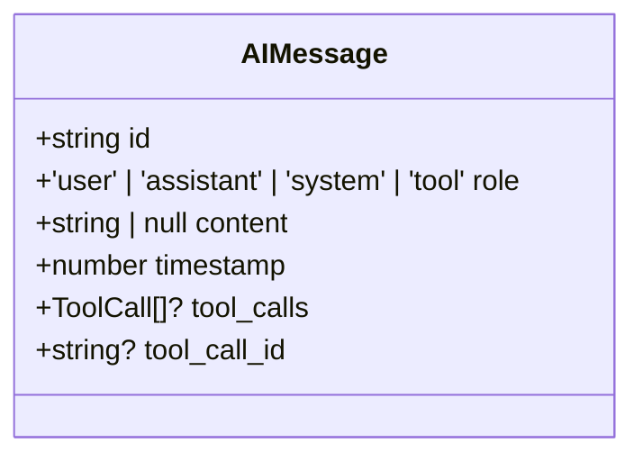

**Diagram sources**
- [ai.ts](file://src/types/ai.ts#L4-L11)

**Section sources**
- [ai.ts](file://src/types/ai.ts#L4-L11)

### ToolCall结构
`ToolCall`接口封装了AI生成的命令调用请求，包含调用ID、类型、函数名称和参数。该结构是AI与系统功能交互的核心，通过`function.arguments`字段传递JSON格式的命令参数。

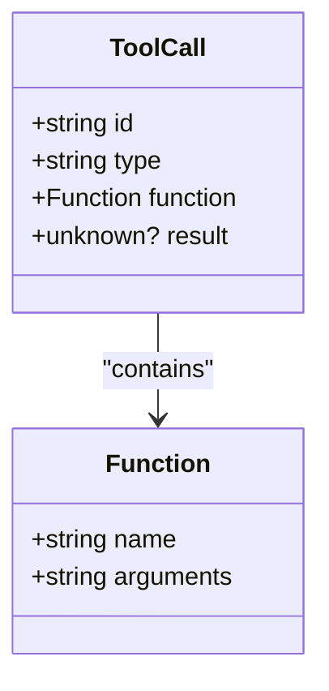

**Diagram sources**
- [ai.ts](file://src/types/ai.ts#L13-L21)

**Section sources**
- [ai.ts](file://src/types/ai.ts#L13-L21)

### CommandSuggestion结构
`CommandSuggestion`接口定义了命令建议的数据结构，包含命令文本、描述、置信度、类型和分类。分类（category）属性支持'git'、'package'、'service'等多种类型，用于智能建议的排序和过滤。

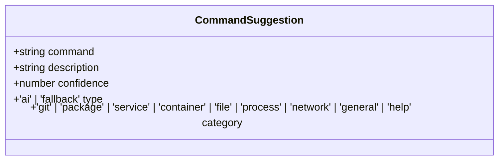

**Diagram sources**
- [ai.ts](file://src/types/ai.ts#L56-L71)

**Section sources**
- [ai.ts](file://src/types/ai.ts#L56-L71)

## 对话状态管理

### ToolCallHistoryItem结构
`ToolCallHistoryItem`接口扩展了`ToolCall`，增加了命令执行状态的完整记录。该结构通过`status`属性跟踪执行状态（executing/completed/error/timeout），并记录开始时间、结束时间、执行时长和结果。

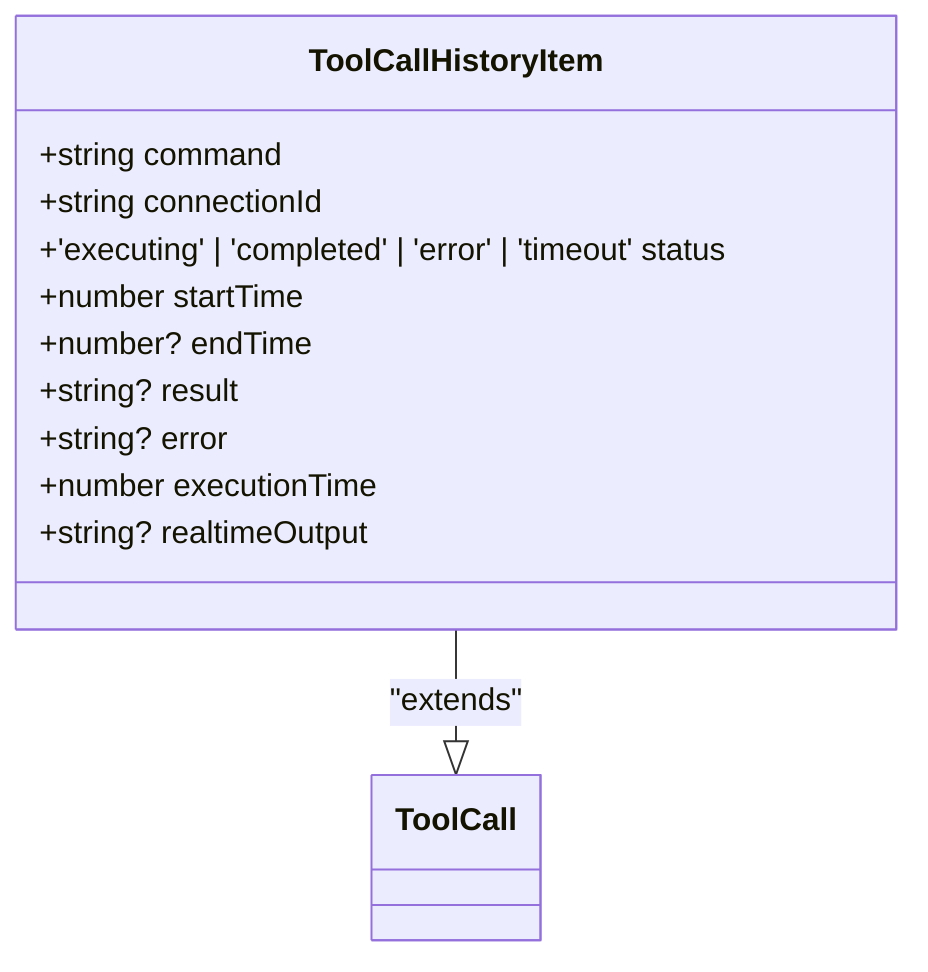

**Diagram sources**
- [ai.ts](file://src/types/ai.ts#L98-L108)

**Section sources**
- [ai.ts](file://src/types/ai.ts#L98-L108)

### 对话状态流转
AI助手的对话状态通过一系列事件和状态更新进行管理。当用户发送消息时，系统创建`AIMessage`并调用AI API。AI响应可能包含`tool_calls`，触发命令执行流程。

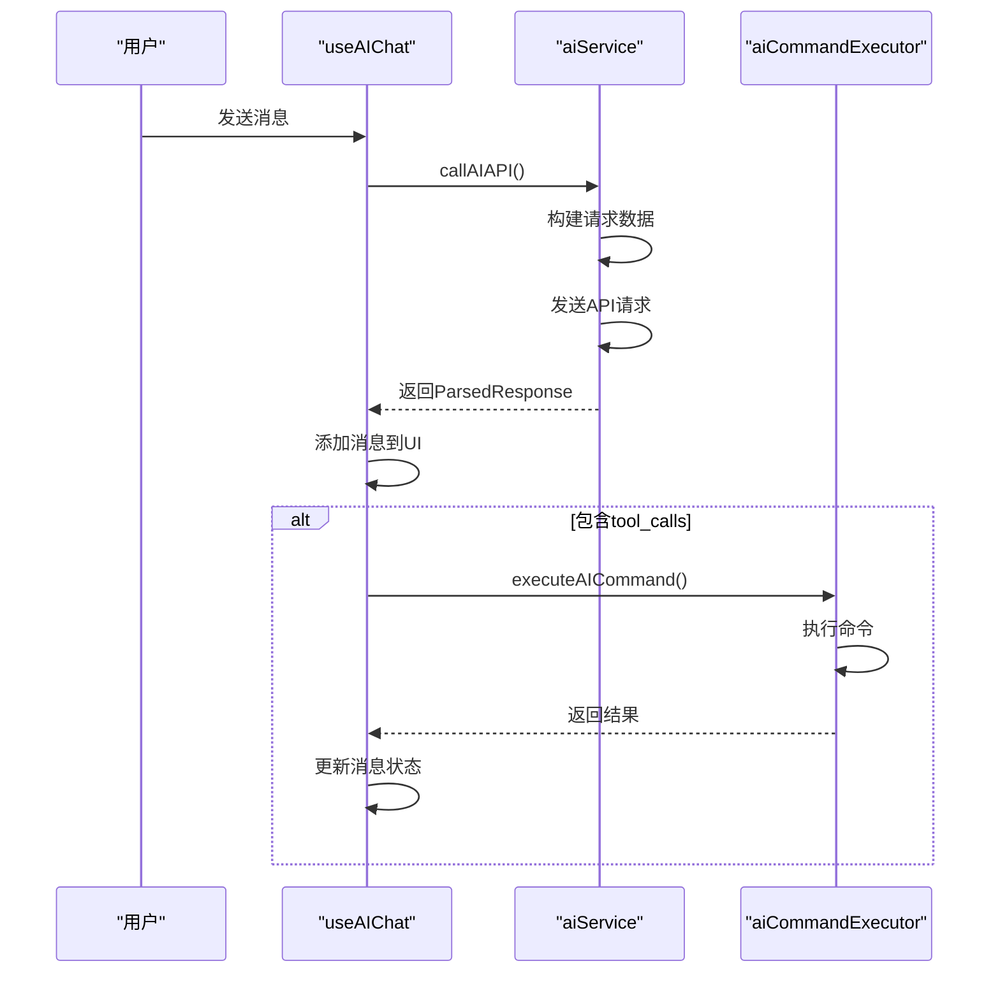

**Diagram sources**
- [useAIChat.ts](file://src/modules/ai-assistant/composables/useAIChat.ts#L150-L200)
- [aiService.ts](file://src/modules/ai-assistant/utils/aiService.ts#L311-L328)
- [aiCommandExecutor.ts](file://src/modules/ai-assistant/utils/aiCommandExecutor.ts#L18-L63)

**Section sources**
- [useAIChat.ts](file://src/modules/ai-assistant/composables/useAIChat.ts#L150-L200)
- [aiService.ts](file://src/modules/ai-assistant/utils/aiService.ts#L311-L328)

## AI配置与服务集成

### AIConfig结构
`AIConfig`接口定义了AI服务的配置项，包括基础URL、API密钥、模型名称等。这些配置项决定了AI服务的集成方式和行为特征。

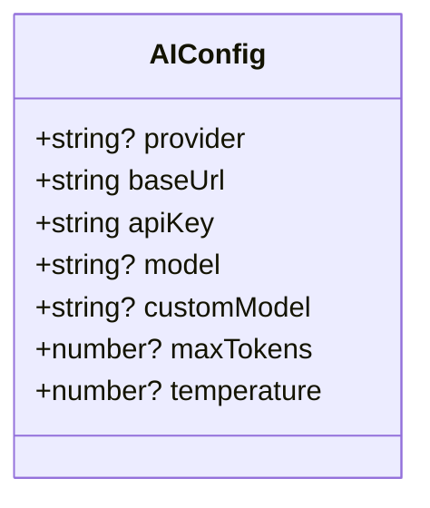

**Diagram sources**
- [ai.ts](file://src/types/ai.ts#L23-L31)

**Section sources**
- [ai.ts](file://src/types/ai.ts#L23-L31)

### 配置验证与获取
系统通过`getAIConfig`函数获取并验证AI配置。配置来源优先级为Electron API > 本地存储 > 默认值。验证失败时会触发配置设置引导。

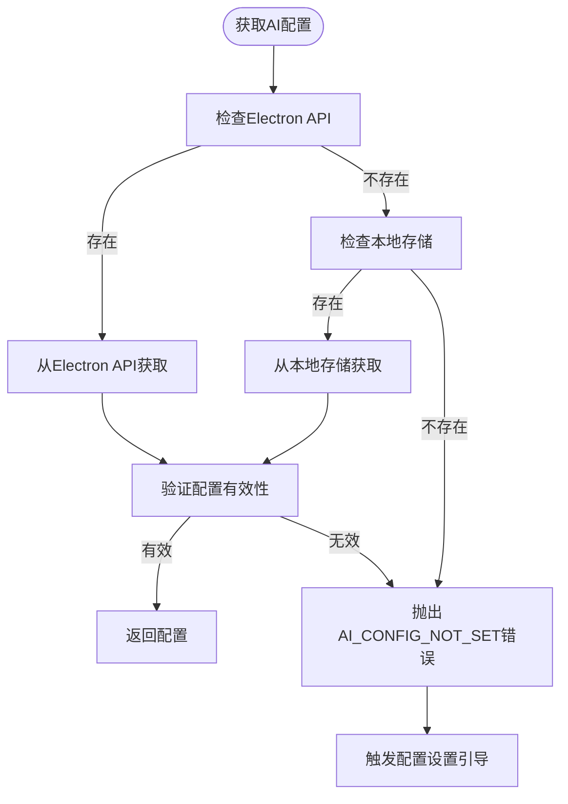

**Diagram sources**
- [aiService.ts](file://src/modules/ai-assistant/utils/aiService.ts#L34-L88)

**Section sources**
- [aiService.ts](file://src/modules/ai-assistant/utils/aiService.ts#L34-L88)

## 响应解析与操作生成

### ParsedResponse结构
`ParsedResponse`接口定义了AI响应的解析结果，包含内容文本和可执行操作列表。操作（actions）字段包含ID、类型、标签和命令，用于生成UI上的可点击按钮。

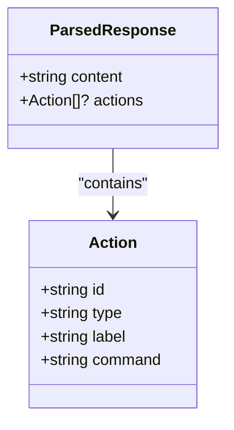

**Diagram sources**
- [ai.ts](file://src/types/ai.ts#L33-L41)

**Section sources**
- [ai.ts](file://src/types/ai.ts#L33-L41)

### 响应解析流程
`parseAIResponse`函数负责解析AI返回的文本内容，提取代码块中的命令并生成可执行操作。解析过程优先处理代码块，然后是行内代码。

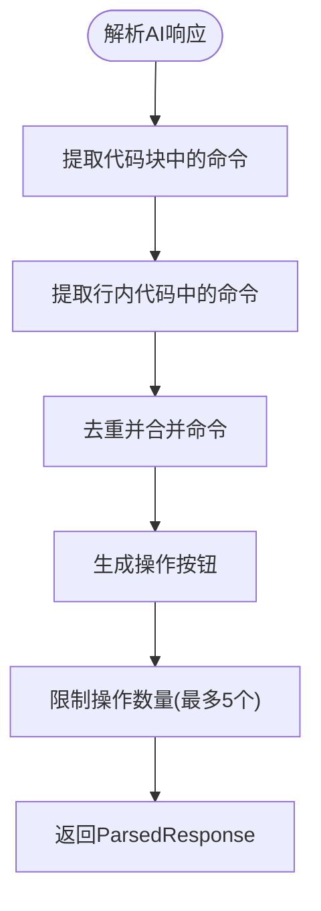

**Diagram sources**
- [aiService.ts](file://src/modules/ai-assistant/utils/aiService.ts#L658-L685)

**Section sources**
- [aiService.ts](file://src/modules/ai-assistant/utils/aiService.ts#L658-L685)

### APIResponse泛型设计
`APIResponse<T>`接口采用泛型设计，统一处理不同AI接口的响应结构。该设计支持`success`、`data`、`output`、`error`等标准字段，确保了API响应处理的一致性。

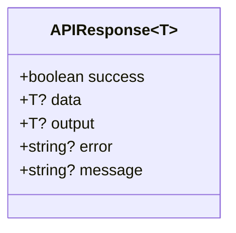

**Diagram sources**
- [ai.ts](file://src/types/ai.ts#L183-L189)
- [api.ts](file://src/types/api.ts#L4-L10)

**Section sources**
- [ai.ts](file://src/types/ai.ts#L183-L189)
- [api.ts](file://src/types/api.ts#L4-L10)

## 智能建议与分类

### 建议分类体系
`CommandSuggestion`的分类（category）属性构建了一个多维度的建议体系，支持'git'、'package'、'service'、'container'、'file'、'process'、'network'、'general'和'help'九种类型。该分类体系使系统能够根据上下文智能推荐相关命令。

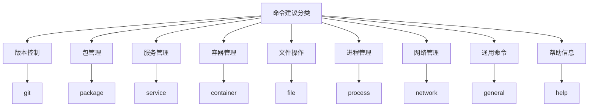

**Diagram sources**
- [ai.ts](file://src/types/ai.ts#L62-L71)

**Section sources**
- [ai.ts](file://src/types/ai.ts#L62-L71)

### 置信度排序机制
系统利用`confidence`属性对建议进行排序，高置信度的建议优先显示。置信度计算基于命令与当前上下文的相关性、历史执行成功率和用户偏好。

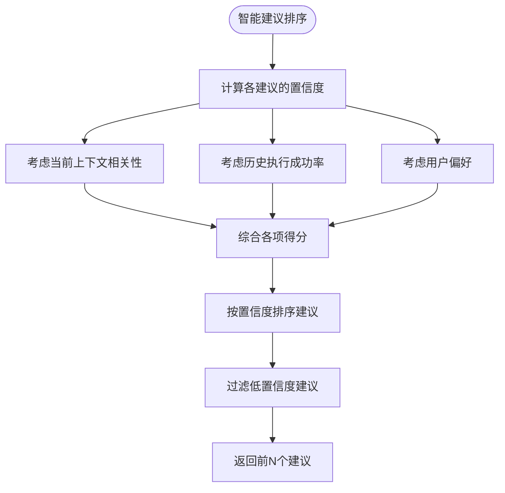

**Section sources**
- [ai.ts](file://src/types/ai.ts#L56-L71)

## 组件间通信与事件流

### 事件系统架构
系统采用基于事件的通信模式，通过`EventTypes`定义的事件类型实现组件间解耦。关键事件包括AI命令开始、完成、错误和配置需求。

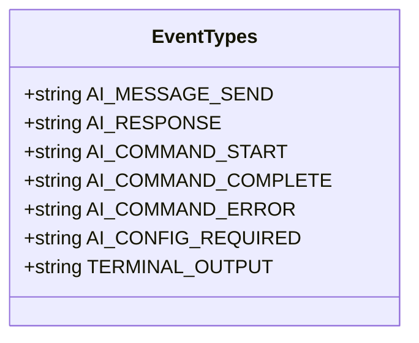

**Diagram sources**
- [eventSystem.ts](file://src/utils/eventSystem.ts#L11-L33)

**Section sources**
- [eventSystem.ts](file://src/utils/eventSystem.ts#L11-L33)

### 事件处理流程
`useAIChat`组合式函数通过`onEvent`监听AI相关事件，并更新UI状态。事件流确保了命令执行状态的实时同步。

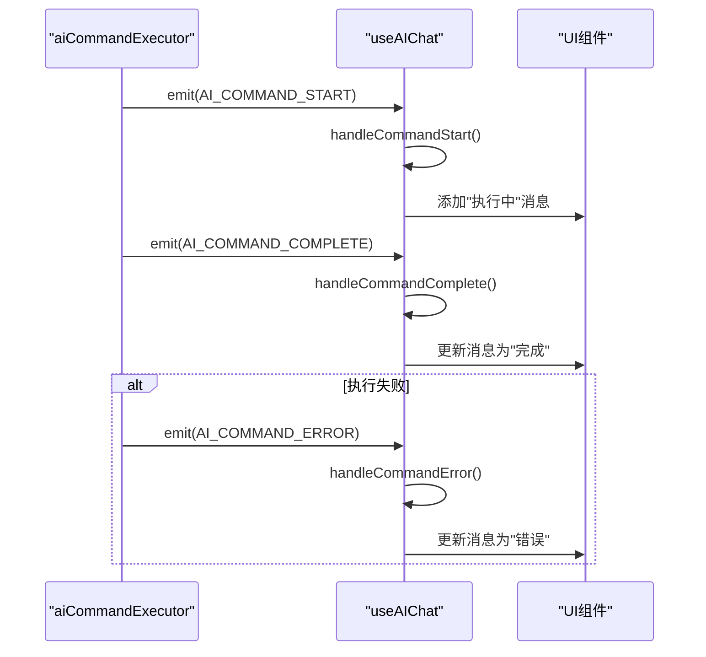

**Diagram sources**
- [useAIChat.ts](file://src/modules/ai-assistant/composables/useAIChat.ts#L400-L550)
- [aiCommandExecutor.ts](file://src/modules/ai-assistant/utils/aiCommandExecutor.ts#L18-L63)

**Section sources**
- [useAIChat.ts](file://src/modules/ai-assistant/composables/useAIChat.ts#L400-L550)

## 错误处理与重试机制

### 错误状态管理
系统通过`ToolCallHistoryItem`的`status`和`error`字段管理错误状态。错误处理流程确保了用户能够清晰了解命令执行失败的原因。

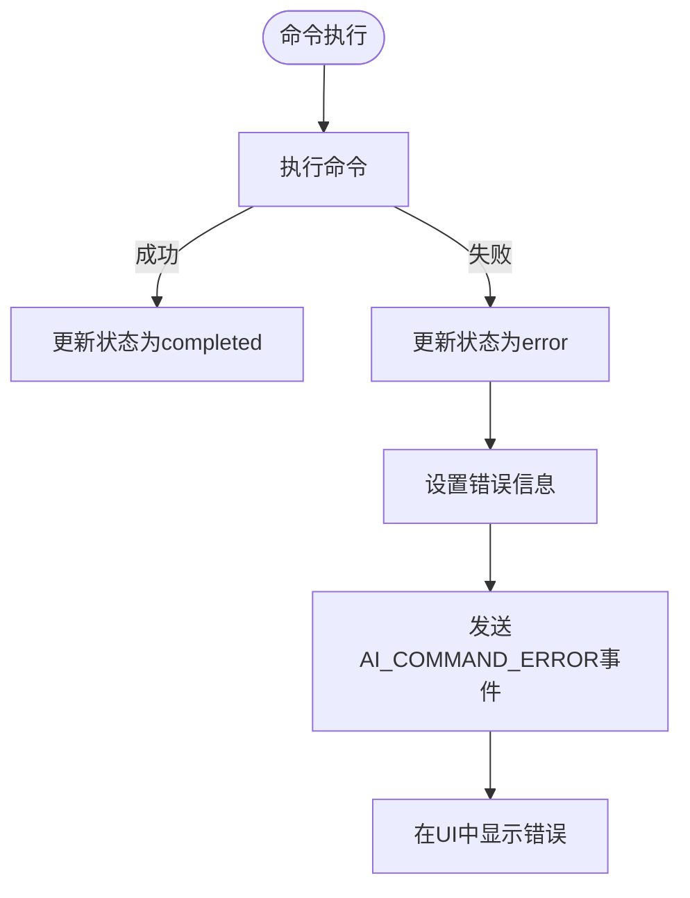

**Diagram sources**
- [aiCommandExecutor.ts](file://src/modules/ai-assistant/utils/aiCommandExecutor.ts#L45-L63)
- [useAIChat.ts](file://src/modules/ai-assistant/composables/useAIChat.ts#L500-L550)

**Section sources**
- [aiCommandExecutor.ts](file://src/modules/ai-assistant/utils/aiCommandExecutor.ts#L45-L63)
- [useAIChat.ts](file://src/modules/ai-assistant/composables/useAIChat.ts#L500-L550)

### 重试机制实现
系统提供`retryToolCall`函数实现命令重试功能。该函数从历史记录中查找指定ID的工具调用，并重新执行其命令。

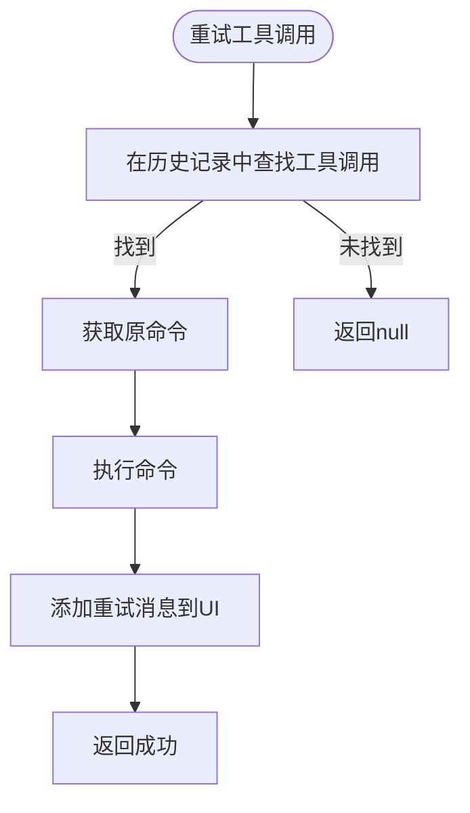

**Diagram sources**
- [useAIChat.ts](file://src/modules/ai-assistant/composables/useAIChat.ts#L370-L380)
- [ai.ts](file://src/modules/ai-assistant/stores/ai.ts#L240-L255)

**Section sources**
- [useAIChat.ts](file://src/modules/ai-assistant/composables/useAIChat.ts#L370-L380)

## 性能统计与监控

### 工具调用统计
系统通过`getToolCallStats`函数提供工具调用的性能统计，包括总数、成功数、失败数、成功率和平均执行时间。

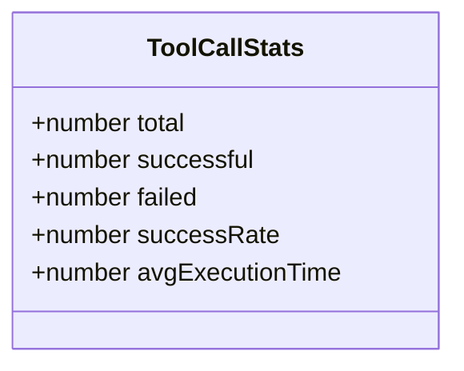

**Diagram sources**
- [ai.ts](file://src/types/ai.ts#L168-L174)

**Section sources**
- [ai.ts](file://src/types/ai.ts#L168-L174)

### 统计计算流程
统计计算基于`toolCallHistory`历史记录，通过过滤和计算得出各项指标。该机制为系统性能优化提供了数据支持。

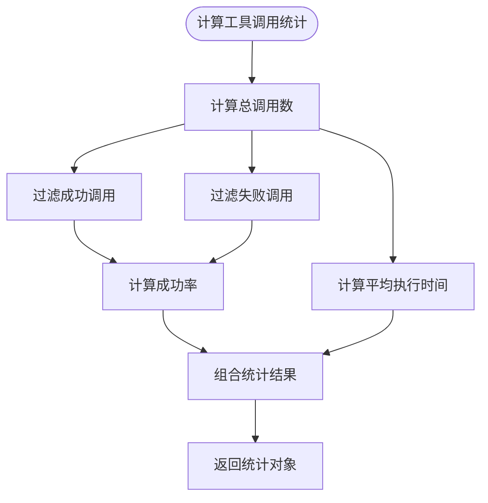

**Diagram sources**
- [useAIChat.ts](file://src/modules/ai-assistant/composables/useAIChat.ts#L340-L360)
- [ai.ts](file://src/modules/ai-assistant/stores/ai.ts#L210-L230)

**Section sources**
- [useAIChat.ts](file://src/modules/ai-assistant/composables/useAIChat.ts#L340-L360)