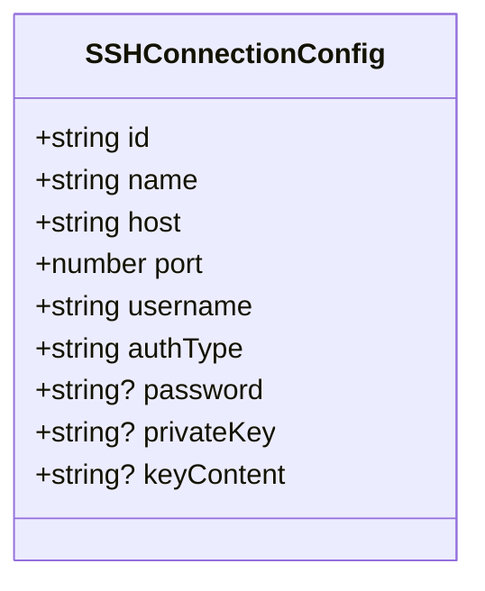
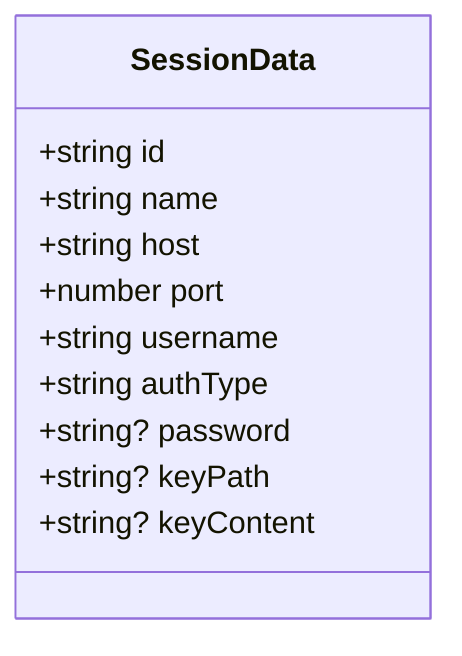
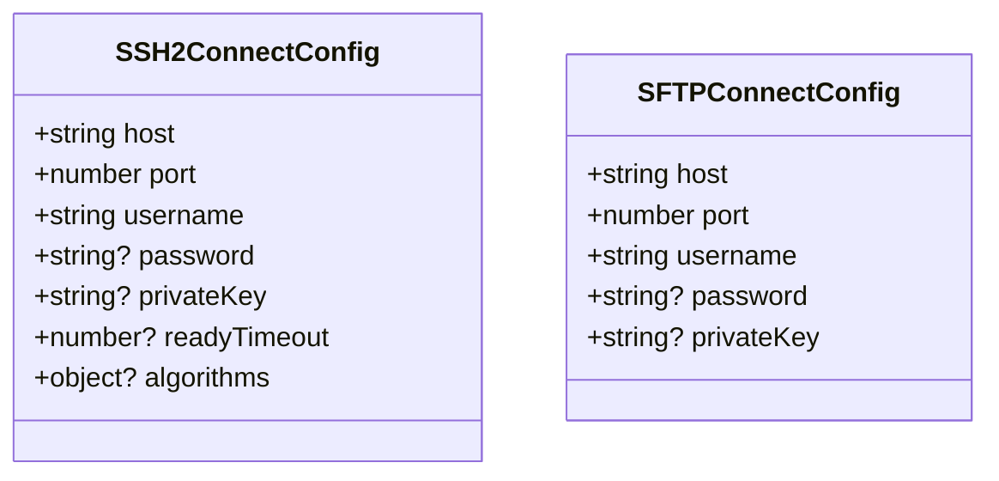
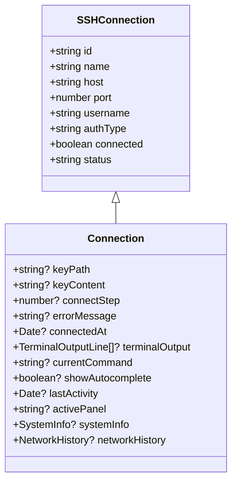
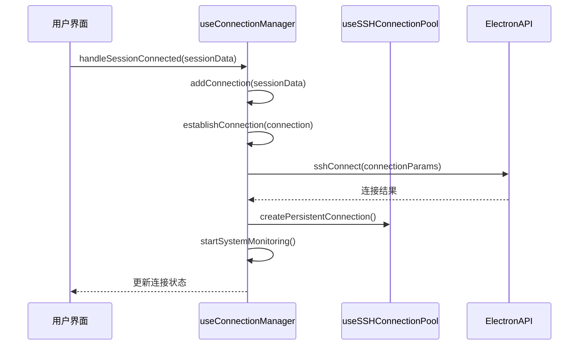
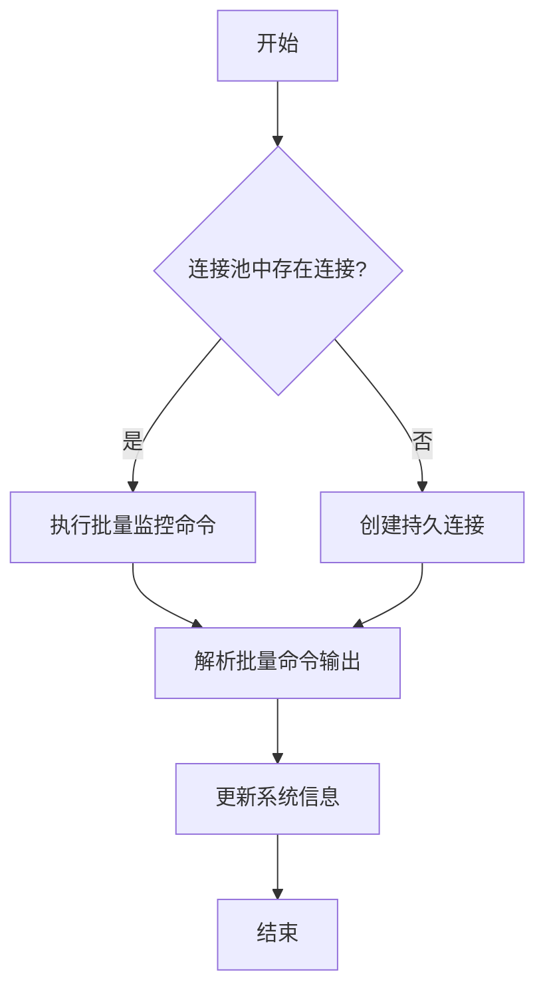
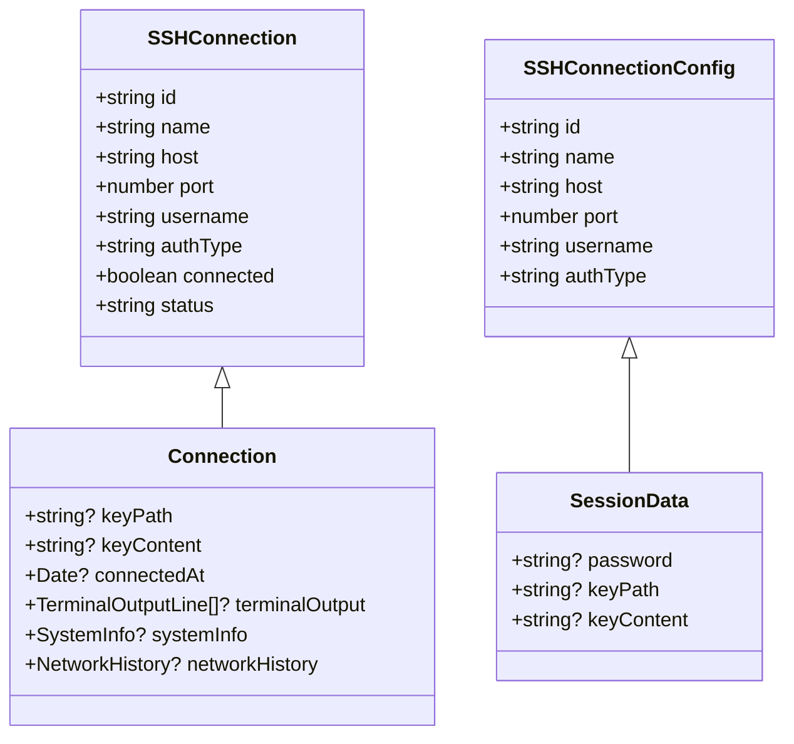
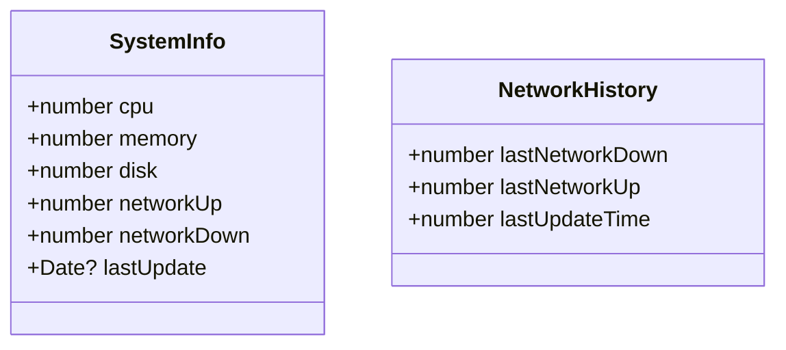

# SSH连接类型

<cite>
**Referenced Files in This Document**   
- [ssh.ts](file://src/types/ssh.ts)
- [useConnectionManager.ts](file://src/composables/useConnectionManager.ts)
- [useSSHConnectionPool.js](file://src/composables/useSSHConnectionPool.js)
- [main.ts](file://main.ts)
</cite>

## 目录
1. [核心类型设计](#核心类型设计)
2. [连接状态与认证参数](#连接状态与认证参数)
3. [会话持久化与配置类型](#会话持久化与配置类型)
4. [扩展连接类型与上下文数据](#扩展连接类型与上下文数据)
5. [组合式函数与类型安全](#组合式函数与类型安全)
6. [类型继承关系图](#类型继承关系图)
7. [资源监控数据结构](#资源监控数据结构)

## 核心类型设计

本文档详细介绍了SSH连接相关的核心类型设计，包括`SSHConnection`、`SSHConnectionConfig`、`Connection`等接口的定义与用途。这些类型构成了SSH连接管理的基础，通过清晰的字段定义和继承关系，实现了连接配置、状态管理和功能扩展的分离。

**Section sources**
- [ssh.ts](file://src/types/ssh.ts#L8-L105)

## 连接状态与认证参数

### SSHConnection 接口
`SSHConnection`接口定义了SSH连接的核心属性，包括连接标识、主机信息、认证方式和连接状态。

- `id`: 连接的唯一标识符
- `host`: 目标主机地址
- `port`: SSH服务端口，默认为22
- `authType`: 认证类型，支持`password`（密码）和`key`（密钥）两种方式
- `status`: 连接状态枚举，包含`connecting`（连接中）、`connected`（已连接）、`failed`（失败）、`disconnected`（已断开）和`cancelled`（已取消）等值

这些状态值在连接生命周期中动态变化，用于反映连接的实际状态，指导用户界面的显示和用户交互。

### SSHConnectionConfig 接口
`SSHConnectionConfig`接口用于定义连接配置，包含建立SSH连接所需的基本参数。

**Diagram sources**
- [ssh.ts](file://src/types/ssh.ts#L25-L35)

**Section sources**
- [ssh.ts](file://src/types/ssh.ts#L25-L35)

## 会话持久化与配置类型

### SessionData 接口
`SessionData`接口用于会话持久化，存储连接会话的关键信息，以便在应用重启后恢复连接状态。

该类型在Electron主进程中通过`getSessions`和`saveSession`API进行持久化存储，实现了连接会话的跨会话保持。

### SSH2ConnectConfig 和 SFTPConnectConfig 接口
`SSH2ConnectConfig`和`SFTPConnectConfig`接口分别定义了底层SSH和SFTP连接的配置参数。

在主进程中，`SSH2ConnectConfig`的`algorithms`字段配置了密钥交换、加密算法、服务器主机密钥和HMAC算法等安全参数，确保了连接的安全性。

**Diagram sources**
- [ssh.ts](file://src/types/ssh.ts#L82-L104)
- [main.ts](file://main.ts#L135-L237)

**Section sources**
- [ssh.ts](file://src/types/ssh.ts#L82-L104)
- [main.ts](file://main.ts#L135-L237)

## 扩展连接类型与上下文数据

### Connection 接口
`Connection`接口扩展了`SSHConnection`，集成了终端输出、系统监控信息等上下文数据，提供了更丰富的连接状态信息。

该接口通过继承实现了功能扩展，同时保持了与基础连接类型的兼容性。

**Diagram sources**
- [ssh.ts](file://src/types/ssh.ts#L50-L63)

**Section sources**
- [ssh.ts](file://src/types/ssh.ts#L50-L63)

## 组合式函数与类型安全

### useConnectionManager 组合式函数
`useConnectionManager`组合式函数使用`Connection`和`SessionData`类型，实现了连接的创建、管理和监控。

该函数通过类型安全的参数传递和响应式数据管理，确保了连接操作的可靠性和可预测性。

### useSSHConnectionPool 组合式函数
`useSSHConnectionPool`组合式函数实现了SSH连接池，通过`executeBatchCommand`方法批量获取系统信息。

**Diagram sources**
- [useConnectionManager.ts](file://src/composables/useConnectionManager.ts#L10-L538)
- [useSSHConnectionPool.js](file://src/composables/useSSHConnectionPool.js#L2-L258)

**Section sources**
- [useConnectionManager.ts](file://src/composables/useConnectionManager.ts#L10-L538)
- [useSSHConnectionPool.js](file://src/composables/useSSHConnectionPool.js#L2-L258)

## 类型继承关系图

该图展示了核心类型之间的继承关系，体现了类型设计的层次性和可扩展性。

**Diagram sources**
- [ssh.ts](file://src/types/ssh.ts#L8-L105)

## 资源监控数据结构

### SystemInfo 和 NetworkHistory 接口
`SystemInfo`和`NetworkHistory`接口用于资源监控，提供了系统性能数据的结构化表示。

`NetworkHistory`用于计算网络速率，通过记录上次更新时间和网络流量，实现了网络使用情况的动态监控。

**Diagram sources**
- [ssh.ts](file://src/types/ssh.ts#L66-L79)

**Section sources**
- [ssh.ts](file://src/types/ssh.ts#L66-L79)