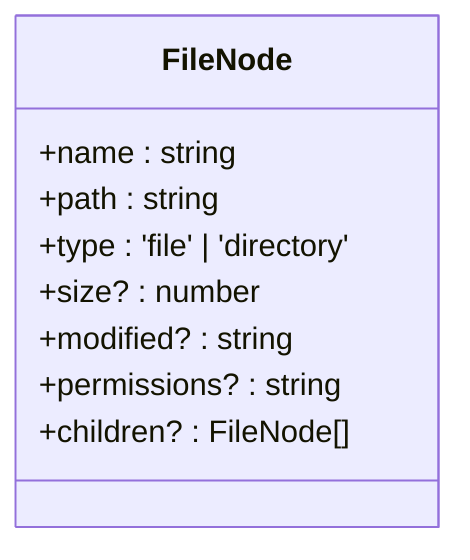
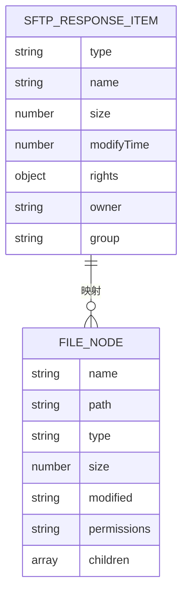

# 文件系统类型

<cite>
**本文档引用的文件**  
- [file.ts](file://src/types/file.ts#L4-L12)
- [FileManager.vue](file://src/modules/file-manager/components/FileManager.vue#L0-L1550)
- [electron.d.ts](file://src/types/electron.d.ts#L35-L35)
- [main.ts](file://main.ts#L463-L517)
</cite>

## 目录
1. [介绍](#介绍)
2. [FileNode 接口结构](#filenode-接口结构)
3. [核心字段详解](#核心字段详解)
4. [递归树形结构与目录浏览机制](#递归树形结构与目录浏览机制)
5. [在 FileManager.vue 中的交互实现](#在-filemanagervue-中的交互实现)
6. [SFTP 文件列表解析与序列化示例](#sftp-文件列表解析与序列化示例)
7. [可选字段的设计考量与性能优化](#可选字段的设计考量与性能优化)

## 介绍
`FileNode` 是本项目中用于表示远程文件系统节点的核心类型，广泛应用于文件管理模块。该类型设计简洁而功能完整，支持文件与目录的统一建模，并通过递归结构实现对任意深度目录层级的表达。结合 `FileManager.vue` 组件，`FileNode` 支持异步加载、目录展开/折叠、右键菜单、拖拽上传等丰富交互行为，为用户提供类本地的文件浏览体验。

## FileNode 接口结构
`FileNode` 接口定义了文件系统节点的基本属性和元数据，采用 TypeScript 的接口形式声明，具备良好的类型安全性和扩展性。其结构包含必需字段（如 `name`、`path`、`type`）和可选字段（如 `size`、`modified`、`permissions`、`children`），通过 `children?: FileNode[]` 实现递归树形结构。



**图示来源**  
- [file.ts](file://src/types/file.ts#L4-L12)

**本节来源**  
- [file.ts](file://src/types/file.ts#L4-L12)

## 核心字段详解
`FileNode` 的字段设计兼顾了功能性与性能，各字段用途如下：

| 字段 | 类型 | 是否必需 | 说明 |
|------|------|----------|------|
| `name` | `string` | 是 | 文件或目录的名称，不包含路径信息 |
| `path` | `string` | 是 | 文件或目录的完整绝对路径 |
| `type` | `'file' \| 'directory'` | 是 | 节点类型，明确区分文件与目录 |
| `size` | `number` | 否 | 文件大小（字节），仅文件节点有效 |
| `modified` | `string` | 否 | 最后修改时间，ISO 8601 格式字符串 |
| `permissions` | `string` | 否 | 权限字符串（如 "drwxr-xr-x"），来自 SFTP 响应 |
| `children` | `FileNode[]` | 否 | 子节点数组，仅目录节点在展开后填充 |

**本节来源**  
- [file.ts](file://src/types/file.ts#L4-L12)

## 递归树形结构与目录浏览机制
`children?: FileNode[]` 是实现文件管理器层级浏览的关键。该字段为可选数组，其存在与否直接反映目录的展开状态：

- **初始状态**：目录节点的 `children` 为 `undefined`，表示未加载子项，UI 显示为可展开状态。
- **展开操作**：用户双击或点击展开按钮时，触发异步请求加载该路径下的文件列表。
- **数据填充**：后端通过 SFTP 协议获取目录内容，解析为 `FileNode` 数组并赋值给 `children`。
- **状态更新**：组件重新渲染，显示子节点列表，形成层级结构。

此设计实现了**惰性加载（Lazy Loading）**，避免一次性加载整个文件系统导致性能问题，仅在用户需要时按需加载。

```mermaid
flowchart TD
A[用户展开目录] --> B{children 存在?}
B --> |是| C[直接渲染子节点]
B --> |否| D[调用 getFileList API]
D --> E[解析 SFTP 响应为 FileNode[]]
E --> F[设置 children 数组]
F --> G[重新渲染 UI]
```

**图示来源**  
- [file.ts](file://src/types/file.ts#L11-L11)
- [FileManager.vue](file://src/modules/file-manager/components/FileManager.vue#L0-L1550)

**本节来源**  
- [file.ts](file://src/types/file.ts#L11-L11)
- [FileManager.vue](file://src/modules/file-manager/components/FileManager.vue#L0-L1550)

## 在 FileManager.vue 中的交互实现
`FileManager.vue` 组件是 `FileNode` 类型的主要使用者，其实现了完整的文件管理交互逻辑：

- **异步加载**：通过 `window.electronAPI.getFileList()` 调用主进程的 SFTP 客户端，获取远程文件列表。
- **展开/折叠**：双击目录项 (`@dblclick="navigateToDirectory"`) 触发路径变更，重新加载该目录内容。
- **状态管理**：使用 `ref` 和 `computed` 属性管理文件列表、选中状态、导航历史等。
- **错误处理**：捕获 SFTP 连接、路径不存在、权限不足等异常，并通过 `emit('show-notification')` 向用户反馈。
- **右键菜单**：通过 `@contextmenu.prevent="showContextMenu"` 实现上下文菜单，支持打开、下载、重命名、删除等操作。

组件通过 `directories` 和 `regularFiles` 两个计算属性对 `files` 数组进行分类和排序，确保目录始终显示在文件之前，提升用户体验。

**本节来源**  
- [FileManager.vue](file://src/modules/file-manager/components/FileManager.vue#L0-L1550)

## SFTP 文件列表解析与序列化示例
`FileNode` 类型与后端 SFTP 协议响应数据存在直接映射关系。主进程通过 `ssh2-sftp-client` 库的 `list()` 方法获取目录内容，其返回的每个条目是一个包含文件元数据的对象。

**SFTP 响应条目示例：**
```json
{
  "type": "d",
  "name": "documents",
  "size": 4096,
  "modifyTime": 1700000000000,
  "accessTime": 1700000000000,
  "rights": { "user": "rwx", "group": "r-x", "other": "r-x" },
  "owner": "user",
  "group": "user"
}
```

**序列化为 FileNode 的过程：**
1. `name` 字段直接映射。
2. `path` 由当前浏览路径与 `name` 拼接而成。
3. `type` 根据 `type` 字段（'d' 表示目录）映射为 `'directory'` 或 `'file'`。
4. `size` 直接映射。
5. `modified` 由 `modifyTime` 时间戳转换为 ISO 字符串。
6. `permissions` 由 `rights` 对象格式化为类似 "drwxr-xr-x" 的字符串。

此过程在 `main.ts` 的 `ipcMain.handle('get-file-list')` 处理函数中完成，确保了前后端数据的一致性。



**图示来源**  
- [main.ts](file://main.ts#L463-L517)
- [file.ts](file://src/types/file.ts#L4-L12)

**本节来源**  
- [main.ts](file://main.ts#L463-L517)
- [file.ts](file://src/types/file.ts#L4-L12)

## 可选字段的设计考量与性能优化
`FileNode` 中的可选字段（`size`、`modified`、`permissions`、`children`）设计体现了性能与功能的平衡：

- **减少初始负载**：对于大型目录，若所有字段均为必需，会导致数据传输量巨大。可选字段允许在初始列表中仅传输核心信息（`name`、`path`、`type`），其他元数据可在需要时（如显示属性对话框）单独获取。
- **按需加载**：`children` 字段的可选性是实现惰性加载的基础。只有当用户展开某个目录时，才发起网络请求获取其子节点，显著减少了初始加载时间和网络开销。
- **内存效率**：未展开的目录不存储其子节点，节省了客户端内存。
- **灵活性**：不同场景下可构造不同完整度的 `FileNode`。例如，在文件上传成功后的通知中，可能只包含 `name` 和 `path`，无需完整元数据。

这种设计模式符合现代 Web 应用的性能优化原则，即“按需加载”和“最小化传输”，确保了即使在处理大型远程文件系统时，用户界面依然保持流畅响应。

**本节来源**  
- [file.ts](file://src/types/file.ts#L4-L12)
- [FileManager.vue](file://src/modules/file-manager/components/FileManager.vue#L0-L1550)