# 类型系统

<cite>
**Referenced Files in This Document**   
- [ssh.ts](file://src/types/ssh.ts)
- [file.ts](file://src/types/file.ts)
- [terminal.ts](file://src/types/terminal.ts)
- [ai.ts](file://src/types/ai.ts)
- [index.ts](file://src/types/index.ts)
- [config.ts](file://src/types/config.ts)
- [useConnectionManager.ts](file://src/composables/useConnectionManager.ts)
- [ConnectionModal.vue](file://src/components/ConnectionModal.vue)
- [ConnectionContent.vue](file://src/components/tabs/ConnectionContent.vue)
- [index.ts](file://src/modules/file-manager/index.ts)
- [index.ts](file://src/modules/terminal/index.ts)
- [index.ts](file://src/modules/ai-assistant/index.ts)
</cite>

## 目录
1. [简介](#简介)
2. [类型架构概览](#类型架构概览)
3. [SSH连接类型](#ssh连接类型)
4. [文件系统类型](#文件系统类型)
5. [终端会话类型](#终端会话类型)
6. [AI交互类型](#ai交互类型)
7. [配置类型](#配置类型)
8. [类型导出与引用](#类型导出与引用)
9. [类型系统优势](#类型系统优势)

## 简介

sshcode应用的类型系统是基于TypeScript构建的全面类型定义架构，旨在为整个应用程序提供类型安全和开发体验优化。该系统通过在`src/types`目录下组织专门的类型文件，实现了关注点分离和模块化设计。核心类型文件包括`ssh.ts`、`file.ts`、`terminal.ts`、`ai.ts`和`index.ts`，分别处理SSH连接、文件系统、终端会话、AI交互和类型导出等不同领域的数据结构。

类型系统的设计遵循了清晰的层次结构和继承关系，通过接口（interface）定义了应用程序中各种实体的数据结构。这些类型不仅在定义时考虑了功能需求，还充分考虑了实际使用场景，确保了类型的安全性和灵活性。通过在`index.ts`文件中统一导出所有类型，系统实现了类型定义的集中管理和便捷引用，使得在`composables`和`components`等模块中可以轻松地导入和使用这些类型。

**Section sources**
- [ssh.ts](file://src/types/ssh.ts#L1-L106)
- [file.ts](file://src/types/file.ts#L1-L14)
- [terminal.ts](file://src/types/terminal.ts#L1-L64)
- [ai.ts](file://src/types/ai.ts#L1-L221)
- [index.ts](file://src/types/index.ts#L1-L105)

## 类型架构概览

sshcode的类型系统采用模块化架构，将不同类型定义分散在专门的文件中，实现了良好的组织和维护性。这种设计模式不仅提高了代码的可读性，还便于团队协作和功能扩展。系统的核心架构围绕几个主要领域构建：SSH连接管理、文件系统操作、终端会话控制和AI交互功能。

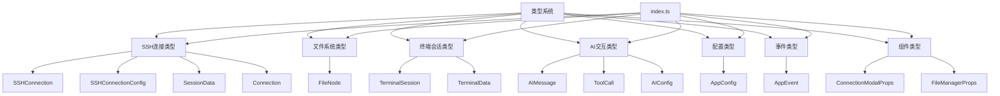

**Diagram sources**
- [ssh.ts](file://src/types/ssh.ts#L1-L106)
- [file.ts](file://src/types/file.ts#L1-L14)
- [terminal.ts](file://src/types/terminal.ts#L1-L64)
- [ai.ts](file://src/types/ai.ts#L1-L221)
- [config.ts](file://src/types/config.ts#L1-L37)
- [events.ts](file://src/types/events.ts#L1-L10)
- [components.ts](file://src/types/components.ts#L1-L20)
- [index.ts](file://src/types/index.ts#L1-L105)

**Section sources**
- [ssh.ts](file://src/types/ssh.ts#L1-L106)
- [file.ts](file://src/types/file.ts#L1-L14)
- [terminal.ts](file://src/types/terminal.ts#L1-L64)
- [ai.ts](file://src/types/ai.ts#L1-L221)
- [config.ts](file://src/types/config.ts#L1-L37)
- [index.ts](file://src/types/index.ts#L1-L105)

## SSH连接类型

SSH连接类型是sshcode应用的核心，定义了与远程服务器建立和管理SSH连接所需的所有数据结构。这些类型主要位于`src/types/ssh.ts`文件中，通过一系列接口实现了连接配置、状态管理和系统监控等功能。

### SSHConnection接口

`SSHConnection`接口定义了SSH连接的基本属性，包括连接标识、主机信息、认证方式和连接状态等。该接口是所有SSH相关操作的基础，确保了连接数据的一致性和完整性。

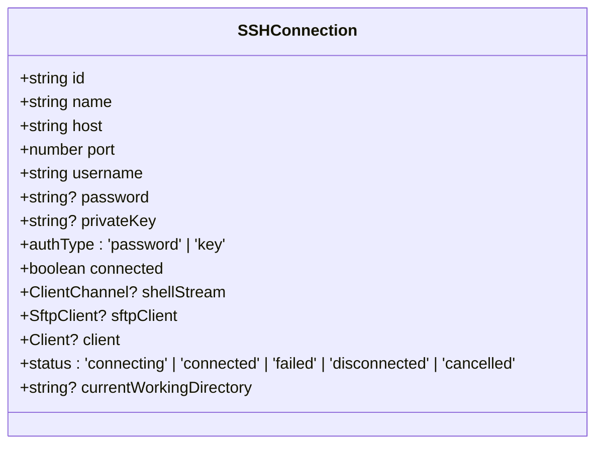

**Diagram sources**
- [ssh.ts](file://src/types/ssh.ts#L8-L23)

### SSHConnectionConfig接口

`SSHConnectionConfig`接口专门用于定义SSH连接的配置参数，与`SSHConnection`接口相比，它更侧重于连接的初始设置，包括连接ID、名称、主机地址、端口、用户名和认证信息等。

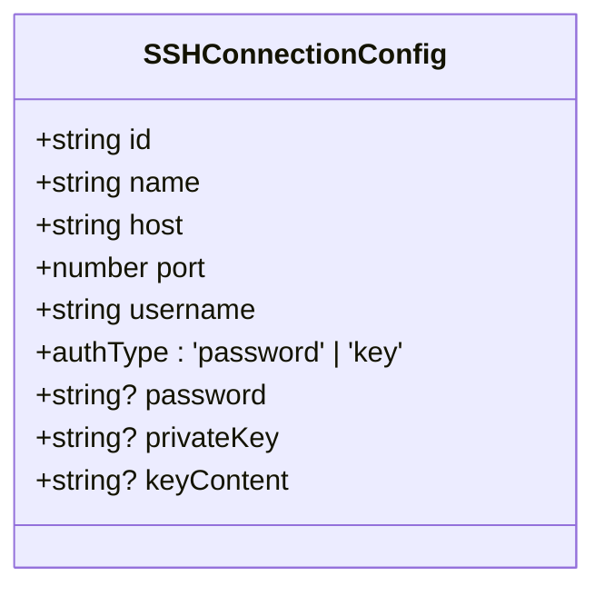

**Diagram sources**
- [ssh.ts](file://src/types/ssh.ts#L25-L37)

### Connection接口

`Connection`接口扩展了`SSHConnection`接口，添加了更多用于连接管理和状态跟踪的属性。这种继承关系体现了类型系统的层次化设计，通过扩展基础接口来满足更复杂的功能需求。

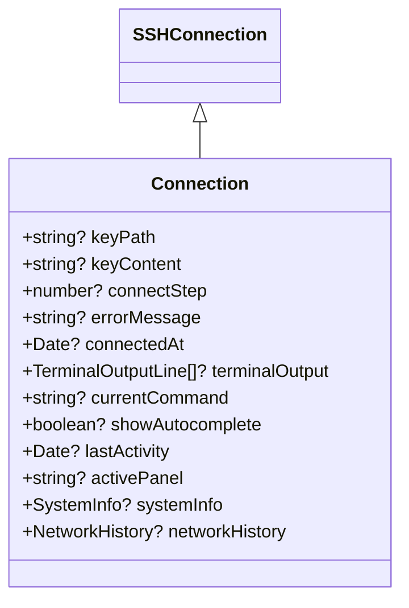

**Diagram sources**
- [ssh.ts](file://src/types/ssh.ts#L50-L63)

### 系统监控类型

为了提供实时的系统状态信息，类型系统定义了`SystemInfo`和`NetworkHistory`接口，用于跟踪和显示远程服务器的CPU、内存、磁盘使用情况以及网络流量等关键指标。

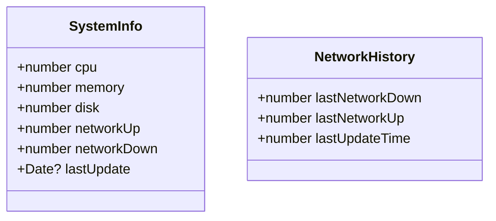

**Diagram sources**
- [ssh.ts](file://src/types/ssh.ts#L65-L85)

**Section sources**
- [ssh.ts](file://src/types/ssh.ts#L8-L106)
- [useConnectionManager.ts](file://src/composables/useConnectionManager.ts#L10-L538)
- [ConnectionModal.vue](file://src/components/ConnectionModal.vue#L1-L1349)

## 文件系统类型

文件系统类型定义了在远程服务器上进行文件浏览和管理所需的数据结构，主要位于`src/types/file.ts`文件中。这些类型通过递归结构实现了对文件和目录的统一表示，为文件管理功能提供了坚实的基础。

### FileNode接口

`FileNode`接口是文件系统类型的核心，它定义了文件或目录的通用属性，包括名称、路径、类型以及可选的大小、修改时间和权限信息。通过`children`属性的递归定义，该接口能够表示任意深度的目录结构。

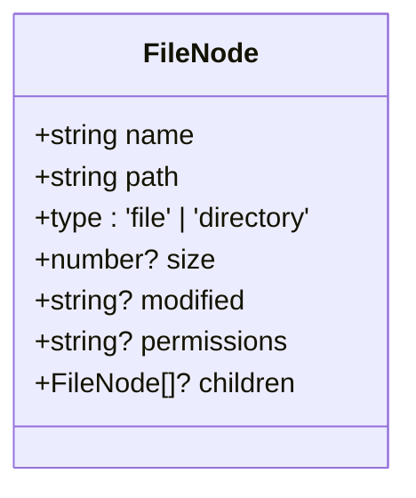

**Diagram sources**
- [file.ts](file://src/types/file.ts#L4-L12)

### 文件管理模块集成

文件系统类型在`src/modules/file-manager/index.ts`中被导出，并在`FileManager`组件中被引用，实现了类型定义与实际功能的紧密结合。

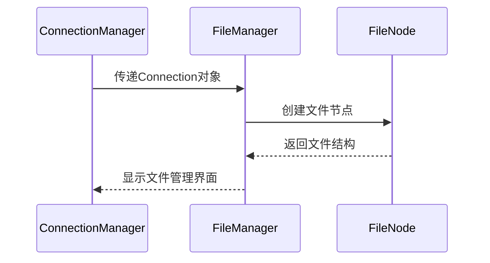

**Diagram sources**
- [file.ts](file://src/types/file.ts#L4-L12)
- [index.ts](file://src/modules/file-manager/index.ts#L1-L11)
- [ConnectionContent.vue](file://src/components/tabs/ConnectionContent.vue#L1-L145)

**Section sources**
- [file.ts](file://src/types/file.ts#L1-L14)
- [index.ts](file://src/modules/file-manager/index.ts#L1-L11)
- [ConnectionContent.vue](file://src/components/tabs/ConnectionContent.vue#L1-L145)

## 终端会话类型

终端会话类型定义了SSH终端交互所需的数据结构，主要位于`src/types/terminal.ts`文件中。这些类型涵盖了终端数据、会话管理、输出格式和事件处理等多个方面。

### TerminalSession接口

`TerminalSession`接口定义了终端会话的核心属性，包括会话ID、关联的连接ID以及可选的终端实例和历史记录。该接口为终端会话的创建和管理提供了统一的数据模型。

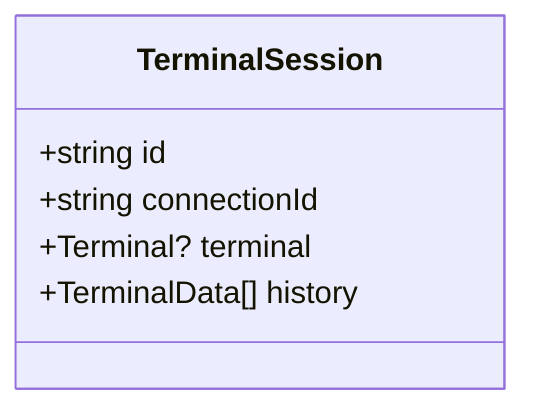

**Diagram sources**
- [terminal.ts](file://src/types/terminal.ts#L10-L13)

### TerminalData接口

`TerminalData`接口定义了终端数据的基本结构，包括输出内容、时间戳和数据类型（输入、输出或错误）。这个接口为终端数据的存储和显示提供了标准化的格式。

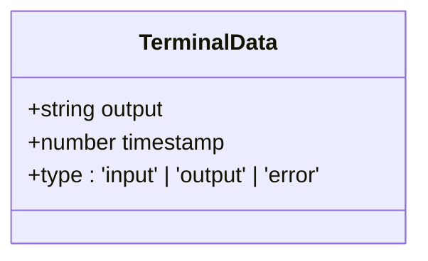

**Diagram sources**
- [terminal.ts](file://src/types/terminal.ts#L4-L8)

### 终端模块集成

终端会话类型在`src/modules/terminal/index.ts`中被导出，并在`XTerminal`等组件中被引用，实现了终端功能的类型安全。

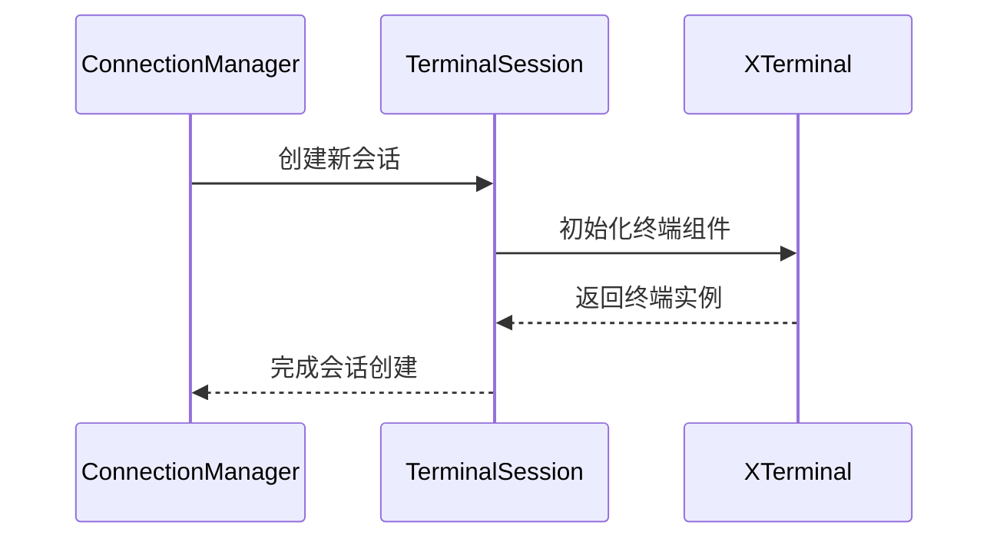

**Diagram sources**
- [terminal.ts](file://src/types/terminal.ts#L10-L13)
- [index.ts](file://src/modules/terminal/index.ts#L1-L20)
- [ConnectionContent.vue](file://src/components/tabs/ConnectionContent.vue#L1-L145)

**Section sources**
- [terminal.ts](file://src/types/terminal.ts#L1-L64)
- [index.ts](file://src/modules/terminal/index.ts#L1-L20)
- [ConnectionContent.vue](file://src/components/tabs/ConnectionContent.vue#L1-L145)

## AI交互类型

AI交互类型定义了与AI助手进行交互所需的数据结构，主要位于`src/types/ai.ts`文件中。这些类型涵盖了消息传递、工具调用、配置管理和响应处理等多个方面。

### AIMessage接口

`AIMessage`接口定义了AI消息的基本结构，包括消息ID、角色（用户、助手、系统或工具）、内容、时间戳以及可选的工具调用信息。这个接口为AI对话的实现提供了基础。

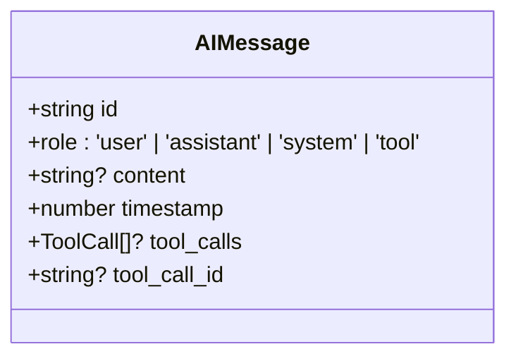

**Diagram sources**
- [ai.ts](file://src/types/ai.ts#L4-L11)

### ToolCall接口

`ToolCall`接口定义了工具调用的结构，包括调用ID、类型、函数名称和参数。这个接口为AI助手执行特定操作（如执行命令）提供了标准化的调用方式。

```mermaid
classDiagram
class ToolCall {
+string id
+string type
+function : {
+name : string
+arguments : string
}
+unknown? result
}
```

**Diagram sources**
- [ai.ts](file://src/types/ai.ts#L13-L21)

### AI配置类型

`AIConfig`接口定义了AI助手的配置参数，包括提供者、基础URL、API密钥、模型选择和生成参数等。这些配置为AI功能的定制化提供了灵活性。

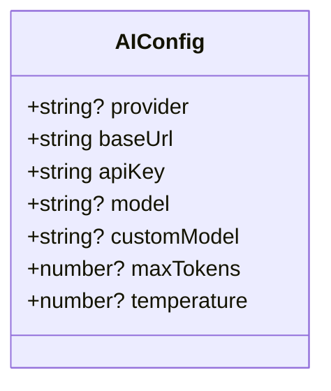

**Diagram sources**
- [ai.ts](file://src/types/ai.ts#L23-L35)

### AI助手模块集成

AI交互类型在`src/modules/ai-assistant/index.ts`中被导出，并在`AIAssistant`组件中被引用，实现了AI功能的类型安全集成。

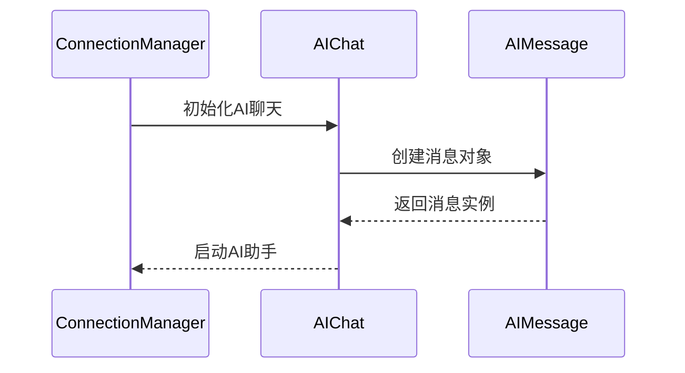

**Diagram sources**
- [ai.ts](file://src/types/ai.ts#L4-L11)
- [index.ts](file://src/modules/ai-assistant/index.ts#L1-L27)
- [ConnectionContent.vue](file://src/components/tabs/ConnectionContent.vue#L1-L145)

**Section sources**
- [ai.ts](file://src/types/ai.ts#L1-L221)
- [index.ts](file://src/modules/ai-assistant/index.ts#L1-L27)
- [ConnectionContent.vue](file://src/components/tabs/ConnectionContent.vue#L1-L145)

## 配置类型

配置类型定义了应用程序的全局配置结构，主要位于`src/types/config.ts`文件中。`AppConfig`接口通过嵌套结构组织了AI、通用、终端和安全等多个方面的配置选项。

### AppConfig接口

`AppConfig`接口是应用程序配置的核心，它整合了各个功能模块的配置需求，为用户提供了一个统一的配置界面。该接口通过详细的属性定义，确保了配置数据的完整性和类型安全。

```mermaid
classDiagram
class AppConfig {
+AIConfig & { provider : string } ai
+general : {
+theme : 'light' | 'dark'
+language : string
+autoSave : boolean
+autoSaveSessions? : boolean
+checkUpdates? : boolean
}
+terminal : {
+font : string
+fontSize : number
+fontFamily : string
+copyOnSelect : boolean
+bell? : boolean
+cursorBlink? : boolean
}
+security : {
+passwordEncryption : boolean
+encryptPasswords? : boolean
+sessionTimeout : number
+confirmDangerousCommands : boolean
}
}
```

**Diagram sources**
- [config.ts](file://src/types/config.ts#L8-L36)

**Section sources**
- [config.ts](file://src/types/config.ts#L1-L37)

## 类型导出与引用

类型系统通过`src/types/index.ts`文件实现了统一的类型导出，为整个应用程序提供了便捷的类型引用机制。这种设计模式不仅简化了类型导入的路径，还提高了代码的可维护性。

### 统一导出机制

`index.ts`文件作为类型系统的入口点，通过重新导出（re-export）的方式将各个模块的类型集中管理。这种模式使得其他模块可以仅通过导入`@/types`路径来访问所有类型，而无需关心具体的文件位置。

```mermaid
flowchart TD
A[index.ts] --> B[SSH类型]
A --> C[AI类型]
A --> D[配置类型]
A --> E[文件系统类型]
A --> F[终端类型]
A --> G[事件类型]
A --> H[组件类型]
B --> B1[SSHConnection]
B --> B2[SSHConnectionConfig]
B --> B3[SessionData]
B --> B4[Connection]
B --> B5[SystemInfo]
B --> B6[NetworkHistory]
C --> C1[AIMessage]
C --> C2[ToolCall]
C --> C3[AIConfig]
C --> C4[ParsedResponse]
C --> C5[ValidationResult]
C --> C6[TestResult]
C --> C7[CommandSuggestion]
C --> C8[UseAIChatProps]
C --> C9[Message]
C --> C10[Action]
C --> C11[ToolCallHistoryItem]
C --> C12[AIChatEmits]
C --> C13[ToolCallStatus]
C --> C14[ConfigStatus]
C --> C15[TerminalInput]
C --> C16[ToolCallStats]
C --> C17[RetryInfo]
C --> C18[CompletionContext]
C --> C19[CacheEntry]
C --> C20[CacheStats]
C --> C21[CommandOptions]
D --> D1[AppConfig]
D --> D2[MainAppConfig]
E --> E1[FileNode]
F --> F1[TerminalData]
F --> F2[TerminalSession]
G --> G1[AppEvent]
H --> H1[ConnectionModalProps]
H --> H2[FileManagerProps]
```

**Diagram sources**
- [index.ts](file://src/types/index.ts#L1-L105)

### 模块间引用

在`composables`和`components`等模块中，通过导入`@/types`路径，可以轻松地使用所有定义的类型。这种引用方式不仅简化了代码，还确保了类型的一致性和正确性。

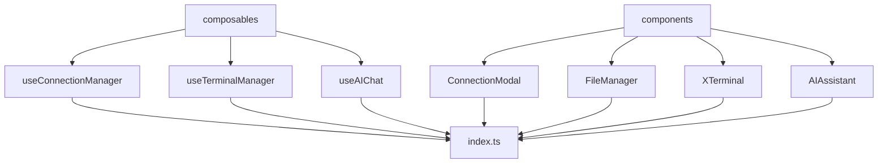

**Diagram sources**
- [index.ts](file://src/types/index.ts#L1-L105)
- [useConnectionManager.ts](file://src/composables/useConnectionManager.ts#L10-L538)
- [ConnectionModal.vue](file://src/components/ConnectionModal.vue#L1-L1349)

**Section sources**
- [index.ts](file://src/types/index.ts#L1-L105)
- [useConnectionManager.ts](file://src/composables/useConnectionManager.ts#L10-L538)
- [ConnectionModal.vue](file://src/components/ConnectionModal.vue#L1-L1349)

## 类型系统优势

sshcode的类型系统通过精心设计的架构和实现，为应用程序带来了显著的优势，主要体现在减少运行时错误和提升开发体验两个方面。

### 减少运行时错误

类型系统通过静态类型检查，在编译时捕获潜在的错误，避免了在运行时出现类型相关的异常。例如，`SSHConnection`接口明确指定了`authType`只能是`'password'`或`'key'`，这确保了认证方式的正确性。同样，`FileNode`接口的递归定义确保了文件结构的完整性，避免了无效的文件树。

### 提升开发体验

类型系统为开发者提供了更好的代码补全、导航和文档功能。通过IDE的类型推断，开发者可以快速了解接口的结构和可用属性，减少了查阅文档的时间。此外，类型定义还为代码重构提供了安全保障，确保在修改接口时能够及时发现和修复相关代码。

**Section sources**
- [ssh.ts](file://src/types/ssh.ts#L1-L106)
- [file.ts](file://src/types/file.ts#L1-L14)
- [terminal.ts](file://src/types/terminal.ts#L1-L64)
- [ai.ts](file://src/types/ai.ts#L1-L221)
- [config.ts](file://src/types/config.ts#L1-L37)
- [index.ts](file://src/types/index.ts#L1-L105)