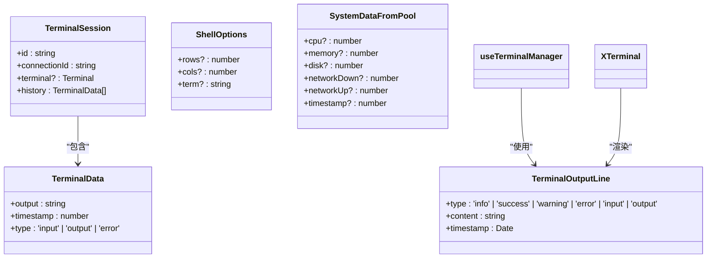
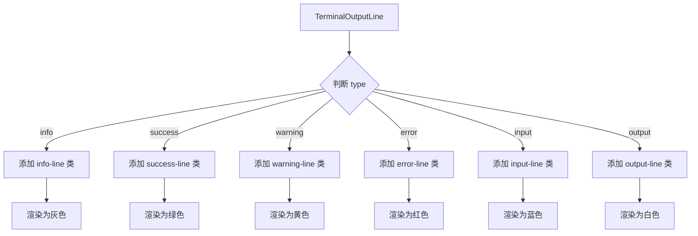
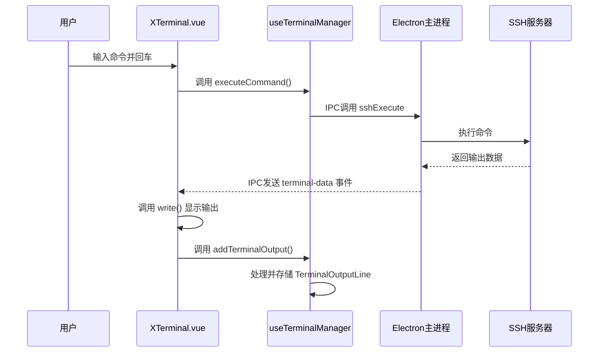

# 终端类型

<cite>
**本文档引用的文件**   
- [terminal.ts](file://src/types/terminal.ts)
- [useTerminalManager.ts](file://src/modules/terminal/composables/useTerminalManager.ts)
- [XTerminal.vue](file://src/modules/terminal/components/XTerminal.vue)
- [useConnectionManager.ts](file://src/composables/useConnectionManager.ts)
- [main.ts](file://main.ts)
- [SystemMonitor.vue](file://src/components/SystemMonitor.vue)
</cite>

## 目录
1. [简介](#简介)
2. [核心类型定义](#核心类型定义)
3. [TerminalSession 会话管理](#terminalsession-会话管理)
4. [TerminalData 命令交互记录](#terminaldata-命令交互记录)
5. [TerminalOutputLine 输出行类型系统](#terminaloutputline-输出行类型系统)
6. [ShellOptions SSH Shell 配置](#shelloptions-ssh-shell-配置)
7. [SystemDataFromPool 系统监控数据](#systemdatafrompool-系统监控数据)
8. [终端输入输出流处理](#终端输入输出流处理)
9. [结论](#结论)

## 简介
本文档深入解析终端功能相关的类型系统，重点阐述 `TerminalSession`、`TerminalData`、`TerminalOutputLine` 等核心类型的设计与应用。文档将说明这些类型如何协同工作，实现终端会话管理、命令历史记录、多样化输出渲染以及系统监控数据处理等功能。通过分析 `XTerminal.vue` 和 `useTerminalManager` 的交互，展示类型系统在实际终端输入输出流处理中的具体应用。

## 核心类型定义

本文档涉及的核心类型均定义在 `src/types/terminal.ts` 文件中，构成了终端功能的类型基础。

**Diagram sources**
- [terminal.ts](file://src/types/terminal.ts#L4-L62)

**Section sources**
- [terminal.ts](file://src/types/terminal.ts#L4-L62)

## TerminalSession 会话管理

`TerminalSession` 接口是终端会话的核心数据结构，用于管理和维护一个独立的终端会话实例。

该类型通过 `id` 和 `connectionId` 两个关键字段建立会话的唯一标识和关联关系。`id` 作为会话的唯一标识符，而 `connectionId` 则将其与特定的 SSH 连接关联起来，确保了会话与底层连接的一一对应。

`terminal` 属性是可选的，它持有一个 `@xterm/xterm` 库的 `Terminal` 实例。这个实例是 xterm.js 终端在前端的直接体现，负责终端的渲染、用户输入的捕获以及与后端的数据交互。通过这个引用，上层逻辑可以直接控制和操作终端的显示状态。

此外，`TerminalSession` 还包含一个 `history` 数组，用于存储该会话的命令交互历史。这个数组的元素类型为 `TerminalData`，记录了用户输入的命令和系统返回的输出，为实现命令历史功能提供了数据基础。

**Section sources**
- [terminal.ts](file://src/types/terminal.ts#L10-L13)
- [useTerminalManager.ts](file://src/modules/terminal/composables/useTerminalManager.ts#L10-L269)

## TerminalData 命令交互记录

`TerminalData` 接口定义了终端中单条命令交互记录的基本结构，是构成 `TerminalSession` 历史记录的核心单元。

该类型包含三个主要属性：
- `output`: 一个字符串，用于存储命令的输出内容或用户输入的命令文本。
- `timestamp`: 一个数字，表示该记录发生的时间戳（毫秒），用于记录事件发生的精确时间。
- `type`: 一个字符串字面量联合类型，取值为 `'input'`、`'output'` 或 `'error'`，用于区分记录的类型。

`type` 字段在命令交互记录中扮演着至关重要的角色。它允许系统明确区分用户输入的命令（`input`）、命令执行成功后的标准输出（`output`）以及执行失败时的错误信息（`error`）。这种区分使得前端可以对不同类型的记录进行差异化处理，例如在日志分析、错误追踪或用户界面展示时，能够根据类型应用不同的样式或逻辑。

**Section sources**
- [terminal.ts](file://src/types/terminal.ts#L4-L8)
- [useTerminalManager.ts](file://src/modules/terminal/composables/useTerminalManager.ts#L10-L269)

## TerminalOutputLine 输出行类型系统

`TerminalOutputLine` 接口定义了终端中每一行输出的详细信息，其类型系统比 `TerminalData` 更加丰富和精细，直接服务于用户界面的渲染。

该类型的关键在于其 `type` 字段，它是一个更广泛的字符串字面量联合类型，包含 `'info'`、`'success'`、`'warning'`、`'error'`、`'input'` 和 `'output'` 六种取值。这种丰富的类型系统为 UI 的差异化渲染提供了精确的语义支持。

- **info**: 用于显示普通的信息性消息，通常渲染为中性颜色（如灰色）。
- **success**: 用于显示操作成功的提示，通常渲染为绿色。
- **warning**: 用于显示警告信息，通常渲染为黄色或橙色。
- **error**: 用于显示错误信息，通常渲染为醒目的红色。
- **input**: 用于显示用户输入的命令，通常与 `output` 有视觉区分。
- **output**: 用于显示命令的标准输出。

在 `XTerminal.vue` 组件中，系统会根据 `TerminalOutputLine` 的 `type` 值，为输出行的 DOM 元素添加相应的 CSS 类（如 `info-line`、`success-line`、`warning-line`、`error-line`）。这些 CSS 类在样式表中定义了不同的颜色、字体粗细等视觉属性，从而实现了丰富多样的终端输出效果。

**Diagram sources**
- [terminal.ts](file://src/types/terminal.ts#L48-L52)
- [XTerminal.vue](file://src/modules/terminal/components/XTerminal.vue#L0-L799)
- [ThreePanelLayout.vue](file://src/components/layout/ThreePanelLayout.vue#L424-L513)

**Section sources**
- [terminal.ts](file://src/types/terminal.ts#L48-L52)
- [XTerminal.vue](file://src/modules/terminal/components/XTerminal.vue#L0-L799)

## ShellOptions SSH Shell 配置

`ShellOptions` 接口用于在创建 SSH Shell 通道时传递配置参数，它直接影响远程终端的行为和外观。

该接口包含三个可选属性：
- `rows`: 指定终端的行数（高度）。
- `cols`: 指定终端的列数（宽度）。
- `term`: 指定终端类型（TERM 环境变量），如 `'xterm-256color'`。

当通过 Electron 的主进程调用 `ssh-create-shell` IPC 事件创建 Shell 会话时，`ShellOptions` 对象会被作为参数传递。主进程会将这些配置应用到 `ssh2` 库的 `conn.shell()` 方法中，从而在远程服务器上启动一个符合指定尺寸和类型的 Shell 会话。这确保了前端 xterm.js 实例的显示效果与后端 Shell 会话的设置保持一致。

**Section sources**
- [terminal.ts](file://src/types/terminal.ts#L18-L22)
- [main.ts](file://main.ts#L254-L382)

## SystemDataFromPool 系统监控数据

`SystemDataFromPool` 接口定义了从 SSH 连接池中获取的系统监控数据的结构。连接池通过复用持久连接，高效地批量获取服务器的实时性能指标。

该接口包含多个可选的数值型属性，用于表示服务器的资源使用情况：
- `cpu`: CPU 使用率（百分比）。
- `memory`: 内存使用率（百分比）。
- `disk`: 磁盘使用率（百分比）。
- `networkDown`: 累计下载流量（字节）。
- `networkUp`: 累计上传流量（字节）。
- `timestamp`: 数据采集的时间戳。

`useConnectionManager` 中的 `processSystemData` 函数负责处理这些原始数据。它会计算网络流量的实时速率（如 KB/s），并将处理后的结果更新到连接对象的 `systemInfo` 字段中，供 `SystemMonitor.vue` 组件消费和展示。

**Section sources**
- [terminal.ts](file://src/types/terminal.ts#L55-L62)
- [useConnectionManager.ts](file://src/composables/useConnectionManager.ts#L396-L480)
- [SystemMonitor.vue](file://src/components/SystemMonitor.vue#L35-L113)

## 终端输入输出流处理

终端的输入输出流处理是整个功能的核心，它涉及 `XTerminal.vue` 和 `useTerminalManager` 两个关键组件的紧密协作。

### 输入流处理
1.  **用户输入**: 用户在 `XTerminal.vue` 的输入框中输入命令。
2.  **事件触发**: `handleTerminalKeydown` 和 `handleTerminalInput` 等事件处理器被触发。
3.  **命令执行**: `useTerminalManager` 的 `executeCommand` 函数被调用，通过 `window.electronAPI.sshExecute` IPC 调用将命令发送到主进程。
4.  **Shell 通信**: 主进程通过 `ssh2` 库的 `stream.write()` 方法将命令写入 SSH Shell 通道。

### 输出流处理
1.  **数据接收**: 主进程通过 `stream.on('data')` 和 `stream.stderr.on('data')` 事件监听 Shell 的输出。
2.  **数据转发**: 主进程通过 `mainWindow.webContents.send('terminal-data')` 将输出数据发送回渲染进程。
3.  **数据处理**: `XTerminal.vue` 的 `handleTerminalData` 函数接收到数据后，调用 `write` 方法将其写入 xterm.js 实例进行显示。
4.  **输出记录**: `useTerminalManager` 的 `addTerminalOutput` 函数负责将输出内容封装成 `TerminalOutputLine` 对象，并根据内容类型（ANSI 转义序列等）进行处理后，添加到连接对象的 `terminalOutput` 数组中，供后续复制、清空等操作使用。

**Diagram sources**
- [XTerminal.vue](file://src/modules/terminal/components/XTerminal.vue#L0-L799)
- [useTerminalManager.ts](file://src/modules/terminal/composables/useTerminalManager.ts#L10-L269)
- [main.ts](file://main.ts#L337-L382)

**Section sources**
- [XTerminal.vue](file://src/modules/terminal/components/XTerminal.vue#L0-L799)
- [useTerminalManager.ts](file://src/modules/terminal/composables/useTerminalManager.ts#L10-L269)

## 结论
本文档详细解析了终端功能的类型系统，展示了 `TerminalSession`、`TerminalData`、`TerminalOutputLine` 等核心类型如何协同工作，构建了一个功能完整、类型安全的终端应用。通过 `id` 和 `connectionId` 的关联，系统实现了会话的精准管理；通过 `type` 字段的精细化设计，实现了命令交互记录的分类和 UI 的差异化渲染；通过 `ShellOptions` 和 `SystemDataFromPool`，实现了对远程 Shell 的配置和系统状态的监控。`XTerminal.vue` 和 `useTerminalManager` 的交互模式，清晰地展现了数据流在组件间的传递与处理过程，为理解终端功能的实现提供了全面的视角。