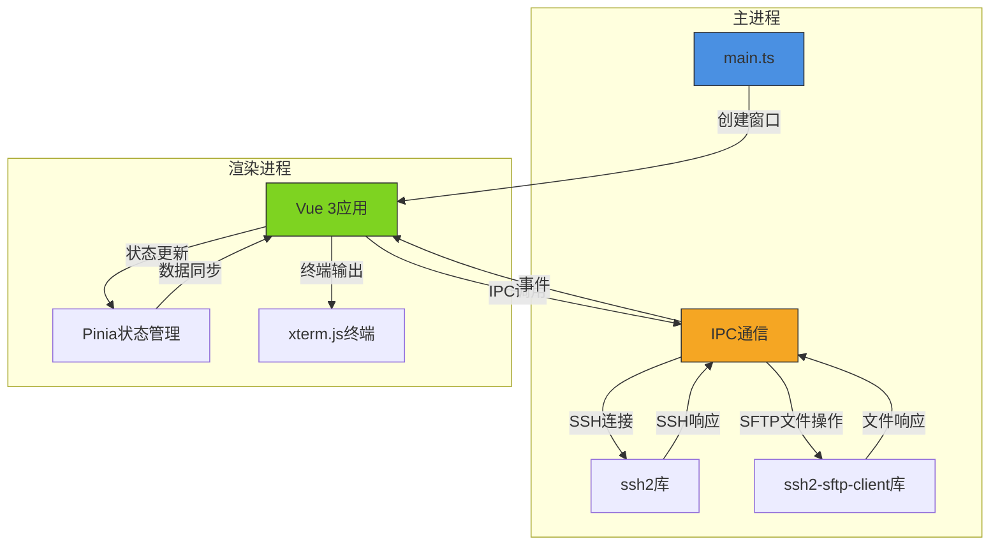

# 项目概述

<cite>
**本文档引用文件**  
- [package.json](file://package.json)
- [main.ts](file://main.ts)
- [preload.ts](file://preload.ts)
- [App.vue](file://src/App.vue)
- [index.ts](file://src/stores/index.ts)
- [ai.ts](file://src/modules/ai-assistant/stores/ai.ts)
- [terminal.js](file://src/modules/terminal/stores/terminal.js)
- [useConnectionManager.ts](file://src/composables/useConnectionManager.ts)
- [useTerminalManager.ts](file://src/modules/terminal/composables/useTerminalManager.ts)
- [config.ts](file://src/types/config.ts)
- [ssh.ts](file://src/types/ssh.ts)
- [ai.ts](file://src/types/ai.ts)
- [terminal.ts](file://src/types/terminal.ts)
- [useElectronAPI.ts](file://src/hooks/useElectronAPI.ts)
- [TabManager.vue](file://src/components/TabManager.vue)
</cite>

## 目录
1. [项目简介](#项目简介)
2. [核心功能](#核心功能)
3. [目标用户](#目标用户)
4. [架构设计](#架构设计)
5. [技术栈](#技术栈)
6. [系统上下文图](#系统上下文图)
7. [安装与启动](#安装与启动)
8. [开发者工作流价值](#开发者工作流价值)
9. [入门指引](#入门指引)
10. [架构决策背景](#架构决策背景)

## 项目简介

sshcode 是一个基于 Electron 和 Vue 3 构建的 SSH 远程连接桌面应用程序，旨在为系统管理员、DevOps 工程师和开发人员提供一个集成化的远程服务器管理解决方案。该项目通过现代化的前端技术栈和桌面应用能力，实现了 SSH 连接管理、多标签终端、文件管理、AI 助手和系统监控等核心功能。

应用采用 MVVM 架构模式，结合 Vue 3 的组合式 API 和 Pinia 状态管理，实现了清晰的代码组织和高效的组件通信。通过 Electron 框架，应用能够在 Windows、macOS 和 Linux 平台上运行，提供原生桌面应用的用户体验。

**Section sources**
- [package.json](file://package.json#L2-L5)
- [main.ts](file://main.ts#L1-L20)
- [App.vue](file://src/App.vue#L1-L10)

## 核心功能

### SSH连接管理
应用提供完整的 SSH 连接管理功能，支持密码和密钥两种认证方式。用户可以创建、保存、编辑和删除连接配置，支持连接会话的持久化存储。连接管理功能通过 `useConnectionManager` 组合式函数实现，提供了连接、断开、重新连接和取消连接等操作。

### 多标签终端
应用支持多标签终端界面，允许用户同时管理多个 SSH 会话。每个标签代表一个独立的连接，用户可以在不同标签间快速切换。终端功能基于 xterm.js 实现，提供了完整的终端仿真能力，包括命令输入、输出显示、自动补全等功能。

### 文件管理
内置文件管理模块允许用户浏览远程服务器的文件系统，支持文件上传、下载和基本的文件操作。文件管理功能通过 SFTP 协议实现，确保了文件传输的安全性。用户可以通过拖拽方式上传文件，也可以通过文件选择对话框进行上传。

### AI助手
集成的 AI 助手功能为用户提供智能命令建议和执行支持。AI 助手可以根据当前上下文分析，推荐合适的命令，并支持一键执行。该功能通过配置化的 AI 服务接口实现，支持不同的 AI 服务提供商。

### 系统监控
应用提供实时的系统监控功能，显示连接服务器的 CPU、内存、磁盘使用率以及网络流量等关键指标。系统监控数据通过定期执行系统命令获取，为用户提供服务器健康状况的直观视图。

**Section sources**
- [package.json](file://package.json#L6-L10)
- [useConnectionManager.ts](file://src/composables/useConnectionManager.ts#L1-L50)
- [TabManager.vue](file://src/components/TabManager.vue#L1-L50)
- [ai.ts](file://src/modules/ai-assistant/stores/ai.ts#L1-L50)

## 目标用户

sshcode 主要面向以下三类用户群体：

### 系统管理员
系统管理员需要频繁访问和管理多台服务器，sshcode 提供的连接管理和多标签终端功能可以显著提高他们的工作效率。通过保存常用的连接配置，管理员可以快速访问目标服务器，而无需每次都输入连接信息。

### DevOps工程师
DevOps 工程师在日常工作中需要执行大量的部署、监控和故障排查任务。sshcode 的 AI 助手功能可以为他们提供智能的命令建议，减少记忆复杂命令的负担。系统监控功能则帮助他们实时了解服务器状态。

### 开发人员
开发人员经常需要连接到开发、测试或生产环境进行调试和部署。sshcode 提供的文件管理功能使得在本地和远程服务器之间传输文件变得简单直观，而多标签终端则支持同时管理多个环境。

**Section sources**
- [package.json](file://package.json#L3-L5)
- [App.vue](file://src/App.vue#L1-L20)

## 架构设计

sshcode 采用典型的 Electron 应用架构，分为主进程和渲染进程两个主要部分。主进程负责管理应用生命周期、窗口创建和原生系统交互，而渲染进程则负责用户界面的展示和交互。

### MVVM模式
应用采用 MVVM（Model-View-ViewModel）架构模式，将用户界面（View）与业务逻辑（ViewModel）分离。Vue 3 的响应式系统作为 ViewModel 层，自动同步 Model 和 View 之间的数据变化。

### 组合式API
项目充分利用 Vue 3 的组合式 API，将相关功能逻辑组织到独立的组合式函数中。例如，`useConnectionManager` 负责连接管理，`useTerminalManager` 负责终端操作，这种设计提高了代码的可重用性和可维护性。

### 模块化设计
应用采用模块化设计，将不同功能划分为独立的模块。src/modules 目录下包含 ai-assistant、file-manager 和 terminal 等模块，每个模块都有自己的组件、组合式函数、状态存储和工具函数，实现了功能的高内聚和低耦合。

**Section sources**
- [App.vue](file://src/App.vue#L1-L50)
- [useConnectionManager.ts](file://src/composables/useConnectionManager.ts#L1-L50)
- [useTerminalManager.ts](file://src/modules/terminal/composables/useTerminalManager.ts#L1-L50)

## 技术栈

sshcode 项目采用了一系列现代化的技术栈，确保了应用的性能、可维护性和跨平台能力。

### Electron
作为桌面应用框架，Electron 允许使用 Web 技术（HTML、CSS、JavaScript）构建跨平台的桌面应用程序。主进程（main.ts）负责创建浏览器窗口和处理系统级事件，而渲染进程则运行 Vue 应用。

### Vue 3
前端界面基于 Vue 3 构建，利用其 Composition API、响应式系统和组件化特性。Vue 3 的性能优化和 TypeScript 支持为项目提供了坚实的基础。

### Pinia
状态管理采用 Pinia，替代了传统的 Vuex。Pinia 提供了更简洁的 API 和更好的 TypeScript 支持，使得状态管理更加直观和类型安全。

### xterm.js
终端功能基于 xterm.js 实现，这是一个功能完整的终端前端组件，支持 ANSI 转义序列、Unicode 字符和各种终端特性。

### ssh2
SSH 连接功能依赖于 ssh2 库，这是一个功能强大的 SSH2 客户端实现，支持多种认证方式和加密算法。

**Section sources**
- [package.json](file://package.json#L50-L80)
- [main.ts](file://main.ts#L1-L20)
- [preload.ts](file://preload.ts#L1-L20)

## 系统上下文图



**Diagram sources**
- [main.ts](file://main.ts#L1-L800)
- [preload.ts](file://preload.ts#L1-L80)
- [App.vue](file://src/App.vue#L1-L210)

## 安装与启动

### 安装依赖
```bash
npm install
```

### 开发模式启动
```bash
npm run start
```

### 生产模式构建
```bash
npm run build-electron
```

### 调试模式
```bash
npm run debug
```

这些命令定义在 package.json 的 scripts 字段中，通过 npm run 命令执行。开发模式会启动 Vite 开发服务器并加载到 Electron 窗口中，便于实时开发和调试；生产模式则会构建优化后的静态文件并打包为桌面应用。

**Section sources**
- [package.json](file://package.json#L10-L25)

## 开发者工作流价值

sshcode 在开发者工作流中提供了多方面的价值：

### 提高效率
通过保存连接配置和多标签管理，开发者可以快速切换不同的开发环境，减少了重复的连接操作，提高了工作效率。

### 减少错误
AI 助手功能可以提供准确的命令建议，减少了因记忆错误或拼写错误导致的命令执行失败，特别是在处理复杂的系统管理命令时。

### 增强可视化
系统监控功能提供了服务器资源使用的可视化视图，帮助开发者快速了解系统状态，及时发现潜在的性能问题。

### 简化文件操作
内置的文件管理器简化了本地与远程服务器之间的文件传输过程，无需额外的 FTP/SFTP 客户端，实现了工作流的集中化。

**Section sources**
- [package.json](file://package.json#L3-L5)
- [main.ts](file://main.ts#L1-L50)

## 入门指引

### 初学者入门步骤
1. 克隆项目仓库并安装依赖
2. 使用 `npm run start` 启动应用
3. 点击连接管理按钮创建新的 SSH 连接
4. 输入服务器信息（主机、端口、用户名）和认证方式
5. 保存连接并点击连接按钮
6. 在终端中执行命令，体验多标签切换
7. 尝试使用 AI 助手获取命令建议

### 配置建议
- 在设置中选择合适的终端字体和主题
- 配置 AI 助手的服务提供商和 API 密钥
- 启用会话自动保存功能，避免重复配置
- 根据网络状况调整连接超时设置

**Section sources**
- [App.vue](file://src/App.vue#L1-L50)
- [main.ts](file://main.ts#L1-L50)

## 架构决策背景

### Electron选择
选择 Electron 而非纯 Web 应用，主要是因为需要访问本地文件系统（用于 SSH 密钥文件）和提供桌面应用的完整体验（如系统托盘、原生菜单等）。Electron 的 Node.js 集成也使得 SSH 底层操作更加直接。

### Vue 3 + Composition API
采用 Vue 3 的 Composition API 而非 Options API，是因为项目需要高度的代码复用和逻辑组织。组合式函数（如 useConnectionManager）可以将相关功能逻辑封装，便于在多个组件间共享。

### Pinia状态管理
选择 Pinia 而非 Vuex，主要是因为 Pinia 提供了更简洁的 API、更好的 TypeScript 支持和更小的包体积。Pinia 的模块化设计也更符合现代 JavaScript 的开发习惯。

### xterm.js终端实现
选择 xterm.js 而非简单的 textarea 或 pre 元素，是因为需要完整的终端仿真功能，包括 ANSI 转义序列处理、Unicode 支持、键盘事件处理等。xterm.js 是目前最成熟和功能最完整的 Web 终端实现。

**Section sources**
- [package.json](file://package.json#L50-L80)
- [main.ts](file://main.ts#L1-L50)
- [preload.ts](file://preload.ts#L1-L50)
- [index.ts](file://src/stores/index.ts#L1-L17)